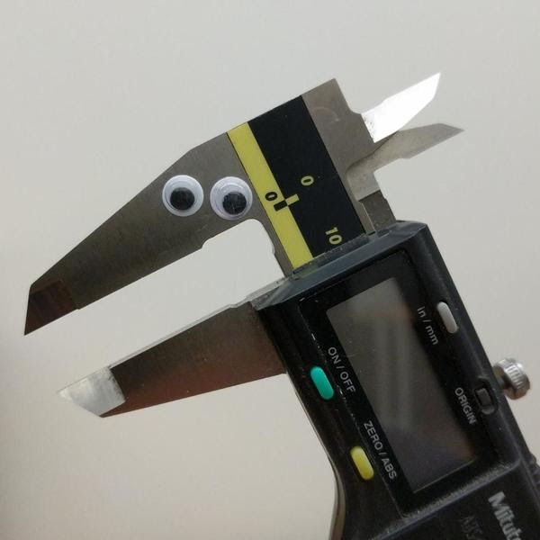
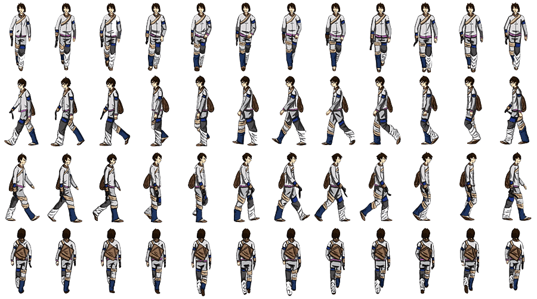

# Mang's Intro to IM - Week 1-7 Lecture Notes #

[Week 1-7 lecture notes](lectureNotes.md)

[Week 8-14 lecture notes](lectureNotes2.md)

[p5js Example Sketches](https://editor.p5js.org/mangtronix/collections/A3JbliQrM)

## Weekly Schedule
- [Week 0](#week-0) - Class visit, Introductions
- [Week 1](#week-1) - p5.js, Variables, animation, conditionals
- [Week 2](#week-2) - Functions 
- [Week 3](#week-3) - arrays, object oriented programming (OOP)
- [Week 4](#week-4) - Working with text
- [Week 5](#week-5) - Working with pixels, sound
- [Week 6](#week-6) - Computer Vision
- [Week 7](#week-7) - Midterm presentations
- FALL BREAK
- [Week 7.9](lectureNotes2.md#week-79) - Saturday 10/28 - Legislative Wednesday
- [Week 8](lectureNotes2.md#week-8) - Introduction to Arduino, electricity
- [Week 9](lectureNotes2.md#week-9) - Analog and digital I/O
- [Week 10](lectureNotes2.md#week-10) - Sound, movement, circuit schematics
- [Week 11](lectureNotes2.md#week-11) - Connecting Arduino to p5.js
- [Week 12](lectureNotes2.md#week-12) - Motors, soldering, fabricating
- [Week 13](lectureNotes2.md#week-13) - Circuit debugging
- [Week 14](lectureNotes2.md#week-14) - Final project
- [IM Show](lectureNotes2.md#im-show) - IM End of Semester Show


## Week 0

### Week 0.1 - 8/28
No class

### Week 0.2 - 8/30

#### Administration
- Andrew Schneider class visit
  - [N O W I S W H E N W E A R E (the stars)](https://nyuad.nyu.edu/en/events/2023/august/nowiswhenweare-andrew-schneider.html) in the Black Box
  - Behind the scenes tour for Intro to IM students Tuesday Sept 5 1-2pm
    - RSVP to bea.laszlo at nyu.edu
- Introductions
- Syllabus etc.
- Reading discussions
- Join the Discord server
  - [Discord invite link on Brightspace](https://brightspace.nyu.edu/d2l/le/lessons/265667/units/8229514)
- Check Wordpress account on https://intro.nyuadim.com/wp-admin
  - [Wordpress login info on Brightspace](https://brightspace.nyu.edu/d2l/le/lessons/265667/units/8229515)
- Show in Project Space opens Thursday!
  - [Your Message Could Not Be Delivered](https://www.nyuad-artgallery.org/en_US/arts-center-project-space/your-message-could-not-be-delivered/)

#### What’s the class about?

<ul>
 	<li>
Digital computation beyond computers (sometimes called "physical computing") considering humanistic needs in design and usability</li>
 	<li>
Computers traditionally lacked knowledge of outside world beyond a keyboard, mouse</li>
<li>Look critically at products and designs</li>
 	<li>
As artists and designers, we can explore new paradigms of interaction with machines and each other</li>
 	<li>
Relatively easily and inexpensively explore creative computation through open source software and hardware</li>
 	<li>
No background needed, strong DIY attitude</li>
 	<li>
Low barrier to entry, high ceiling</li>
</ul>

#### Red Burns advice to new students
[Let's Stop Focusing on Shiny Gadgets and Start Using Tech to Empower People](https://www.wired.com/2013/09/focus-on-people-not-tech-and-other-impt-lessons-for-interaction-design-and-life/)

**What I hope for you:**

That you combine that edgy mixture of self-confidence and doubt.

That you have enough self-confidence to try new things.

That you have enough self doubt to question.

That you think of technology as a verb, not a noun; it is subtle but important difference.

That you remember the issues are usually not technical.

That you create opportunities to improvise.

That you provoke it. That you expect it.

That you make visible what, without you, might never have been seen.

That you communicate emotion.

That you create images that might take a writer ten pages to write.

That you observe, imagine and create.

That you look for the question, not the solution.

That you are not seduced by speed and power.

That you don’t see the world as a market, but rather a place that people live in -- you are designing for people, not machines.

That you have a stake in magic and mystery and art.

That sometimes we fall back on Rousseau and separate mind from body.

That you understand the value of pictures, words, and critical thinking.

That poetry drives you, not hardware.

That you are willing to risk, make mistakes, and learn from failure.

That you develop a practice founded in critical reflection.

That you build a bridge between theory and practice.

That you embrace the unexpected.

That you value serendipity.

That you reinvent and re-imagine.

That you listen. That you ask questions. That you speculate and experiment.

That you play. That you are spontaneous. That you collaborate.

That you welcome students from other parts of the world and understand we don’t live in a monolithic world.

That each day is magic for you.

That you turn your thinking upside down.

That you make whole pieces out of disparate parts.

That you find what makes the difference.

That your curiosity knows no bounds.

That you understand what looks easy is hard.

That you imagine and re-imagine.

That you develop a moral compass.

That you welcome loners, cellists, and poets.

That you are flexible. That you are open.

That you can laugh at yourself. That you are kind.


#### Example
<ul>
 	<li>Carlos Guedes' wonderful <a href="https://vimeo.com/235763130">Phobos</a>, Orquestra Robótica Disfuncional (1 min)</li>
	<li>Mang's <a href="https://www.michaelang.com/project/city-refl3ctor">City Refl3ctor</li>
 	<li>Sudhu Tewari's <a href="https://www.youtube.com/watch?v=MjNB3nKPMb8" >Yasmin Electro Mechanical Sequencer</a></li>
 	<li>List of <a href="http://eat.cca.edu/" >inspirational movies</a> collected by <a href="http://www.ultrafuzz.net/" >Barney Haynes</a> (also <a href="https://vimeo.com/barneyhaynes" >here</a>) and shown at his interface classes.</li>
 	<li>List collected by <a href="https://github.com/zamfi">J.D. Zamfirescu</a>
<li><a href="http://www.youtube.com/watch?v=zkpH1BjD6Wc" >Tree-climbing robot</a></li>
<li><a href="http://www.youtube.com/watch?v=tOsNXg2vAd4#t=120" >Insect robot</a></li>
<li><a href="http://www.youtube.com/watch?v=YblSltHDbIU" >Treadbot</a></li>
<li><a href="https://www.futureforms.us/murmur-wall" >Murmur Wall</a></li>
<li><a href="http://vimeo.com/72826106" >Floating Couch</a></li>
<li><a href="https://www.youtube.com/watch?v=BZysu9QcceM#t=36" >Wooden Segment Mirror</a></li>
<li><a href="https://www.youtube.com/watch?v=pNkz8wEJljc" >Generative design</a></li>
<li><a href="https://vimeo.com/71044541" >Textile weaving</a></li>
<li><a href="https://www.youtube.com/watch?v=czuhNcNU6qU" >Projection mapping</a></li>
<li><a href="http://www.youtube.com/watch?v=sLVXmsbVwUs#t=20" >Laser
harp</a></li>
<li><a href="http://vimeo.com/57082262#at=130" >Arc-o-matic</a></li>
<li><a href="https://www.youtube.com/watch?v=w4cdbV2oaEc" >Eggbot</a></li>
<li><a href="http://www.youtube.com/watch?v=kx9D74t7GD8#t=89"
>Textspresso</a></li>
<li><a href="http://www.youtube.com/watch?v=pCC1GXnYfFI#t=11" >Shapoko / tinyg</a></li>
<li><a href="http://www.youtube.com/watch?v=NAbiAzYhTOQ" >Makerbot Replicator</a></li>
<li><a href="https://www.youtube.com/watch?v=0DNkbZvVYvc"
>Roomba</a></li></li>
 	<li><a href="https://www.youtube.com/watch?v=1G0MzlfMPuM" >Golan Levin: Art that looks back at you</a></li>
 	<li><a href="https://www.youtube.com/watch?v=PV_w38ldZaE" >Drawdio</a></li>
 	<li>Claire Neel's <a href="https://youtu.be/lYERKTf5YtI" >reactive eye</a></li>
 	<li>Professor Aaron Sherwood's <a href="http://aaron-sherwood.com/works/firewall/">Reactive Wall</a></li>
 	<li><a href="http://melissafelderman.com/digitalgraffitiwall/index.html">Digital Graffiti Wall</a></li>
 	<li><a href="http://www.willjfield.com/itp-2/explorer-space-simulator/">Space Simulator</a></li>
 	<li><a href="https://vimeo.com/114414122">Wind based jug organ</a></li>
 	<li><a href="http://andysigler.com/projects/dipinator/">The Dipinator</a></li>
 	<li><a href="https://www.gabebc.com/jitterbox">Jitterbox</a></li>
</ul>
</li>
</ul>

#### Homework
- Join the Discord server (optional, recommended)
  - [Discord invite link on Brightspace](https://brightspace.nyu.edu/d2l/le/lessons/306565/units/8991352)
- Log into the class Wordpress using your user account. If you have problems let Mang know
  - [Wordpress login information](https://brightspace.nyu.edu/d2l/le/lessons/306565/units/8991353)
- Create an account on [p5js.org](https://p5js.org/)

## Week 1

### Week 1.1 - 9/4

#### Let's get started
- What is p5.js?
  - [https://p5js.org/](https://p5js.org/)
  - [Getting started with p5.js](https://p5js.org/get-started/)
  - [Learn p5.js](https://p5js.org/learn/)
    - [Color](https://p5js.org/learn/color.html)
    - [Co-ordinate system and shapes](https://p5js.org/learn/coordinate-system-and-shapes.html)
    - [Curves](https://p5js.org/learn/curves.html)
    - [Interactivity](https://p5js.org/learn/interactivity.html)
    - [Program Flow](https://p5js.org/learn/program-flow.html)
    - [Debugging](https://p5js.org/learn/debugging.html)
<!--  - [Introduction to p5.js](https://medium.com/comsystoreply/introduction-to-p5-js-9a7da09f20aa) -->
  - [Programming with p5.js videos (Coding Train)](https://www.youtube.com/playlist?list=PLRqwX-V7Uu6Zy51Q-x9tMWIv9cueOFTFA)
    - [p5.js Web Editor (Coding Train)](https://www.youtube.com/playlist?list=PLRqwX-V7Uu6Zy51Q-x9tMWIv9cueOFTFA)
    - [Shapes and Drawing (Coding Train)](https://www.youtube.com/watch?v=c3TeLi6Ns1E&list=PLRqwX-V7Uu6Zy51Q-x9tMWIv9cueOFTFA&index=5)
    - [Color (Coding Train)](https://www.youtube.com/watch?v=riiJTF5-N7c&list=PLRqwX-V7Uu6Zy51Q-x9tMWIv9cueOFTFA&index=6)


<!-- $$$ move to after break
##### GitHub
- What is [GitHub](https://github.com/)?
- Difference between an account and a repository
- Follow along with me and create an account
- Instructions for this are
[here](https://github.com/michaelshiloh/resourcesForClasses#github-resources).

Please use your name for your account name so that I can more easily recognize
it.  If you don't want to use your name for privacy reasons, please choose an
alias that I can recognize as you.

Name your repository "introduction to interactive Media". 

- Edit your README.md file
	- What is README.md?
	- What is .md?
- Simple Markdown 
	- **Bold**
	- Paragraphs must be separated by a blank line
	- Inserting images: 
	- Always remember to commit your changes!
	- More [here](https://github.com/michaelshiloh/resourcesForClasses#github-resources).
-->

##### Simple shapes in p5.js

Open [p5.js editor](https://editor.p5js.org/)

- `ellipse()`
- `rect()`
- `createCanvas()`
- `triangle(x1, y1, x2, y2, x3, y3)`
- `line()`
- `point()`

What does this all mean?
- Functions
- Arguments or parameters

Controlling color, fill, and stroke

- `stroke()`
- `noStroke()`
- `fill()`
- `arc(100, 100, 100, 100, 0, 180)`
- `arc(100, 100, 100, 100, 0, radians(180), CHORD)`

Here is the program we developed in class:

````
function setup() {
  createCanvas(600,600); 
  background(25, 130, 80); 
  
  // draw a circle and a rectangle with the default colors
  circle (width/2, height/2, 50);
  rect(10, 10, 80, 20);
  
  // change the stroke and fill
  fill(180,0,0);
  stroke(0,0,180);
  // circle(80, 80, 80); this circle is commented out so it won't be drawn
  ellipse(200, 280, 50, 80);
  
  // change the stroke color but keep the same fill
  stroke(180,0,0);
  line( 0,0, 300, 100);
  
  let foo = radians(90);
  print(foo);                  //!!!!!!!!!!!!!!!!!!!!!!!! THIS IS VERY USEFUL!!!!!!!
  
  arc(50, 55, // center of the ellipse
      50, 50, // width and height
      0, radians(180)); // start and stop angle
  
  triangle( 100, 100, 10, 200, 100, 300);
  print(width/2, height/2);
}

let x = 0;
function draw() {
	// Where am I?
  print(mouseX, mouseY);
  
	// I can do animation!
  circle(x, 500, 40);
  x=x+1;
}

````
**Notes**
- Built-in variables
	- `width`, `height`, `mouseX`, `mouseY`
	- many others; we will discover more as we go along

**Create an account on p5js.org so you can save your sketches!**
Sketches will be submitted by making a blog post and submitting through Brightspace (in future weeks)
	
##### Sharing your sketch
- [How to embed your P5js sketch directly into a blog post](https://intro.nyuadim.com/2022/01/06/how-to-embed-a-p5js-sketch-in-your-blog-post/)
- Code snippets in blog post

<!-- $$$ move to after break
##### Saving a sketch to GitHub

- Navigate to desired folder
- Click on "Add file" 
- Select "Create new file"
- Type in optional new folder(s) followed by slashes `/` followed by a file
	name
- Copy your code from the p5.js editor and paste it into GitHub
- Scroll down to the bottom
- Optionally change the commit comment
- Click on "Commit new file"
-->

[Back to top](#weekly-schedule)

### Week 1.2 - 9/6

#### Questions
Did any questions come up since we last met?

- Uploading files to web editor
  - Click triangle next to "Sketch Files" and click "Upload file"
  - [p5.js Web Editor: Uploading Media Files (Coding Train)](https://www.youtube.com/watch?v=rO6M5hj0V-o)
  - [Load image example sketch (p5js Editor)](https://editor.p5js.org/mangtronix/sketches/xw78_aQeb)

##### Variables

p5.js Links
- [Variables](https://p5js.org/examples/data-variables.html)
- [True and False](https://p5js.org/examples/data-true-and-false.html)
- [Variable Scope](https://p5js.org/examples/data-variable-scope.html)
- [Array](https://p5js.org/examples/arrays-array.html)
- [Mouse Functions](https://p5js.org/examples/input-mouse-functions.html)
  - Example of storing a value in a variable

- Javascript is not a typed language: you don't need to declare
	a variable's type
- [Week 2 - Variables (p5js editor)](https://editor.p5js.org/mangtronix/sketches/X3tNw_gGC)
- `let myNumber = 4.5;`
- `let myString = "the quick brown fox";`
- `let myArray = ["the", "quick", "brown", "fox"];`
- `let myRandomNumber = random(255);`
- `let myRandomNumber = round(random(255));`
How can we find out what a variable's value is?
`print()` 

##### Animation

p5.js Links
- [Setup and Draw](https://p5js.org/examples/structure-setup-and-draw.html)
- [Width and Height](https://p5js.org/examples/structure-width-and-height.html)


Use the `draw()` function to draw something different in each frame. This can
be the location of a shape but you can manipulate anything such as color also:

The  `draw()` function is called once per frame. Think of it as drawing a new
page on a ["flip book"](https://en.wikipedia.org/wiki/Flip_book)

[Week 2 - Drawing (p5js editor)](https://editor.p5js.org/mangtronix/sketches/YkprSBTwX)
````
let foo = 0;

function setup() {
  createCanvas(300, 300);
}

function draw() {
  ellipse(foo, 50, 40, 40);
  foo = foo + 1;
}
````

By default, the previous frame is not erased. Sometimes this is useful.
Use the `background()` function to "paint" over any previous drawings. 

````
function setup() {
  createCanvas(500, 500);
}

let triangleTopLeftX = 0;
let redValue = 255;

function draw() {
  // erase previous drawings
  background(10, 255, 255);

  // Move the triangle
  triangleTopLeftX = triangleTopLeftX + 1;

	// If the triangle reaches the right edge, move to the left edge
  if (triangleTopLeftX >= width) {
    triangleTopLeftX = 0;
  }

  // Change the value of red
  redValue = redValue - 1;

	//If red reaches a certian level, reset it
  if (redValue === 55) {
		redValue = 255;
	}

  // Select the fill for the triangle
  fill(redValue, redValue - 100, redValue - 100);

  // Draw the triangle
  triangle(
    triangleTopLeftX,
    20, // top left corner
    triangleTopLeftX + 100,
    30, // top right corner
    triangleTopLeftX + 50,
    200
  ); // bottom corner
  
  // Select the fill for the circle
  fill(10,20, 240);

  // Draw the circle
  circle(mouseX, mouseY, 30);
  print("mouse coordinates = " + mouseX + ", " + mouseY);
}

````

##### Notes:

- Local vs. Global variables
- Built-in variables

````
// Example usage of a global variable

let count; // this is now a global variable

function setup() {
  circle(50, 50, 30);
  count = 7; // the variable is initialized here
}

function draw() {
  count = count + 1; // not algebra!
  // The result of the right hand side calculation
  // replaces whatever value was stored in the variable
  // on the left side of the '=' sign
  // end result: the variable "count" is incremented by 1

  print (count);
}
````

##### What is `frameRate()`?

````
function setup() {
  frameRate(10);       // frameRate() is a function
  print(frameRate()); // it takes awhile for the frame rate to change
}

function draw() {
  print(frameRate());
}
````

##### Additional resources
Refer to these for additional information
- [Programming with p5.js for Beginners (Coding Train Videos)](https://www.youtube.com/playlist?list=PLRqwX-V7Uu6Zy51Q-x9tMWIv9cueOFTFA)
- [JavaScript Programming Tutorial (w3schools)](https://www.w3schools.com/js/default.asp)
- [JavaScript Loops Explained](https://www.freecodecamp.org/news/javascript-loops-explained-for-loop-for/)

## Week 2

### Week 2.1 - 9/11

Overview:
- Readings
- Review
- Loops
- Functions
- Homework assignment + reading

##### Readings
Each week there will be assigned reading. You need to read / watch the material before the start of
Monday's class and post a response. We will discuss the readings in groups in class.

[Explanation of in-class discussion (Syllabus)](https://intro.nyuadim.com/syllabus/#studentled)

[Week 2 - Random shuffle group (p5js)](https://editor.p5js.org/mangtronix/sketches/QxFRtipnL) - Choosing discussion groups

[List of readings (Weekly Schedule)](https://intro.nyuadim.com/)


##### Review

- conditionals 

````
function setup() {
  createCanvas(300, 300);
}

function draw() {
  if (mouseIsPressed === true) {
    background(color(0, 0, 255));
  } else {
    background(color(200, 0, 0));
  }
}
````

**Notes**:
1. `mouseIsPressed` is another built-in variable. There are many others.
1. `mouseIsPressed` is a new type of data, namely a `boolean`, 
	which means it has
	 only one of two values, `true` or `false`
1. Note that `{` and `}` indicate the blocks
1. The `else` part of an `if()` statement is optional (what happens if we
	 remove it?)

In class exercise:
- Using the cursor to draw
- Now use a mouse press to clear the screen
- Clear the screen if the mouse is pressed inside a certain circle
- Combine these to create a primitive painting program

##### Loops
`while()` is like `if()` but it keeps on doing it as long as condition is true

````
function setup() {
  createCanvas(300, 300);

  let foo = 50; // create and initialize a variable

  while (foo < width) { // keep going as long as the condition is true
    ellipse(foo, 50, 40, 40);
		// modify the variable so something different happens next time
    foo = foo + 50; 
  }
}
````

1. You should get in the habit of giving meaningful names to your variables.
	1. What is a better name for the variable foo?
1. What would happen if you replace the `while()` with `if()`?

There is another way to make a loop using the keyword `for()`. The `for()`
loop structure combines the initialization step and the incrementation step
into the `for()` loop construction:

````
function setup() {
  createCanvas(300, 300);

  // initialization, condition, and incrementation all in one line
  for (let foo = 50; foo < width; foo = foo + 50)  {
    ellipse(foo, 50, 40, 40);
  }
}
````

Which should you use? Whichever is easier for you to understand. Remember that
**most of the time spent programming is fixing problems**, and **whatever you
understand best will probably have fewer problems**.

Both `for()` loops and `while()` loops can be nested, meaning a loop inside a
loop:

````

function setup() {
  createCanvas(700, 700);
  background(230);
  fill(0);

  let yPos = 0;
  let xPos = 0;

  for (yPos = 30; yPos < height; yPos=yPos + 40) {
    for (xPos = 20; xPos<width; xPos=xPos + 40) {
      circle(xPos,yPos, 5);
    }
  }
}

````

#### Functions

Every time you use one of the built-in 'commands', you are really using (or
more properly 'calling') a built-in function. Functions are a very important
building block of programming, and in addition to using built-in functions,
you can also create your own. In fact, you've already been doing that, when
you created the `setup()` and `draw()` functions. In the case of
`setup()` and `draw()` you have to use those names, but when you create other
functions you can make up your own names. Just like variables names, good 
function names make your programs easier to understand.

Why create your own functions?

- Reuse (if it's something you might do again)
- Clarity (remember your three important audiences: yourself, others learning
	from you, me when I grade your work)
- Easier to debug (what is debugging?)
	- One of the most powerful ways to approach
	a bug is to reproduce it with simplest possible example. 
	This is much easier when the thing that's causing
	the problem is already a function.
- Modularity
- Flexibility (with good choice of parameters)

Let's modify the example from last class to use a function. First let's draw a
house instead of a circle to make it a little more interesting:

````
function setup() {
  createCanvas(300, 300);

  // initialization, condition, and incrementation all in one line
  for (let foo = 50; foo < width; foo = foo + 50)  {
    rect(foo, 50, 40, 40);
    line(foo, 50, foo+20, 30);
    line(foo+20, 30, foo+40, 50);
  }
}
````

Now let's make a function called `drawOneHouse()`. If we want to
draw a house at different locations, we need a way to tell
the function `drawOneHouse()` where to put the house. Functions accommodate
this by allowing us to pass information into the function by putting 
that information in the parenthesis. In the function, we store this
information in temporary variables that we can use in the function:

````
function setup() {
  createCanvas(300, 300);

  for (let foo = 50; foo < width; foo = foo + 50) {
    drawOneHouseAt(foo);
  }
}

function drawOneHouseAt( x) {
  rect(x, 50, 40, 40);
  line(x, 50, x+20, 30);
  line(x+20, 30, x+40, 50);
}
````

**Notes**
1. I've said this before and I'll keep saying: 
	**Choose descriptive names for your variables and functions!** 
	`foo` is a bad name, `xPos` is a good name,
	 `houseXPos` is a better name.
1. The value of `foo` (50, 100, 150 ...) is the information passed to the
	 function so that the function can do it's work. The proper name for this
	 information is an **argument**
1. The variable `x` is a temporary variable that **only exists in the function**.
	 This variable is used to store the argument that was passed into the
	 function so that the function can do its work. Once the function is
	 finished, this variable is no longer needed and is destroyed. 
	 A variable used in this way is called a **parameter**
1. Functions may take zero, one, or multiple arguments. When you write 
	a function, you decide how many arguments you need. For example, we might
	have included the house size or roof height or house y location. (Of course
	when you use functions that someone else wrote 
	you must use the proper number of parameters.)
1. Functions can return information as well, for example the `random()`
	 function. Functions can either return one piece of information, or none.
	We will see later how to do this. 

#### Variable Scope (again)

https://editor.p5js.org/mangtronix/sketches/DaceAEVzA
````
let foo;  // this is a global variable, visible in all functions

function setup() {
  foo = 7;
}

function draw() {

  print(foo);

  let bar; // this is a local variable, visible only inside of draw()

  for (let i = 0; i < width/2; i++) { 
    // i is a local variable visible only inside this for() loop
    ellipse(i, height/2, 10,15);
  }
}
````

### Readings / Class Discussion
- Readings are listed on the [main page](https://intro.nyuadim.com/)

### Debugging
- [p5js Field Guide to Debugging](https://p5js.org/learn/debugging.html)
- [Debugging (Happy Coding)](https://happycoding.io/tutorials/p5js/debugging)

#### Week 2.2 Additional Resources
- [Programming with p5.js for Beginners (Coding Train Videos)](https://www.youtube.com/playlist?list=PLRqwX-V7Uu6Zy51Q-x9tMWIv9cueOFTFA)
- [JavaScript Programming Tutorial (w3schools)](https://www.w3schools.com/js/default.asp)
- [JavaScript Loops Explained](https://www.freecodecamp.org/news/javascript-loops-explained-for-loop-for/)
- [p5.js rotate (p5js reference)](https://p5js.org/reference/#/p5/rotate)
- [p5js transformations (Gene Kogan)](https://genekogan.com/code/p5js-transformations/)
  - Running examples of transformations
- [9.1: Transformations Pt.1 (Translate, Rotate, Push/Pop) - p5.js Tutorial (Dan Shiffman YouTube)](https://www.youtube.com/watch?v=o9sgjuh-CBM)
- [Intro to IM Sketch Collection (p5 web editor)](https://editor.p5js.org/mangtronix/collections/A3JbliQrM)

[Back to top](#weekly-schedule)

### Week 2.2 - 9/13

##### Artwork examples
- [Vera Molnar](https://magazine.artland.com/vera-molnar/)
- [Manfred Mohr](http://www.emohr.com/)

##### Functions

Any questions about what we've covered already?

Functions that return a value: See the [reference page for
`return`](https://p5js.org/reference/#/p5/return)

**Notes**
- Functions can take any number of arguments (or none), but can return at most
one

In class exercise:

1. Write a function that will take a single parameter
and draw a vertical line from the top of the canvas to the bottom
at the X coordinate indicated by the parameter
	1. In the `setup()` function test your function 
	at a couple of different locations
1. Write another function that will draw a **horizontal** line
at the indicated **Y** coordinate
	1. Test as before
1. Using these two functions, write a program in `setup()`
that draws a grid of lines at regular intervals on the canvas

#### Callback Functions / Event Handlers

`mouseClicked()` [example](https://p5js.org/reference/#/p5/mouseClicked) in
the reference section

**Notes**
- You never have to call **callback functions**. The p5.js system calls them
	for you when that event happens
	
See [Program flow](https://p5js.org/learn/program-flow.html) for more examples of callback functions and event handlers.


https://editor.p5js.org/mangtronix/sketches/7zooOaxnq
````
const redLocationX = 40;
const redLocationY = 40;

const blueLocationX = 80;
const blueLocationY = 40;

const menuSizeX = 120
const menuSizeY = 80;

const circleDiameter = 40;
const backgroundColor = 240;

function setup() {
  createCanvas(400,400);

  //prepare background
  background(backgroundColor);

  // Put a box around the menu. We won't be allowed to draw here
  rect(0,0, menuSizeX, menuSizeY);

  // draw red circle
  fill (255,0,0);
  circle(redLocationX, redLocationY, circleDiameter);

  // now blue
  fill (0, 0, 255);
  circle(blueLocationX, blueLocationY, circleDiameter);

  // initialize fill to green
  fill (0, 255, 0);

  // turn off stroke
  noStroke();

  // faster refresh rate makes line more solid
  frameRate(200);
}

function draw() {

  if (mouseIsPressed &&
      !mouseIsWithinRect(0, 0, menuSizeX, menuSizeY)) {
    circle(mouseX, mouseY, 15);
  }
}

function mouseClicked() {

   // Have we chosen red?
  if (mouseIsWithinCircle(redLocationX, redLocationY, circleDiameter/2)) {
    console.log("you chose red!");
    fill (255,0,0);
  }

  // Have we chosen blue?
  if (mouseIsWithinCircle(blueLocationX, blueLocationY, circleDiameter/2)) {
    console.log("you chose blue!");
    fill (0, 0, 255);
  }

}

function mouseIsWithinCircle( x, y, radius) {
  if (dist(mouseX, mouseY, x, y) < radius) {
    return true;
  }
  return false;
}

function mouseIsWithinRect( x, y, sizeX, sizeY) {
  if (mouseX > x &&
      mouseX < x + sizeX &&
      mouseY > y &&
      mouseY < y + sizeY) {
    return true;
  }
  return false;
}

````

**Notes**
- Operator precedence is [very
	complicated](https://developer.mozilla.org/en-US/docs/Web/JavaScript/Reference/Operators/Operator_Precedence). It is best to put parenthesis to
	force the order you want.

## Week 3

### Week 3.1 - 9/18

#### Topics today
- Reading discussion
- Look at homework
- Arrays
- Object Oriented Programming
  - See examples in [Week 4](#week4)
  - [Class Syntax](https://javascript.info/class)
- Transformations

#### Arrays

Very simply, arrays let you store multiple things under one variable name, and
let you identify which thing you want by using an `index`

- [JavaScript Array Reference (w3schools)](https://www.w3schools.com/jsref/jsref_obj_array.asp)
- [Week 3.2 - Arrays (p5editor)](https://editor.p5js.org/mangtronix/sketches/RgFNsZcxI)

````
function setup() {
  const numberOfValues = 10;

  let values = []

  let n = 0;
  while (n < numberOfValues ) {
    values.push( n * n );
    n = n + 1;
  }

  for (let i = 0; i < values.length; i++) {
    print(values[i]);
  }
}
````

**Things to notice**

- Similar to the way functions are signified by `()`, 
	arrays are signified by `[]`
- Arrays can be of any data type, but can't be mixed types
- New keyword: `const` 
- Why not just use ten "normal" variables?
- Arrays and loops (either `for()` or `while()`) almost always show up
  together. If you have an array, you almost always want a loop.
- Note that the `while()` loop used to put the numbers into the array
	is exactly the same as the `for()` loop used to print the array. I could
	have used either in both places. I did this to show you that they are
	interchangeable.
	
- Some ways to iterate over an array
  - [JS Loop For (w3schools)](https://www.w3schools.com/js/js_loop_for.asp)
  - [JS Loop For Of (w3schools)](https://www.w3schools.com/js/js_loop_forof.asp)

- See [Week 3.2 - Arrays (p5editor)](https://editor.p5js.org/mangtronix/sketches/RgFNsZcxI) for examples on how to insert and remove items

#### Object Oriented Programming (OOP)

- [JavaScript Classes (w3schools)](https://www.w3schools.com/js/js_classes.asp)
- [Classes (MDN)](https://developer.mozilla.org/en-US/docs/Web/JavaScript/Reference/Classes)

Walk through these examples:
- [Ball Class Example 1 (p5editor)](https://editor.p5js.org/mangtronix/sketches/VsFd39EN2)
- [Ball Class Example 2 (p5editor)](https://editor.p5js.org/mangtronix/sketches/-7sWqG_Bu)
- [Ball Class Example 3 (p5editor)](https://editor.p5js.org/mangtronix/sketches/zef9Vc-s7)
- [Ball Class Example 4 (p5editor)](https://editor.p5js.org/mangtronix/sketches/M_G7Qs6Jf)
- [Car Class Example (p5editor)](https://editor.p5js.org/mangtronix/sketches/ShJMnrrkW)
- [Flocking example (p5js)](https://p5js.org/examples/simulate-flocking.html) (note: uses older '.prototype' way of emulating classes)

#### Transformations

Walk through
[this](https://creative-coding.decontextualize.com/transformations-and-functions/)
tutorial. You might also find
[this](https://genekogan.com/code/p5js-transformations/) useful for a
slightly different perspective.

[Back to top](#weekly-schedule)

### Week 3.2 - 9/20

#### Plan for today

- Discuss reading
- Look at homework

- Artwork examples
  - [Text Rain - Camille Utterback](http://camilleutterback.com/projects/text-rain/)
  - Scott Snibbe
    - [Boundary Functions (2001)](https://www.snibbe.com/art/boundaryfunctions)
      - Uses [planar subdivision function in OpenCV](https://docs.opencv.org/3.4/df/d5b/group__imgproc__subdiv2d.html)
      - [Voronoi Diagram (Wikipedia)](https://en.wikipedia.org/wiki/Voronoi_diagram)
    - [Deep Walls (2002)](https://www.snibbe.com/art/deepwalls)

- Class examples
  - [Week 4 - Choosing Students (p5editor)](https://editor.p5js.org/mangtronix/sketches/DMnZyF6Xc)
  - [Week 4 - Fish class (p5editor)](https://editor.p5js.org/mangtronix/sketches/E-0n-8gIN)
  - [Week 4 - Ball class with text (p5editor)](https://editor.p5js.org/mangtronix/sketches/0Vgh2i2lh)

Additional p5js resources:
- [Programming with p5.js (Coding Train)](https://www.youtube.com/playlist?list=PLRqwX-V7Uu6Zy51Q-x9tMWIv9cueOFTFA)
- [Introduction to p5.js](https://medium.com/comsystoreply/introduction-to-p5-js-9a7da09f20aa)

##### Discuss reading

##### Look at some homework

## Week 4

### Week 4.1 - 9/25
#### Plan for today: 

- Discussion
- Homework feedback to all
- Look at some homework

### Week 4.2 - 9/27

#### Working with text

- How put text on the canvas
  - [p5js Typography reference](https://p5js.org/reference/#group-Typography) 
- Data Visualization 
- Generative Text

##### Text on the canvas

###### The most basic usage

[Week 4 - Basic Text](https://editor.p5js.org/mangtronix/sketches/Gsvk37_QK)
````
function setup() {
  createCanvas(400, 400);

  text("My Important Message", width / 2, height / 2);
}
````

###### Different Fonts and Position

[Week 4 - Basic Text](https://editor.p5js.org/mangtronix/sketches/Gsvk37_QK)

````
function setup() {
  createCanvas(400, 400);
	textFont("Courier New", 25);

	text("My Important Message", width / 2, height / 2);
}
````

Fonts that seem to be available are 'Courier New' (monospace),
and 'Helvetica' (non-monospace)

You can also load your own fonts but that requires uploading them to the p5.js
server

Help->Reference->LoadFont
[Typography (p5 reference)](https://p5js.org/reference/#group-Typography)

**Important**: Note that p5.js is asynchronous, 
meaning that `setup()` will continue even if the `loadFont()` hasn't finished.
There are two ways to force your program to wait for the font to load:

1. Use `preLoad()`
1. Specify an optional callback function in `loadFont()`

###### Selecting one of many fonts

Note that loading a font takes time, so if you expect to use multiple
fonts it's best to preload all of them, and then switch between
them using [`textFont()`](https://p5js.org/reference/#/p5/textFont)

###### Other things to do with text

There are of course many other things you can do with text. You can look at 
Help->Reference->Typography and File->Examples->Typography for ideas and
examples.

##### Data Visualization

What is data visualization? Here are some examples:

- [Ben Fry](http://benfry.com/allstreets/)
- [Aaron Koblin](http://www.aaronkoblin.com/project/flight-patterns)
- [Jer Thorp](https://www.jerthorp.com/portfolio) e.g. Cascade
- [earth:: a global map of wind, weather, and ocean conditions](https://earth.nullschool.net/)

###### Finding data

Note: your data source must be available via an https (SSL-encrypted) URL in order for it to be loaded dynamically from a sketch hosted on an https server (like https://p5editor.p5js.org).  Sites starting with http:// will not work. For static data you can download the .csv file to your computer and then add it to your sketch files.

[Week 4 JSON http vs https (p5editor)](https://editor.p5js.org/mangtronix/sketches/uO7btEsNN)

Sources

- https://www.springboard.com/blog/free-public-data-sets-data-science-project/
- https://www.ndbc.noaa.gov/rt_data_access.shtml
- https://www.kaggle.com/datasets
- Professor' Mathura's [list of data
	sources](https://github.com/MathuraMG/ConnectionsLabSpring22/blob/master/Week_3_JSON_Fetch/README.md#list-of-data-sources)
 	
Format

- The most common format is CSV. You can create your own CSV file from a 
	spreadsheet because most programs
	(Excel, OpenOffice Calc, Google Sheets) can export any table in CSV format
- Other formats are JSON and XML. We won't spend any time on them, but there
	are p5.js libraries for these.
	
##### Simple CSV example
- [Week 4 - Simple CSV examples (p5 editor)](https://editor.p5js.org/mangtronix/sketches/yCb7BOnKf)

##### Worked example: Getting and working with a CSV file

- A [database](https://eerscmap.usgs.gov/uswtdb/) of energy generated by wind turbines
- Click "Get Data"
- Scroll down a bit to "Tabular Data: CSV format" and click on "CSV
format". 
	- This will download a `.zip` file.
- Unzip the file. 
	- This will create `uswtdb_v4_1_20210721.csv`
- This is a plain text file; you can view it with a text editor
	- You will see that the first line is the heading of each column
	- Some of the fields are numerical (e.g. case_id)
	- Some of the fields are text (e.g. t_state, t_county)
	- Some of the fields are missing (e.g. faa_ors, faa_asn)
- Now you can load this file into an array of `Strings` and then process each
	line one at a time, pulling out individual fields:

[Week 4 - Datavis with csv](https://editor.p5js.org/mangtronix/sketches/W5sqRDo6U)
````
/*
 * example to process a CSV file containing data
 * about wind turbines in the USA
 * Source: https://eerscmap.usgs.gov/uswtdb/
 */

// An array of strings to hold the entire file
let strings = [];

// For scaling, we want to know the minimum and maximum latitude and longitude
let minLat;
let maxLat;
let minLong;
let maxLong;

function preload() {
  // The text from the file is loaded into an array.
  strings = loadStrings("uswtdb_v4_3_20220114.csv");
}

function setup() {
  createCanvas(500, 400);
  background(235);

  // Did we succeed to load anything?
  if (strings == null) {
    print("failed to load the file, stopping here");

    // this is an endless loop; it's a common way
    // to prevent a program from continuing when
    // something is so wrong that there is no sense
    // in continuing
    while (true) {}
  }

  print(
    "strings loaded from file successfully, read " + strings.length + " lines"
  );

  // Find the minimum and maximum latitude
  // and longitude
  findMinMaxLatLong();
}

function findMinMaxLatLong() {
  let singleRow = [];

  // loop over each row in the file
  for (let csvRowNumber = 1; csvRowNumber < strings.length; csvRowNumber++) {
    // get a single row and split that row
    // into individual words
    singleRow = split(strings[csvRowNumber], ",");

    // We know that the last two fields are the
    // latitude and longitude and so they are
    // numerical:
    let longitude = float(singleRow[25]);
    let latitude = float(singleRow[26]);

    // The file may be missing a field, in which case
    // the converstion to a float might have failed
    if (isNaN(longitude) || isNaN(latitude)) {
      print("conversion to float failed; skipping row " + csvRowNumber);
    } else {
      if (csvRowNumber == 1) {
        minLat = latitude - 10;
        maxLat = latitude + 10;
        minLong = longitude - 10;
        maxLong = longitude + 10;
      }

      if (latitude < minLat) minLat = latitude;
      if (latitude > maxLat) maxLat = latitude;
      if (longitude < minLong) minLong = longitude;
      if (longitude > maxLong) maxLong = longitude;
    }
  } // end of for() loop

  print("Latitude (min, max) = (" + minLat + "," + maxLat + ") ");
  print("Longitude (min, max) = (" + minLong + "," + maxLong + ")");
} // end of findMinMaxLatLong

let csvRowNumber = 1;
// Skip the first line, since we know it's a header

function draw() {
  let singleRow = [];

  // get a single row and split that row into
  // individual words
  singleRow = split(strings[csvRowNumber], ",");

  // This really slows things
  // down so use only when debugging
  //println("Row " +
  // csvRowNumber +
  //   " contains " +
  //   singleRow.length +
  //   " fields" );

  // We know that the last two fields are the
  // latitude and longitude and so they are
  // numerical:
  let longitude = float(singleRow[25]);
  let latitude = float(singleRow[26]);

  // use only when debugging
  // println("Latitude " +
  // latitude +
  //   " longitude " +
  //   longitude );

  // Check for non-numerical strings.
  if (isNaN(longitude) || isNaN(latitude)) {
    print("conversion to float failed; skipping row " + csvRowNumber);
  } else {
    // scale that to fit on our canvas
    //println(csvRowNumber);
    let ypos = map(latitude, minLat, maxLat, 0, height);
    let xpos = map(longitude, minLong, maxLong, 0, width);

    // Put a mark there
    point(xpos, ypos);
  } // end of valid data

  csvRowNumber++;
  if (csvRowNumber >= strings.length) {
    println("finished");
    noLoop();
  }
}

````


Things to notice:
1. The `split()` function does half the magic
1. The `int()` or `float()` function does much of the rest
1. data files might have errors in them and you need to defend your program
	 against them
1. `loop()` and `noLoop()` can be used anytime you want to start or stop the
	 `draw()` function from repeating


##### JSON and XML: Other file formats

JSON and XML are other format for organizing data in a file. 
They are more complex than CSV, and again p5.js provides functions.

##### Generative Text
Pull words from a CSV file 
and by using `random()` in a clever way,
write poems or slogans or whatever. 

[Week 4 - Fill in the blank](https://editor.p5js.org/mangtronix/sketches/3q3Nir5AA)
Here is a terribly lame example:

````
/*
Generate poetry from a file of words
 the file has words in this format:

 roses,red,violets,blue,dream,disneyland

 we will refer to them as:

 item1,color1,item2,color2,verb,location

 and construct a poem:

 item1 are color1, item2 are color2
 when I verb I verb to location
 */

// Let's put the index of the word into numbers:
let ITEM1 = 0;
let COLOR1 = 1;
let ITEM2 = 2;
let COLOR2 = 3;
let VERB = 4;
let LOCATION = 5;
// final means that I will not change these variables
// It is conventional to use all caps for variable names that will not change


let strings = [];

function setup() {

  // The text from the file is loaded into an array.
  strings = loadStrings("words.csv");

  // How many lines did we get?
 // println("strings array contains this many lines: " + strings.length);
}

let csvRowNumber = 0;

function draw() {
  let singleRow = [];

  // First line: "item1 are color1, item2 are color2"

  // Pick a random number, round that number DOWN to a whole number,
  // and split that row into individual words
  singleRow = split(strings[int (random(strings.length))], ',');
  // get item1
  let item1 = singleRow[ITEM1];

  // Now keep doing this for each word
  singleRow = split(strings[int (random(strings.length))], ',');
  // get color1
  let color1 = singleRow[COLOR1];

  // Now the second half of the first line: "violets are blue"
  singleRow = split(strings[int (random(strings.length))], ',');
  let item2 = singleRow[ITEM2];
  singleRow = split(strings[int (random(strings.length))], ',');
  // get color2
  let color2 =  singleRow[COLOR2];

  // that's the end of the first line of the poem
  print(item1 + " are " + color1 + ", " + item2 + " are " + color2);

  // Now the second line: when I verb I verb of location
  message = "When I " ;
  singleRow = split(strings[int (random(strings.length))], ',');
  message += singleRow[VERB];
  
  message += ", I ";
  singleRow = split(strings[int (random(strings.length))], ',');
  message += singleRow[VERB];
  
  message += " to the ";
  singleRow = split(strings[int (random(strings.length))], ',');
  message += singleRow[LOCATION];
  print(message);

  // that's the end of the second line of the poem so start a new line
  // and also put an extra blank line
  print('\n');
  print('\n');

  noLoop(); // Wait for a mouse click then do it again
}

// If you click the mouse, allow the draw() function to resume
function mouseClicked() {
  loop();
}
````

and this is an example of the words you can feed it. 
put these contents into a file called `words.csv`:

````
roses,red,violets,blue,dream,disneyland
robots,silver,pencils,grey,run,supermarket
goldfish,orange,motors,white,turn,workbench
books,multicolored,lamposts,azure,swim,island
computers,black,mice,pink,squeak,home
````

- Running sketch fullscreen
  - [p5js fullscreen()](https://p5js.org/reference/#/p5/fullscreen) 
  - [Responsive fullscreen (p5js sketch)](https://editor.p5js.org/mangtronix/sketches/t4G0erH1B)
    - Press 'f' to go fullscreen - sketch automatically resizes to full screen size
  - Note: most browsers require user interaction (e.g. click) before JS can play sound	
   

[Back to top](#weekly-schedule)

#### Plan for today
- Working with images!
- The `pixels` array (time permitting)
- Sound (time permitting)
- Introducing midterm (time permitting)

#### Homework feedback to all:

- Better comments. I should be able to read your code and comments and
	completely understand your program.
	- Your code should explain what is really happening. 
		`things = 2; // increase the number of things` is wrong. It is setting
		the number of things to 2, not increasing the number of things.
- Better formatting:
	- Remove unnecessary spaces
	- Break long lines (both code and comments) into short lines. A line
		should fit in the p5.js editor window.
- Remove unnecessary functions, or explain why they are there
- Remove unnecessary variables, or explain why they are there
- Instead of naming functions thing1, thing2, thing3, give them
	meaningful names like happyFace, sadFace, and surprisedFace
- Any time you have more than 2 or 3 objects they should probably be in an
	array. If there is a reason not to have them in an array you need to
	explain why in the comments.
- Read the assignment carefully and make sure you provide everything that 
is requested
- If `draw()` is empty explain why
- Don't include your entire program in the README.md. You may include short
	pieces to augment your description.
- Explain the arguments to functions, or better yet, use names that are so 
	clear that no comments are needed. `constructor(wid,hgt,rnd,clr)` I could
	guess that `wid` is width and `hgt` is height, but why not use the full
	word? You are all fast typists. Better yet, if you are drawing e.g. a
	car, name the variables `carWidth` and `carHeight`. `clr` and `rnd` I
	could not figure out except by seeing how they were used, but I shouldn't
	have to do that.
- A function that only calls another function e.g.
	is almost certainly pointless.
	if there is a reason, it should be explained.
````
foo() {
	this.bar()
}
````
- If code is commented out, explain why
- If the video clip is in your GitHub repo, embed it in the README.md
	- If the video clip is on Vimeo or YouTube, put a link in your README.md
- Tidy your code before putting it on GitHub
- Use the correct suffix for your variables, classes, and functions. If a
	class defines a single car, don't call it `cars`. If individual cars are
	then gathered in an array of multiple cars, don't call it `arrayCar`.
- Try to avoid hardcoded or magic numbers. 
	Use built-in variables (`width/2` instead
	of `const CENTER = 200`) whenever possible. If you must use numbers
	explain why.
- Start your homework early so that there is time to meet with me if you
	need help. I'm willing to meet on the weekend but not late Monday night.

#### Working with images!

The `p5.Image` class
- Just another class, i.e. it has
	- Data (the pixels, width, height, etc.)
	- Functionality `(image()`, `get()`, etc.)

````
let catImg;
function preload() {
  photo = loadImage("https://placekitten.com/400/400");
}
function setup() {
  createCanvas(400, 400);
  background(255);
  image(photo, 0, 0); // this actually displays the image
}
````

- `image(photo, positionX, positionY, width, height)` - display 
this image at this location and scale to this size
- `photo.resize(w,h)` - scale to this size. If one of the arguments is zero,
	then scale to the remaining argument and retain the original aspect ratio.
- `photo.get(x,y,w,h)` - Returns a new p5.Image containing a portion of the image
- `photo.get(x,y)` - Returns the color of the pixel at this location

````
let catImg;
function preload() {
  catImg = loadImage("https://placekitten.com/400/400");
}
function setup() {
  createCanvas(400, 400);
  background(255);
  image(catImg, 0, 0);

  let newImg = catImg.get( 50,60, 100,50);
  image (newImg, 250, 200);
}
````

For more information and ideas
- Reference page for p5.Image for other methods
- Examples -> image

## Week 5

### Week 5.1 - 10/2

#### Plan for this week: 
- Reading discussion
- Look at homework

- Pixels array
- Sprite sheets
- Sound
- Introduce midterm project
  - Each student makes their own project
- Additional tutorials
  - [Happy Coding p5js tutorials](https://happycoding.io/tutorials/p5js/) 

#### The `pixels` array: Treating the canvas as an image

You can access individual pixels 
from the canvas (and whatever is on the canvas)
using the special built-in array called `pixels`. 
Before using this array you must load everything from the canvas 
into the `pixels` array using the `loadPixels()` function, 
and after making any changes you must call `updatePixels()` 
to write from the `pixels` array back to the canvas
if you want to make the changes visible

[Week 5 - updatePixels](https://editor.p5js.org/mangtronix/sketches/MrA1DHw6t)
````
function setup() {
  let pink = color(255, 102, 204);
  loadPixels();
  let d = pixelDensity();
  let halfImage = 4 * (width * d) * ((height / 2) * d);
  for (let i = 0; i < halfImage; i += 4) {
    pixels[i] = red(pink);
    pixels[i + 1] = green(pink);
    pixels[i + 2] = blue(pink);
    pixels[i + 3] = alpha(pink);
  }
  updatePixels();
}
````

- The pixels array is one-dimensional, 
meaning if you want to go to a different row on the canvas 
you need to offset by that many widths
- Each pixel occupies 4 positions in the array
- Thus the equation for accessing a given pixel is
   (x + y * width) * 4
- Remember to set `pixelDensity(1);` in case you have a high 
resolution display


````
function setup() {
  pixelDensity(1);

	// blue background 
	// makes it easier to see the pink
  background(0, 102, 204);

  loadPixels();

	// Here is the equation 
	// for the start (red value) 
	// of a pixel 
	// at a particular coordinate (x,y)
  // (x + y*width) * 4

  // Change most of the fiftieth row to pink
  // instead of the whole line, 
	// only do from x = 10 to x = 90
  for (let i = (10 + 50 * width) * 4;
       i < (90 + 50 * width) * 4;
       i += 4) {

		// pink
    pixels[i + 0] = 255;
    pixels[i + 1] = 102;
    pixels[i + 2] = 204;
    pixels[i + 3] = 100;
  }

	// this puts the array back on the screen
  updatePixels();
}
````

It's important to remember that a pixel is just four numbers
so you can manipulate pixels mathematically 
e.g. make it fade:

````
function setup() {
  pixelDensity(1);
  background(0, 102, 204);
}

let redValue = 0; 

function draw() {

  loadPixels();
  
  for (let i = 0; i < width * height * 4 ; i+=4) {
    pixels[i] = redValue;
  } 
  updatePixels();

  redValue = (redValue + 1 ) %255
  print(redValue);
  
  updatePixels();

}
````

Just for fun, here is the last example from the video where Dan
created a random (only in the green channel) background:

````
function setup() {
  createCanvas(256,256);
  pixelDensity(1);
}

function draw() {
  loadPixels();
  for (var y = 0; y < height; y++) {
    for (var x = 0; x < width; x++) {
      var index = (x + y * width) * 4;

      pixels[index + 0] = x;
      // red value changes horizontally

      pixels[index + 1] = random(255);
      // green value random

      pixels[index + 2] = y;
      // blue value changes vertically

      pixels[index + 3] = 255;
      // no transparency
    }
  }
  updatePixels();
}
````

Look at the reference page for the pixels array

A fun examples from Professor Sherwood:


````
let tiles = [];
let tileSize = 100;

function preload() {
  img = loadImage("aiweiwei.jpeg");
}

function setup() {
  createCanvas(400, 400);
  let numTiles = img.height / tileSize;
  while (numTiles > 0) {
    tiles.push(
      img.get(
        int(random(img.width - tileSize)),
        int(random(img.height - tileSize)),
        tileSize,
        tileSize
      )
    );
    numTiles--;
  }
  imageMode(CENTER);
}

function draw() {
  push();
  translate(width / 2, height / 2);

  let numSegments = 10;
  let eachAngle = TWO_PI / numSegments;
  let whichImage = int(random(tiles.length));

  for (let i = 0; i < numSegments; i++) {
    let x = cos(eachAngle * i) * tileSize + 1;
    let y = sin(eachAngle * i) * tileSize + 1;
    push();
    translate(x, y);
    rotate(eachAngle * i);
    image(tiles[whichImage], 0, 0);
    pop();
  }

  pop();
  noLoop();
}

function keyPressed() {
  loop();
}
````

Can we use a sequence of images for animation?




Download this to your laptop: 
https://github.com/michaelshiloh/IntroductionToInteractiveMedia/blob/master/media/walking.png

How would we use them?

[Week 5 - Walk animation](https://editor.p5js.org/mangtronix/sketches/33cCGQMvQ)
````
let spritesheet;
let sprites = [];
let direction = 1; // 0 up
let step = 0;
let x;
let y;
let speed = 3;

function preload() {
  spritesheet = loadImage("walking.png");
}

function setup() {
  // fullscreen(true);
  createCanvas(500, 450);

  // 12 images across, 4 down, in the spritesheet

  let w = int(spritesheet.width / 12);
  let h = int(spritesheet.height / 4);

  for (let y = 0; y < 4; y++) {
    sprites[y] = [];
    for (let x = 0; x < 12; x++) {
      sprites[y][x] =
        spritesheet.get(x * w, y * h, w, h);
    } // iterate over rows
  } // iterate over columns

  x = width / 2;
  y = height / 2;

  imageMode(CENTER);

	// Display first sprite
  image(sprites[direction][step], x, y);
}

// nothing to do here because all the action
// happens in the keyPressed() callback
function draw() {}

function keyPressed() {
  // look at sprite sheet to determine 
  // which direction is which row

  if (keyCode === DOWN_ARROW) {
    direction = 0;
    y += speed;
  }

  if (keyCode === LEFT_ARROW) {
    direction = 1;
    x -= speed;
  }

  if (keyCode === RIGHT_ARROW) {
    direction = 2;
    x += speed;
  }

  if (keyCode === UP_ARROW) {
    direction = 3;
    y -= speed;
  }

	// Every so often 
	// advance to the next sprite
  if (frameCount % speed == 0) {
    step = (step + 1) % 12;
  }

	// Finally draw paint the sprite
  background(255);
  image(sprites[direction][step], x, y);
}

````

You can probably find many sprite sheets by googling "sprite sheet" +
whatever you want.


#### Sound!

Upload this to your p5 editor: 
https://github.com/mangtronix/IntroductionToInteractiveMedia/blob/master/media/doorbell.mp3

Very basic example:

[Week 5 - Sound](https://editor.p5js.org/mangtronix/sketches/JA0W5jhOJ)
````
/*
Must upload doorbell.mp3
Must include sound library in index.html
*/

function preload() {
  song = loadSound('doorbell.mp3');
}

function setup() {
  background(234);
  song.play();
}

function draw() {
  if (song.isPlaying()) {
    print("song is playing")
  } else {
    print("song is not playing")
    noLoop
  }
}

function mouseClicked() {
  if (song.isPlaying()) {
    song.stop();
  } else {
    song.play();
  }
}
````

As always, it's useful to explore the examples and the reference page

- Sound examples
	- File -> Examples -> Sound
		- [Load and Play Sound](https://editor.p5js.org/p5/sketches/Sound:_Load_and_Play_Sound)
		- [Sound Effect](https://editor.p5js.org/p5/sketches/Sound:_Sound_Effect)
		- [Record Save](https://editor.p5js.org/p5/sketches/Sound:_Record_Save)
		- [Live Input](https://editor.p5js.org/p5/sketches/Sound:_Live_Input)

**Remember**
Sound requires a separate library which must be included and to record sound it has to be enabled in the
security preferences.

##### Sound Synthesis

The other way to make sounds is to create them mathematically

- Sound examples
	- File -> Examples -> Sound
		- [Note Envelope](https://editor.p5js.org/p5/sketches/Sound:_Note_Envelope)
		- [Frequency Modulation](https://editor.p5js.org/p5/sketches/Sound:_FreqModulation)


##### Working in groups (time permitting):
If we had multiple sound files, how would we play the
next one when we click the mouse?

[Back to top](#weekly-schedule)


## Week 6

### Week 6.1 - 10/9
#### Plan for today: 
- Announcements
  - Computer vision on Wednesday
  - Midterm presentations on Monday
  - First class after break (Saturday) will be assigned asynchronous video tutorials
- Discussion of reading 
  - [Leading online database to remove 600,000 images after art project reveals its racist bias](https://www.theartnewspaper.com/2019/09/23/leading-online-database-to-remove-600000-images-after-art-project-reveals-its-racist-bias)
- Midterm project idea feedback
  - General questions?
  - Quick individual feedback
- Example of [Draggable class - click drag example (p5editor)](https://editor.p5js.org/codingtrain/sketches/U0R5B6Z88)
- Computer Vision
	- Frame Differencing

- Posenet (time permitting)
  - Check examples / demos - [ml5js Posenet reference](https://learn.ml5js.org/#/reference/posenet)
  - Also see [Handsfree.js](https://handsfreejs.netlify.app/#installing) for gesture recognition
    - possible to record your own gestures based on finger positions

- Text input
  - [Text input example (p5editor)](https://p5js.org/examples/dom-input-and-button.html)

#### Homework feedback

<!--
- I love the diversity in data sets that you found! So much more creative than
	the example I showed in class.
- In general, your descriptions and comments are weak. Most of you need
	better descriptions and almost all of you need better comments.
	- `k = 0; x = 0; y = 0;` What is `k`? I assume `x` and `y` are coordinates,
		but of what? Why are they set to zero? Is that important? If not, why is
		it there?
	- Your comments must explain what your code does: A comment that says "loop
		over all elements in the array" is accurate but doesn't give the reader
		any new information. You must explain why you are looping over all
		elements. Put a comment (preferably more than one line) at the beginning
		of every function, loop, or distinct block of code explaining a) what it
		does and b) how it does it
	- Make sure your comments agree with the code! A comments that says "the
		last two fields" but then refers to fields 1 and 2 (when I can see that
		there are at least 5 is clearly wrong. Did you just copy that blindly from
		my example?
- Shoutouts 
	- [Ryan](https://github.com/ryanrichardsmith/IntroductionToInteractiveMedia/blob/main/Feb22/playlist.js) for excellent comments
		- Also
			[Pranav](https://github.com/sripranav9/IntroductionToInteractiveMedia/blob/main/February22/dataVisualization.js)
	- [Dhabia](https://github.com/noorajabir/IntroToIM/tree/main/Feb%2022) for excellent presentation
	- [Shaikha](https://github.com/ShaikhaAlN/IntroToIM/tree/main/Feb22) for whimsical project
-->

#### Working with a camera: Computer Vision!

Basic sketch showing how to get input from camera:

[Week 6 - Capture](https://editor.p5js.org/mangtronix/sketches/srrGqhU3f)
````
let capture;

function setup() {
  createCanvas(200, 200);
  capture = createCapture(VIDEO);
  capture.hide();
}

function draw() {
  image(capture, // what image to display
        0, 0,    // where to place the image on the canvas
        width,   // width to display

        // the height is more complicated:
        // we want the capture height to be
        // the width multiplied by the aspect ratio
        width * capture.height / capture.width);
}
````

Reference page for
[createCapture](https://p5js.org/reference/#/p5/createCapture)

Some video examples:
- [Simple frame differencing](https://editor.p5js.org/michaelshiloh/sketches/ZqXC5-6M0), similar to the method in Golan Levin's article
- A more complex
	[example](https://editor.p5js.org/aaronsherwood/sketches/uxNAkReWT) by Prof.
	Aaron that uses frame differencing to detect which vertical slice of the
	camera image has the most motion, and trigger a corresponding sound clip

Posenet
  - Skeleton extraction from image using machine learning
  - [ml5.js - Friendly Machine Learning for the Web](https://learn.ml5js.org/#/)
  - [ml5js Posenet](https://learn.ml5js.org/#/reference/posenet)
  - [Posenet example (p5editor)](https://editor.p5js.org/ml5/sketches/PoseNet_webcam)
  - [Posenet example 1 (Coding Train / p5editor)](https://editor.p5js.org/codingtrain/sketches/ULA97pJXR)

### Week 6.2 - 10/9
#### Plan for today: 
- Distribute Arduino kits
  - You need to provide your own hub / dongle to connect to your computer
    - Test it - Not all hubs work
  - Homework for [Saturday 11/29 (Legislative Wednesday)](lectureNotes2.md#week-79) is to get your Arduino LED blinking
- Review frame differencing
- Project status
- Debugging
  - [A Brief Introduction to Debugging (Vimeo, ITP)](https://vimeo.com/channels/debugging)
  - [p5js Field Guide to Debugging](https://p5js.org/learn/debugging.html)
  - [p5js Debugging (Happy Coding)](https://happycoding.io/tutorials/p5js/debugging)
- [p5js Interactivity](https://p5js.org/learn/interactivity.html)
  - Mouse and keyboard examples
- Work session

#### Review frame differencing
- If you wanted to display white (instead of the color of the difference)
	wherever motion above a certain threshold is detected, how would you do this?
- Video Mirror (flipping the x)
	- https://editor.p5js.org/aaronsherwood/sketches/cK59ueQ6a
- In class exercise: Can you trigger sounds according to where there is
	motion?  You might want to borrow ideas from
	[here](https://editor.p5js.org/aaronsherwood/sketches/uxNAkReWT)

#### Random items

##### Grids
- An [example](https://editor.p5js.org/itp42/sketches/dBeLZC8mm) by Prof.
	Mathura showing how to create and move in a grid

##### Perlin Noise

[Week 6 - Random line](https://editor.p5js.org/mangtronix/sketches/nWUFIeBEL)
````
function draw() {
  background(204);
  let n = random(0, width);
  line(n, 0, n, height);
}
````

What if we wanted the line to move in a more organic, lifelike
fashion? Organic things (e.g. butterflies, leaves blowing in the wind, clouds) 
don't jump instantly from one place to another,
they tend to move close to where they were last time


[Week 6 - Perlin noise line](https://editor.p5js.org/mangtronix/sketches/FrQDtMNmd)
````
let offset = 0.0;

function draw() {
  background(204);
  offset = offset + .01;
  let n = noise(offset) * width;
  line(n, 0, n, height);
}
````

Things to notice:

- Why is the variable `offset` global? (Remember our discussion of variable
	scope)

##### Other things you can do with arrays

Look at other array methods in the reference page:
- `append`
- `pop` 
- [Week 6 - Removing array elements (p5editor)](https://editor.p5js.org/mangtronix/sketches/0i8RVCZDD)


##### Blocking vs. non-blocking functions

- What are blocking and non-blocking functions?
- How do you know when a non-blocking function is done?
- Soundfile reference page

##### Game techniques
- [Week 6 - Game State](https://editor.p5js.org/mangtronix/sketches/lwALEq10U)
  - Sketch that transitions between start, playing, and end states
- [Week 6 - Time in game](https://editor.p5js.org/mangtronix/sketches/TS0cjoC86)
  - Writing a millisInGame() that returns milliseconds since game (re)started
- [Week 6 - continuous scrolling background image](https://editor.p5js.org/mangtronix/sketches/xZQRSxmgl)
  - Scrolling background image

##### Other resources

[Creative Coding lecture notes](https://creative-coding.decontextualize.com/)

[Coding Train](https://thecodingtrain.com/Tutorials/) tutorials (by Dan Shiffman)

A nice set of p5.js tutorials by [Happy
Coding](https://happycoding.io/tutorials/p5js/)


[Back to top](#weekly-schedule)

## Week 7
### Week 7.1 - 10/16
#### Plan for today: 
- Midterm projects: Share in a group

- Homework:
  - Check [main page](https://intro.nyuadim.com/)
  - Bring any adapter you need from USB-A to your computer for the first class after the break

## FALL BREAK / FALL BREAK / FALL BREAK

<!-- $$$ move to after break
##### GitHub
- What is [GitHub](https://github.com/)?
- Difference between an account and a repository
- Follow along with me and create an account
- Instructions for this are
[here](https://github.com/michaelshiloh/resourcesForClasses#github-resources).

Please use your name for your account name so that I can more easily recognize
it.  If you don't want to use your name for privacy reasons, please choose an
alias that I can recognize as you.

Name your repository "introduction to interactive Media". 

- Edit your README.md file
	- What is README.md?
	- What is .md?
- Simple Markdown 
	- **Bold**
	- Paragraphs must be separated by a blank line
	- Inserting images: 
	- Always remember to commit your changes!
	- More [here](https://github.com/michaelshiloh/resourcesForClasses#github-resources).
-->

[Week 8-14 lecture notes](lectureNotes2.md)
