# Aaron's's Intro to IM - Lecture Notes #

[p5js Example Sketches](https://editor.p5js.org/aaronsherwood/collections/BKHiAiMtG)

## Weekly Schedule 
- [Week 1](#week-1) - Introductions, p5.js, variables
- [Week 2](#week-2) - Animation, conditionals, loops
- [Week 3](#week-3) - Functions, arrays, object oriented programming (OOP)
- [Week 4](#week-4) - Working with text
- [Week 5](#week-5) - Working with pixels, sound
- [Week 6](#week-6) - Computer Vision
- [Week 7](#week-7) - Midterm presentations
- SPRING BREAK
- [Week 7.9](#week-79) - Introduction to Arduino, electricity, No class Mar 19 (1st class back is Mar 21)
- [Week 8](#week-8) - Introduction to Arduino, electricity cont.
- [Week 9](#week-9) - Analog and digital I/O
- [Week 10](#week-10) - Sound, movement, circuit schematics, No class Apr 11
- [Week 11](#week-11) - Connecting Arduino to p5.js
- [Week 12](#week-12) - Motors
- [Week 13](#week-13) - Circuit debugging, soldering, fabricating
- [Week 14](#week-14) - Final project due, course review
- [IM Show](#im-show) - IM End of Semester Show


## Week 1

### Week 1.1 - Jan 23

#### Introductions
- Who am I?? [https://aaron-sherwood.com/](https://aaron-sherwood.com/)

#### What’s the class about?

<ul>
 	<li>
Digital computation beyond computers (sometimes called "physical computing") considering humanistic needs in design and usability</li>
 	<li>
Computers traditionally lacked knowledge of outside world beyond a keyboard, mouse</li>
<li>Look critically at products and designs</li>
 	<li>
As artists and designers, we can explore new paradigms of interaction with machines and each other</li>
 	<li>
Relatively easily and inexpensively explore creative computation through open source software and hardware</li>
 	<li>
No background needed, strong DIY attitude</li>
 	<li>
Low barrier to entry, high ceiling</li>
</ul>

#### Red Burns advice to new students
[Let's Stop Focusing on Shiny Gadgets and Start Using Tech to Empower People](https://www.wired.com/2013/09/focus-on-people-not-tech-and-other-impt-lessons-for-interaction-design-and-life/)

**What I hope for you:**

That you combine that edgy mixture of self-confidence and doubt.

That you have enough self-confidence to try new things.

That you have enough self doubt to question.

That you think of technology as a verb, not a noun; it is subtle but important difference.

That you remember the issues are usually not technical.

That you create opportunities to improvise.

That you provoke it. That you expect it.

That you make visible what, without you, might never have been seen.

That you communicate emotion.

That you create images that might take a writer ten pages to write.

That you observe, imagine and create.

That you look for the question, not the solution.

That you are not seduced by speed and power.

That you don’t see the world as a market, but rather a place that people live in -- you are designing for people, not machines.

That you have a stake in magic and mystery and art.

That sometimes we fall back on Rousseau and separate mind from body.

That you understand the value of pictures, words, and critical thinking.

That poetry drives you, not hardware.

That you are willing to risk, make mistakes, and learn from failure.

That you develop a practice founded in critical reflection.

That you build a bridge between theory and practice.

That you embrace the unexpected.

That you value serendipity.

That you reinvent and re-imagine.

That you listen. That you ask questions. That you speculate and experiment.

That you play. That you are spontaneous. That you collaborate.

That you welcome students from other parts of the world and understand we don’t live in a monolithic world.

That each day is magic for you.

That you turn your thinking upside down.

That you make whole pieces out of disparate parts.

That you find what makes the difference.

That your curiosity knows no bounds.

That you understand what looks easy is hard.

That you imagine and re-imagine.

That you develop a moral compass.

That you welcome loners, cellists, and poets.

That you are flexible. That you are open.

That you can laugh at yourself. That you are kind.

#### Example
- [red circles interaction](https://vimeo.com/14633259)
- [music capacitive touch wall](https://www.youtube.com/watch?v=RG5Fi-eCLbc&ab_channel=raonsquare)
- [range finder music wall](https://www.youtube.com/watch?v=hP36xoPXDnM&ab_channel=VoicesofU)
- [mirror following](https://vimeo.com/9852175)
- [bubble blowing](http://intro18spring.nyuadim.com/2018/03/01/midterm-bubble-blowing-machine/)
- [interactive totoro](https://vimeo.com/325303174)
- [interactive stairs](https://www.behance.net/gallery/88193739/Musical-Stairs-An-Interactive-Installation)

#### Administration
- Website
- Syllabus etc.
- Reading discussions
- Video's on Wordpress

#### Homework (due before next class)
- Join the Discord server (optional, recommended)
- Log into the class Wordpress using your user account. If you have problems let me know
- Create an account on [p5js.org](https://p5js.org/)


### Week 1.2 - Jan 25

#### Let's get started
- What is p5.js?
  - [https://p5js.org/](https://p5js.org/)
  - [Getting started with p5.js](https://p5js.org/get-started/)
  - [Learn p5.js](https://p5js.org/learn/)
    - [Color](https://p5js.org/learn/color.html)
    - [Co-ordinate system and shapes](https://p5js.org/learn/coordinate-system-and-shapes.html)
    - [Curves](https://p5js.org/learn/curves.html)
    - [Interactivity](https://p5js.org/learn/interactivity.html)
    - [Program Flow](https://p5js.org/learn/program-flow.html)
    - [Debugging](https://p5js.org/learn/debugging.html)
  - [Programming with p5.js videos (Coding Train)](https://www.youtube.com/playlist?list=PLRqwX-V7Uu6Zy51Q-x9tMWIv9cueOFTFA)
    - [p5.js Web Editor (Coding Train)](https://www.youtube.com/playlist?list=PLRqwX-V7Uu6Zy51Q-x9tMWIv9cueOFTFA)
    - [Shapes and Drawing (Coding Train)](https://www.youtube.com/watch?v=c3TeLi6Ns1E&list=PLRqwX-V7Uu6Zy51Q-x9tMWIv9cueOFTFA&index=5)
    - [Color (Coding Train)](https://www.youtube.com/watch?v=riiJTF5-N7c&list=PLRqwX-V7Uu6Zy51Q-x9tMWIv9cueOFTFA&index=6)

##### Simple shapes in p5.js

Open [p5.js editor](https://editor.p5js.org/)

- `ellipse()`
- `rect()`
- `createCanvas()`
- `triangle(x1, y1, x2, y2, x3, y3)`
- `line()`
- `point()`

What does this all mean?
- Functions
- Arguments or parameters

Controlling color, fill, and stroke

- `stroke()`
- `noStroke()`
- `fill()`
- `arc(100, 100, 100, 100, 0, 180)`
- `arc(100, 100, 100, 100, 0, radians(180), CHORD)`

Here is the example program:

````
////////////////////////////////////////////////
// global variables:
// they're being declared and initialized
// outside of functions
// though they could be initialized in a function
// but will always have to be declared outside
////////////////////////////////////////////////

let trianglePosX = 100;
let trianglePosY = 200;
let circlePosX = 0;
let speed = 5;

function setup() {
  createCanvas(600, 400);

  ////////////////////////////////////////////////
  // print will print info to the console
  print(trianglePosX);
  ////////////////////////////////////////////////
}

function draw() {
  background(255);
  
  ////////////////////////////////////////////////
  // UNCOMMENT BELOW FOR THE VARIOUS EXAMPLES
  ////////////////////////////////////////////////

  ////////////////////////////////////////////////
  // simple drawing
  ////////////////////////////////////////////////
  
  noStroke();
  fill(0, 255, 0);
  rect(200, 200, 150, 150);
  
  ////////////////////////////////////////////////
  // ellipse and circle
  ////////////////////////////////////////////////
  
  //   fill(255, 120, 0, 200);
  //   ellipse(width / 2, height / 2, width / 4, height / 4);

  //   fill(255, 0, 0, 100);
  //   circle(width / 2, height / 2, height / 2);
  
  ////////////////////////////////////////////////
  // line only has stroke
  ////////////////////////////////////////////////

  //   stroke(255, 120, 0);
  //   line(0, height / 2, width, height / 2);

  ////////////////////////////////////////////////
  // variables are helpful to move a shape around
  ////////////////////////////////////////////////
  
  //   noStroke();
  //   fill(255);
  //   trianglePosX = mouseX;
  //   trianglePosY = mouseY;
  //   triangle(
  //     trianglePosX,
  //     trianglePosY,
  //     trianglePosX,
  //     trianglePosY + 100,
  //     trianglePosX + 100,
  //     trianglePosY + 100
  //   );
  
  ////////////////////////////////////////////////
  // an arc draws part of a circle
  ////////////////////////////////////////////////

  // arc(width/2, height/2, 100, 100, PI, 5, PIE);

  // noStroke();
  // fill(255, 120, 0, 200);
  // circle(circlePosX, height / 2, width / 4);
  
  ////////////////////////////////////////////////
  // add a number to the circle's x position to
  // make it move across the screen
  ////////////////////////////////////////////////

  // circlePosX = circlePosX + speed;

  // if (circlePosX > width) {
  //   circlePosX = 0;
  // }
}


````
**Notes**
- Built-in variables
	- `width`, `height`, `mouseX`, `mouseY`
	- many others; we will discover more as we go along

**Create an account on p5js.org so you can save your sketches!**
Sketches will be submitted by making a blog post and submitting through Brightspace (in future weeks)
	
##### Sharing your sketch
- [How to embed your P5js sketch directly into a blog post](https://intro.nyuadim.com/2022/01/06/how-to-embed-a-p5js-sketch-in-your-blog-post/)
- Code snippets in blog post

- Uploading files to web editor
  - Click triangle next to "Sketch Files" and click "Upload file"
  - [p5.js Web Editor: Uploading Media Files (Coding Train)](https://www.youtube.com/watch?v=rO6M5hj0V-o)
  - [Load image example sketch (p5js Editor)](https://editor.p5js.org/mangtronix/sketches/xw78_aQeb)

##### Variables

p5.js Links
- [Variables](https://p5js.org/examples/data-variables.html)
- [True and False](https://p5js.org/examples/data-true-and-false.html)
- [Variable Scope](https://p5js.org/examples/data-variable-scope.html)
- [Array](https://p5js.org/examples/arrays-array.html)
- [Mouse Functions](https://p5js.org/examples/input-mouse-functions.html)
  - Example of storing a value in a variable

- Javascript is not a typed language: you don't need to declare
	a variable's type
- `let myNumber = 4.5;`
- `let myString = "the quick brown fox";`
- `let myArray = ["the", "quick", "brown", "fox"];`
- `let myRandomNumber = random(255);`
- `let myRandomNumber = round(random(255));`
How can we find out what a variable's value is?
`print()` 

##### Animation

p5.js Links
- [Setup and Draw](https://p5js.org/examples/structure-setup-and-draw.html)
- [Width and Height](https://p5js.org/examples/structure-width-and-height.html)


Use the `draw()` function to draw something different in each frame. This can
be the location of a shape but you can manipulate anything such as color also:

The  `draw()` function is called once per frame. Think of it as drawing a new
page on a ["flip book"](https://en.wikipedia.org/wiki/Flip_book)

````
let foo = 0;

function setup() {
  createCanvas(300, 300);
}

function draw() {
  ellipse(foo, 50, 40, 40);
  foo = foo + 1;
}
````

By default, the previous frame is not erased. Sometimes this is useful.
Use the `background()` function to "paint" over any previous drawings. 

````
function setup() {
  createCanvas(500, 500);
}

let triangleTopLeftX = 0;
let redValue = 255;

function draw() {
  // erase previous drawings
  background(10, 255, 255);

  // Move the triangle
  triangleTopLeftX = triangleTopLeftX + 1;

	// If the triangle reaches the right edge, move to the left edge
  if (triangleTopLeftX >= width) {
    triangleTopLeftX = 0;
  }

  // Change the value of red
  redValue = redValue - 1;

	//If red reaches a certian level, reset it
  if (redValue === 55) {
		redValue = 255;
	}

  // Select the fill for the triangle
  fill(redValue, redValue - 100, redValue - 100);

  // Draw the triangle
  triangle(
    triangleTopLeftX,
    20, // top left corner
    triangleTopLeftX + 100,
    30, // top right corner
    triangleTopLeftX + 50,
    200
  ); // bottom corner
  
  // Select the fill for the circle
  fill(10,20, 240);

  // Draw the circle
  circle(mouseX, mouseY, 30);
  print("mouse coordinates = " + mouseX + ", " + mouseY);
}

````

##### Notes:

- Local vs. Global variables
- Built-in variables

````
// Example usage of a global variable

let count; // this is now a global variable

function setup() {
  circle(50, 50, 30);
  count = 7; // the variable is initialized here
}

function draw() {
  count = count + 1; // not algebra!
  // The result of the right hand side calculation
  // replaces whatever value was stored in the variable
  // on the left side of the '=' sign
  // end result: the variable "count" is incremented by 1

  print (count);
}
````

##### What is `frameRate()`?

````
function setup() {
  frameRate(10);       // frameRate() is a function
  print(frameRate()); // it takes awhile for the frame rate to change
}

function draw() {
  print(frameRate());
}
````

##### Additional resources
Refer to these for additional information
- [Programming with p5.js for Beginners (Coding Train Videos)](https://www.youtube.com/playlist?list=PLRqwX-V7Uu6Zy51Q-x9tMWIv9cueOFTFA)
- [JavaScript Programming Tutorial (w3schools)](https://www.w3schools.com/js/default.asp)
- [JavaScript Loops Explained](https://www.freecodecamp.org/news/javascript-loops-explained-for-loop-for/)

[Back to top](#weekly-schedule)


## Week 2

### Week 2.1 - 1/30

Overview:
- Readings
- Review
- Loops
- Functions
- Homework assignment + reading

##### Readings
Each week there will be assigned reading. You need to read / watch the material before the start of
Monday's class and post a response. We will discuss the readings in groups in class.

[Explanation of in-class discussion (Syllabus)](https://intro.nyuadim.com/syllabus/#studentled)

[Week 2 - Random shuffle group (p5js)](https://editor.p5js.org/mangtronix/sketches/QxFRtipnL) - Choosing discussion groups

[List of readings (Weekly Schedule)](https://intro.nyuadim.com/)


##### Review

- conditionals 

````
function setup() {
  createCanvas(300, 300);
}

function draw() {
  if (mouseIsPressed === true) {
    background(color(0, 0, 255));
  } else {
    background(color(200, 0, 0));
  }
}
````

**Notes**:
1. `mouseIsPressed` is another built-in variable. There are many others.
1. `mouseIsPressed` is a new type of data, namely a `boolean`, 
	which means it has
	 only one of two values, `true` or `false`
1. Note that `{` and `}` indicate the blocks
1. The `else` part of an `if()` statement is optional (what happens if we
	 remove it?)

In class exercise:
- Using the cursor to draw
- Now use a mouse press to clear the screen
- Clear the screen if the mouse is pressed inside a certain circle
- Combine these to create a primitive painting program

##### Loops
`while()` is like `if()` but it keeps on doing it as long as condition is true

````
function setup() {
  createCanvas(300, 300);

  let foo = 50; // create and initialize a variable

  while (foo < width) { // keep going as long as the condition is true
    ellipse(foo, 50, 40, 40);
		// modify the variable so something different happens next time
    foo = foo + 50; 
  }
}
````

1. You should get in the habit of giving meaningful names to your variables.
	1. What is a better name for the variable foo?
1. What would happen if you replace the `while()` with `if()`?

There is another way to make a loop using the keyword `for()`. The `for()`
loop structure combines the initialization step and the incrementation step
into the `for()` loop construction:

````
function setup() {
  createCanvas(300, 300);

  // initialization, condition, and incrementation all in one line
  for (let foo = 50; foo < width; foo = foo + 50)  {
    ellipse(foo, 50, 40, 40);
  }
}
````

Which should you use? Whichever is easier for you to understand. Remember that
**most of the time spent programming is fixing problems**, and **whatever you
understand best will probably have fewer problems**.

Both `for()` loops and `while()` loops can be nested, meaning a loop inside a
loop:

````

function setup() {
  createCanvas(700, 700);
  background(230);
  fill(0);

  let yPos = 0;
  let xPos = 0;

  for (yPos = 30; yPos < height; yPos=yPos + 40) {
    for (xPos = 20; xPos<width; xPos=xPos + 40) {
      circle(xPos,yPos, 5);
    }
  }
}

````

#### Functions

Every time you use one of the built-in 'commands', you are really using (or
more properly 'calling') a built-in function. Functions are a very important
building block of programming, and in addition to using built-in functions,
you can also create your own. In fact, you've already been doing that, when
you created the `setup()` and `draw()` functions. In the case of
`setup()` and `draw()` you have to use those names, but when you create other
functions you can make up your own names. Just like variables names, good 
function names make your programs easier to understand.

Why create your own functions?

- Reuse (if it's something you might do again)
- Clarity (remember your three important audiences: yourself, others learning
	from you, me when I grade your work)
- Easier to debug (what is debugging?)
	- One of the most powerful ways to approach
	a bug is to reproduce it with simplest possible example. 
	This is much easier when the thing that's causing
	the problem is already a function.
- Modularity
- Flexibility (with good choice of parameters)

Let's modify the example from last class to use a function. First let's draw a
house instead of a circle to make it a little more interesting:

````
function setup() {
  createCanvas(300, 300);

  // initialization, condition, and incrementation all in one line
  for (let foo = 50; foo < width; foo = foo + 50)  {
    rect(foo, 50, 40, 40);
    line(foo, 50, foo+20, 30);
    line(foo+20, 30, foo+40, 50);
  }
}
````

Now let's make a function called `drawOneHouse()`. If we want to
draw a house at different locations, we need a way to tell
the function `drawOneHouse()` where to put the house. Functions accommodate
this by allowing us to pass information into the function by putting 
that information in the parenthesis. In the function, we store this
information in temporary variables that we can use in the function:

````
function setup() {
  createCanvas(300, 300);

  for (let foo = 50; foo < width; foo = foo + 50) {
    drawOneHouseAt(foo);
  }
}

function drawOneHouseAt( x) {
  rect(x, 50, 40, 40);
  line(x, 50, x+20, 30);
  line(x+20, 30, x+40, 50);
}
````

**Notes**
1. I've said this before and I'll keep saying: 
	**Choose descriptive names for your variables and functions!** 
	`foo` is a bad name, `xPos` is a good name,
	 `houseXPos` is a better name.
1. The value of `foo` (50, 100, 150 ...) is the information passed to the
	 function so that the function can do it's work. The proper name for this
	 information is an **argument**
1. The variable `x` is a temporary variable that **only exists in the function**.
	 This variable is used to store the argument that was passed into the
	 function so that the function can do its work. Once the function is
	 finished, this variable is no longer needed and is destroyed. 
	 A variable used in this way is called a **parameter**
1. Functions may take zero, one, or multiple arguments. When you write 
	a function, you decide how many arguments you need. For example, we might
	have included the house size or roof height or house y location. (Of course
	when you use functions that someone else wrote 
	you must use the proper number of parameters.)
1. Functions can return information as well, for example the `random()`
	 function. Functions can either return one piece of information, or none.
	We will see later how to do this. 

#### Variable Scope (again)

````
let foo;  // this is a global variable, visible in all functions

function setup() {
  foo = 7;
}

function draw() {

  print(foo);

  let bar; // this is a local variable, visible only inside of draw()

  for (let i = 0; i < width/2; i++) { 
    // i is a local variable visible only inside this for() loop
    ellipse(i, height/2, 10,15);
  }
}
````

### Readings / Class Discussion
- Readings are listed on the [main page](https://intro.nyuadim.com/)

### Debugging
- [p5js Field Guide to Debugging](https://p5js.org/learn/debugging.html)
- [Debugging (Happy Coding)](https://happycoding.io/tutorials/p5js/debugging)

#### Week 2.2 Additional Resources
- [Programming with p5.js for Beginners (Coding Train Videos)](https://www.youtube.com/playlist?list=PLRqwX-V7Uu6Zy51Q-x9tMWIv9cueOFTFA)
- [JavaScript Programming Tutorial (w3schools)](https://www.w3schools.com/js/default.asp)
- [JavaScript Loops Explained](https://www.freecodecamp.org/news/javascript-loops-explained-for-loop-for/)
- [p5.js rotate (p5js reference)](https://p5js.org/reference/#/p5/rotate)
- [p5js transformations (Gene Kogan)](https://genekogan.com/code/p5js-transformations/)
  - Running examples of transformations
- [9.1: Transformations Pt.1 (Translate, Rotate, Push/Pop) - p5.js Tutorial (Dan Shiffman YouTube)](https://www.youtube.com/watch?v=o9sgjuh-CBM)
- [Intro to IM Sketch Collection (p5 web editor)](https://editor.p5js.org/mangtronix/collections/A3JbliQrM)


### Week 2.2 - Feb 1

##### Artwork examples
- [Vera Molnar](https://magazine.artland.com/vera-molnar/)
- [Manfred Mohr](http://www.emohr.com/)

##### Functions

Any questions about what we've covered already?

Functions that return a value: See the [reference page for
`return`](https://p5js.org/reference/#/p5/return)

**Notes**
- Functions can take any number of arguments (or none), but can return at most
one

In class exercise:

1. Write a function that will take a single parameter
and draw a vertical line from the top of the canvas to the bottom
at the X coordinate indicated by the parameter
	1. In the `setup()` function test your function 
	at a couple of different locations
1. Write another function that will draw a **horizontal** line
at the indicated **Y** coordinate
	1. Test as before
1. Using these two functions, write a program in `setup()`
that draws a grid of lines at regular intervals on the canvas

#### Callback Functions / Event Handlers

`mouseClicked()` [example](https://p5js.org/reference/#/p5/mouseClicked) in
the reference section

**Notes**
- You never have to call **callback functions**. The p5.js system calls them
	for you when that event happens
	
See [Program flow](https://p5js.org/learn/program-flow.html) for more examples of callback functions and event handlers.

````
const redLocationX = 40;
const redLocationY = 40;

const blueLocationX = 80;
const blueLocationY = 40;

const menuSizeX = 120
const menuSizeY = 80;

const circleDiameter = 40;
const backgroundColor = 240;

function setup() {
  createCanvas(400,400);

  //prepare background
  background(backgroundColor);

  // Put a box around the menu. We won't be allowed to draw here
  rect(0,0, menuSizeX, menuSizeY);

  // draw red circle
  fill (255,0,0);
  circle(redLocationX, redLocationY, circleDiameter);

  // now blue
  fill (0, 0, 255);
  circle(blueLocationX, blueLocationY, circleDiameter);

  // initialize fill to green
  fill (0, 255, 0);

  // turn off stroke
  noStroke();

  // faster refresh rate makes line more solid
  frameRate(200);
}

function draw() {

  if (mouseIsPressed &&
      !mouseIsWithinRect(0, 0, menuSizeX, menuSizeY)) {
    circle(mouseX, mouseY, 15);
  }
}

function mouseClicked() {

   // Have we chosen red?
  if (mouseIsWithinCircle(redLocationX, redLocationY, circleDiameter/2)) {
    console.log("you chose red!");
    fill (255,0,0);
  }

  // Have we chosen blue?
  if (mouseIsWithinCircle(blueLocationX, blueLocationY, circleDiameter/2)) {
    console.log("you chose blue!");
    fill (0, 0, 255);
  }

}

function mouseIsWithinCircle( x, y, radius) {
  if (dist(mouseX, mouseY, x, y) < radius) {
    return true;
  }
  return false;
}

function mouseIsWithinRect( x, y, sizeX, sizeY) {
  if (mouseX > x &&
      mouseX < x + sizeX &&
      mouseY > y &&
      mouseY < y + sizeY) {
    return true;
  }
  return false;
}

````

**Notes**
- Operator precedence is [very
	complicated](https://developer.mozilla.org/en-US/docs/Web/JavaScript/Reference/Operators/Operator_Precedence). It is best to put parenthesis to
	force the order you want.

[Back to top](#weekly-schedule)

<!--

## Week 3

### Week 3.1 - 9/18

#### Topics today
- Reading discussion
- Look at homework
- Arrays
- Object Oriented Programming
  - See examples in [Week 4](#week4)
  - [Class Syntax](https://javascript.info/class)
- Transformations

#### Arrays

Very simply, arrays let you store multiple things under one variable name, and
let you identify which thing you want by using an `index`

- [JavaScript Array Reference (w3schools)](https://www.w3schools.com/jsref/jsref_obj_array.asp)
- [Week 3.2 - Arrays (p5editor)](https://editor.p5js.org/mangtronix/sketches/RgFNsZcxI)

````
function setup() {
  const numberOfValues = 10;

  let values = []

  let n = 0;
  while (n < numberOfValues ) {
    values.push( n * n );
    n = n + 1;
  }

  for (let i = 0; i < values.length; i++) {
    print(values[i]);
  }
}
````

**Things to notice**

- Similar to the way functions are signified by `()`, 
	arrays are signified by `[]`
- Arrays can be of any data type, but can't be mixed types
- New keyword: `const` 
- Why not just use ten "normal" variables?
- Arrays and loops (either `for()` or `while()`) almost always show up
  together. If you have an array, you almost always want a loop.
- Note that the `while()` loop used to put the numbers into the array
	is exactly the same as the `for()` loop used to print the array. I could
	have used either in both places. I did this to show you that they are
	interchangeable.
	
- Some ways to iterate over an array
  - [JS Loop For (w3schools)](https://www.w3schools.com/js/js_loop_for.asp)
  - [JS Loop For Of (w3schools)](https://www.w3schools.com/js/js_loop_forof.asp)

- See [Week 3.2 - Arrays (p5editor)](https://editor.p5js.org/mangtronix/sketches/RgFNsZcxI) for examples on how to insert and remove items

#### Object Oriented Programming (OOP)

- [JavaScript Classes (w3schools)](https://www.w3schools.com/js/js_classes.asp)
- [Classes (MDN)](https://developer.mozilla.org/en-US/docs/Web/JavaScript/Reference/Classes)

Walk through these examples:
- [Ball Class Example 1 (p5editor)](https://editor.p5js.org/mangtronix/sketches/VsFd39EN2)
- [Ball Class Example 2 (p5editor)](https://editor.p5js.org/mangtronix/sketches/-7sWqG_Bu)
- [Ball Class Example 3 (p5editor)](https://editor.p5js.org/mangtronix/sketches/zef9Vc-s7)
- [Ball Class Example 4 (p5editor)](https://editor.p5js.org/mangtronix/sketches/M_G7Qs6Jf)
- [Car Class Example (p5editor)](https://editor.p5js.org/mangtronix/sketches/ShJMnrrkW)
- [Flocking example (p5js)](https://p5js.org/examples/simulate-flocking.html) (note: uses older '.prototype' way of emulating classes)

#### Transformations

Walk through
[this](https://creative-coding.decontextualize.com/transformations-and-functions/)
tutorial. You might also find
[this](https://genekogan.com/code/p5js-transformations/) useful for a
slightly different perspective.

[Back to top](#weekly-schedule)

### Week 3.2 - 9/20

#### Plan for today

- Discuss reading
- Look at homework

- Artwork examples
  - [Text Rain - Camille Utterback](http://camilleutterback.com/projects/text-rain/)
  - Scott Snibbe
    - [Boundary Functions (2001)](https://www.snibbe.com/art/boundaryfunctions)
      - Uses [planar subdivision function in OpenCV](https://docs.opencv.org/3.4/df/d5b/group__imgproc__subdiv2d.html)
      - [Voronoi Diagram (Wikipedia)](https://en.wikipedia.org/wiki/Voronoi_diagram)
    - [Deep Walls (2002)](https://www.snibbe.com/art/deepwalls)

- Class examples
  - [Week 4 - Choosing Students (p5editor)](https://editor.p5js.org/mangtronix/sketches/DMnZyF6Xc)
  - [Week 4 - Fish class (p5editor)](https://editor.p5js.org/mangtronix/sketches/E-0n-8gIN)
  - [Week 4 - Ball class with text (p5editor)](https://editor.p5js.org/mangtronix/sketches/0Vgh2i2lh)

Additional p5js resources:
- [Programming with p5.js (Coding Train)](https://www.youtube.com/playlist?list=PLRqwX-V7Uu6Zy51Q-x9tMWIv9cueOFTFA)
- [Introduction to p5.js](https://medium.com/comsystoreply/introduction-to-p5-js-9a7da09f20aa)

##### Discuss reading

##### Look at some homework

## Week 4

### Week 4.1 - 9/25
#### Plan for today: 

- Discussion
- Homework feedback to all
- Look at some homework

### Week 4.2 - 9/27

#### Working with text

- How put text on the canvas
  - [p5js Typography reference](https://p5js.org/reference/#group-Typography) 
- Data Visualization 
- Generative Text

##### Text on the canvas

###### The most basic usage

[Week 4 - Basic Text](https://editor.p5js.org/mangtronix/sketches/Gsvk37_QK)
````
function setup() {
  createCanvas(400, 400);

  text("My Important Message", width / 2, height / 2);
}
````

###### Different Fonts and Position

[Week 4 - Basic Text](https://editor.p5js.org/mangtronix/sketches/Gsvk37_QK)

````
function setup() {
  createCanvas(400, 400);
	textFont("Courier New", 25);

	text("My Important Message", width / 2, height / 2);
}
````

Fonts that seem to be available are 'Courier New' (monospace),
and 'Helvetica' (non-monospace)

You can also load your own fonts but that requires uploading them to the p5.js
server

Help->Reference->LoadFont
[Typography (p5 reference)](https://p5js.org/reference/#group-Typography)

**Important**: Note that p5.js is asynchronous, 
meaning that `setup()` will continue even if the `loadFont()` hasn't finished.
There are two ways to force your program to wait for the font to load:

1. Use `preLoad()`
1. Specify an optional callback function in `loadFont()`

###### Selecting one of many fonts

Note that loading a font takes time, so if you expect to use multiple
fonts it's best to preload all of them, and then switch between
them using [`textFont()`](https://p5js.org/reference/#/p5/textFont)

###### Other things to do with text

There are of course many other things you can do with text. You can look at 
Help->Reference->Typography and File->Examples->Typography for ideas and
examples.

##### Data Visualization

What is data visualization? Here are some examples:

- [Ben Fry](http://benfry.com/allstreets/)
- [Aaron Koblin](http://www.aaronkoblin.com/project/flight-patterns)
- [Jer Thorp](https://www.jerthorp.com/portfolio) e.g. Cascade
- [earth:: a global map of wind, weather, and ocean conditions](https://earth.nullschool.net/)

###### Finding data

Note: your data source must be available via an https (SSL-encrypted) URL in order for it to be loaded dynamically from a sketch hosted on an https server (like https://p5editor.p5js.org).  Sites starting with http:// will not work. For static data you can download the .csv file to your computer and then add it to your sketch files.

[Week 4 JSON http vs https (p5editor)](https://editor.p5js.org/mangtronix/sketches/uO7btEsNN)

Sources

- https://www.springboard.com/blog/free-public-data-sets-data-science-project/
- https://www.ndbc.noaa.gov/rt_data_access.shtml
- https://www.kaggle.com/datasets
- Professor' Mathura's [list of data
	sources](https://github.com/MathuraMG/ConnectionsLabSpring22/blob/master/Week_3_JSON_Fetch/README.md#list-of-data-sources)
 	
Format

- The most common format is CSV. You can create your own CSV file from a 
	spreadsheet because most programs
	(Excel, OpenOffice Calc, Google Sheets) can export any table in CSV format
- Other formats are JSON and XML. We won't spend any time on them, but there
	are p5.js libraries for these.
	
##### Simple CSV example
- [Week 4 - Simple CSV examples (p5 editor)](https://editor.p5js.org/mangtronix/sketches/yCb7BOnKf)

##### Worked example: Getting and working with a CSV file

- A [database](https://eerscmap.usgs.gov/uswtdb/) of energy generated by wind turbines
- Click "Get Data"
- Scroll down a bit to "Tabular Data: CSV format" and click on "CSV
format". 
	- This will download a `.zip` file.
- Unzip the file. 
	- This will create `uswtdb_v4_1_20210721.csv`
- This is a plain text file; you can view it with a text editor
	- You will see that the first line is the heading of each column
	- Some of the fields are numerical (e.g. case_id)
	- Some of the fields are text (e.g. t_state, t_county)
	- Some of the fields are missing (e.g. faa_ors, faa_asn)
- Now you can load this file into an array of `Strings` and then process each
	line one at a time, pulling out individual fields:

[Week 4 - Datavis with csv](https://editor.p5js.org/mangtronix/sketches/W5sqRDo6U)
````
/*
 * example to process a CSV file containing data
 * about wind turbines in the USA
 * Source: https://eerscmap.usgs.gov/uswtdb/
 */

// An array of strings to hold the entire file
let strings = [];

// For scaling, we want to know the minimum and maximum latitude and longitude
let minLat;
let maxLat;
let minLong;
let maxLong;

function preload() {
  // The text from the file is loaded into an array.
  strings = loadStrings("uswtdb_v4_3_20220114.csv");
}

function setup() {
  createCanvas(500, 400);
  background(235);

  // Did we succeed to load anything?
  if (strings == null) {
    print("failed to load the file, stopping here");

    // this is an endless loop; it's a common way
    // to prevent a program from continuing when
    // something is so wrong that there is no sense
    // in continuing
    while (true) {}
  }

  print(
    "strings loaded from file successfully, read " + strings.length + " lines"
  );

  // Find the minimum and maximum latitude
  // and longitude
  findMinMaxLatLong();
}

function findMinMaxLatLong() {
  let singleRow = [];

  // loop over each row in the file
  for (let csvRowNumber = 1; csvRowNumber < strings.length; csvRowNumber++) {
    // get a single row and split that row
    // into individual words
    singleRow = split(strings[csvRowNumber], ",");

    // We know that the last two fields are the
    // latitude and longitude and so they are
    // numerical:
    let longitude = float(singleRow[25]);
    let latitude = float(singleRow[26]);

    // The file may be missing a field, in which case
    // the converstion to a float might have failed
    if (isNaN(longitude) || isNaN(latitude)) {
      print("conversion to float failed; skipping row " + csvRowNumber);
    } else {
      if (csvRowNumber == 1) {
        minLat = latitude - 10;
        maxLat = latitude + 10;
        minLong = longitude - 10;
        maxLong = longitude + 10;
      }

      if (latitude < minLat) minLat = latitude;
      if (latitude > maxLat) maxLat = latitude;
      if (longitude < minLong) minLong = longitude;
      if (longitude > maxLong) maxLong = longitude;
    }
  } // end of for() loop

  print("Latitude (min, max) = (" + minLat + "," + maxLat + ") ");
  print("Longitude (min, max) = (" + minLong + "," + maxLong + ")");
} // end of findMinMaxLatLong

let csvRowNumber = 1;
// Skip the first line, since we know it's a header

function draw() {
  let singleRow = [];

  // get a single row and split that row into
  // individual words
  singleRow = split(strings[csvRowNumber], ",");

  // This really slows things
  // down so use only when debugging
  //println("Row " +
  // csvRowNumber +
  //   " contains " +
  //   singleRow.length +
  //   " fields" );

  // We know that the last two fields are the
  // latitude and longitude and so they are
  // numerical:
  let longitude = float(singleRow[25]);
  let latitude = float(singleRow[26]);

  // use only when debugging
  // println("Latitude " +
  // latitude +
  //   " longitude " +
  //   longitude );

  // Check for non-numerical strings.
  if (isNaN(longitude) || isNaN(latitude)) {
    print("conversion to float failed; skipping row " + csvRowNumber);
  } else {
    // scale that to fit on our canvas
    //println(csvRowNumber);
    let ypos = map(latitude, minLat, maxLat, 0, height);
    let xpos = map(longitude, minLong, maxLong, 0, width);

    // Put a mark there
    point(xpos, ypos);
  } // end of valid data

  csvRowNumber++;
  if (csvRowNumber >= strings.length) {
    println("finished");
    noLoop();
  }
}

````


Things to notice:
1. The `split()` function does half the magic
1. The `int()` or `float()` function does much of the rest
1. data files might have errors in them and you need to defend your program
	 against them
1. `loop()` and `noLoop()` can be used anytime you want to start or stop the
	 `draw()` function from repeating


##### JSON and XML: Other file formats

JSON and XML are other format for organizing data in a file. 
They are more complex than CSV, and again p5.js provides functions.

##### Generative Text
Pull words from a CSV file 
and by using `random()` in a clever way,
write poems or slogans or whatever. 

[Week 4 - Fill in the blank](https://editor.p5js.org/mangtronix/sketches/3q3Nir5AA)
Here is a terribly lame example:

````
/*
Generate poetry from a file of words
 the file has words in this format:

 roses,red,violets,blue,dream,disneyland

 we will refer to them as:

 item1,color1,item2,color2,verb,location

 and construct a poem:

 item1 are color1, item2 are color2
 when I verb I verb to location
 */

// Let's put the index of the word into numbers:
let ITEM1 = 0;
let COLOR1 = 1;
let ITEM2 = 2;
let COLOR2 = 3;
let VERB = 4;
let LOCATION = 5;
// final means that I will not change these variables
// It is conventional to use all caps for variable names that will not change


let strings = [];

function setup() {

  // The text from the file is loaded into an array.
  strings = loadStrings("words.csv");

  // How many lines did we get?
 // println("strings array contains this many lines: " + strings.length);
}

let csvRowNumber = 0;

function draw() {
  let singleRow = [];

  // First line: "item1 are color1, item2 are color2"

  // Pick a random number, round that number DOWN to a whole number,
  // and split that row into individual words
  singleRow = split(strings[int (random(strings.length))], ',');
  // get item1
  let item1 = singleRow[ITEM1];

  // Now keep doing this for each word
  singleRow = split(strings[int (random(strings.length))], ',');
  // get color1
  let color1 = singleRow[COLOR1];

  // Now the second half of the first line: "violets are blue"
  singleRow = split(strings[int (random(strings.length))], ',');
  let item2 = singleRow[ITEM2];
  singleRow = split(strings[int (random(strings.length))], ',');
  // get color2
  let color2 =  singleRow[COLOR2];

  // that's the end of the first line of the poem
  print(item1 + " are " + color1 + ", " + item2 + " are " + color2);

  // Now the second line: when I verb I verb of location
  message = "When I " ;
  singleRow = split(strings[int (random(strings.length))], ',');
  message += singleRow[VERB];
  
  message += ", I ";
  singleRow = split(strings[int (random(strings.length))], ',');
  message += singleRow[VERB];
  
  message += " to the ";
  singleRow = split(strings[int (random(strings.length))], ',');
  message += singleRow[LOCATION];
  print(message);

  // that's the end of the second line of the poem so start a new line
  // and also put an extra blank line
  print('\n');
  print('\n');

  noLoop(); // Wait for a mouse click then do it again
}

// If you click the mouse, allow the draw() function to resume
function mouseClicked() {
  loop();
}
````

and this is an example of the words you can feed it. 
put these contents into a file called `words.csv`:

````
roses,red,violets,blue,dream,disneyland
robots,silver,pencils,grey,run,supermarket
goldfish,orange,motors,white,turn,workbench
books,multicolored,lamposts,azure,swim,island
computers,black,mice,pink,squeak,home
````

- Running sketch fullscreen
  - [p5js fullscreen()](https://p5js.org/reference/#/p5/fullscreen) 
  - [Responsive fullscreen (p5js sketch)](https://editor.p5js.org/mangtronix/sketches/t4G0erH1B)
    - Press 'f' to go fullscreen - sketch automatically resizes to full screen size
  - Note: most browsers require user interaction (e.g. click) before JS can play sound	
   

[Back to top](#weekly-schedule)

#### Plan for today
- Working with images!
- The `pixels` array (time permitting)
- Sound (time permitting)
- Introducing midterm (time permitting)

#### Homework feedback to all:

- Better comments. I should be able to read your code and comments and
	completely understand your program.
	- Your code should explain what is really happening. 
		`things = 2; // increase the number of things` is wrong. It is setting
		the number of things to 2, not increasing the number of things.
- Better formatting:
	- Remove unnecessary spaces
	- Break long lines (both code and comments) into short lines. A line
		should fit in the p5.js editor window.
- Remove unnecessary functions, or explain why they are there
- Remove unnecessary variables, or explain why they are there
- Instead of naming functions thing1, thing2, thing3, give them
	meaningful names like happyFace, sadFace, and surprisedFace
- Any time you have more than 2 or 3 objects they should probably be in an
	array. If there is a reason not to have them in an array you need to
	explain why in the comments.
- Read the assignment carefully and make sure you provide everything that 
is requested
- If `draw()` is empty explain why
- Don't include your entire program in the README.md. You may include short
	pieces to augment your description.
- Explain the arguments to functions, or better yet, use names that are so 
	clear that no comments are needed. `constructor(wid,hgt,rnd,clr)` I could
	guess that `wid` is width and `hgt` is height, but why not use the full
	word? You are all fast typists. Better yet, if you are drawing e.g. a
	car, name the variables `carWidth` and `carHeight`. `clr` and `rnd` I
	could not figure out except by seeing how they were used, but I shouldn't
	have to do that.
- A function that only calls another function e.g.
	is almost certainly pointless.
	if there is a reason, it should be explained.
````
foo() {
	this.bar()
}
````
- If code is commented out, explain why
- If the video clip is in your GitHub repo, embed it in the README.md
	- If the video clip is on Vimeo or YouTube, put a link in your README.md
- Tidy your code before putting it on GitHub
- Use the correct suffix for your variables, classes, and functions. If a
	class defines a single car, don't call it `cars`. If individual cars are
	then gathered in an array of multiple cars, don't call it `arrayCar`.
- Try to avoid hardcoded or magic numbers. 
	Use built-in variables (`width/2` instead
	of `const CENTER = 200`) whenever possible. If you must use numbers
	explain why.
- Start your homework early so that there is time to meet with me if you
	need help. I'm willing to meet on the weekend but not late Monday night.

#### Working with images!

The `p5.Image` class
- Just another class, i.e. it has
	- Data (the pixels, width, height, etc.)
	- Functionality `(image()`, `get()`, etc.)

````
let catImg;
function preload() {
  photo = loadImage("https://placekitten.com/400/400");
}
function setup() {
  createCanvas(400, 400);
  background(255);
  image(photo, 0, 0); // this actually displays the image
}
````

- `image(photo, positionX, positionY, width, height)` - display 
this image at this location and scale to this size
- `photo.resize(w,h)` - scale to this size. If one of the arguments is zero,
	then scale to the remaining argument and retain the original aspect ratio.
- `photo.get(x,y,w,h)` - Returns a new p5.Image containing a portion of the image
- `photo.get(x,y)` - Returns the color of the pixel at this location

````
let catImg;
function preload() {
  catImg = loadImage("https://placekitten.com/400/400");
}
function setup() {
  createCanvas(400, 400);
  background(255);
  image(catImg, 0, 0);

  let newImg = catImg.get( 50,60, 100,50);
  image (newImg, 250, 200);
}
````

For more information and ideas
- Reference page for p5.Image for other methods
- Examples -> image

## Week 5

### Week 5.1 - 10/2

#### Plan for this week: 
- Reading discussion
- Look at homework

- Pixels array
- Sprite sheets
- Sound
- Introduce midterm project
  - Each student makes their own project
- Additional tutorials
  - [Happy Coding p5js tutorials](https://happycoding.io/tutorials/p5js/) 

#### The `pixels` array: Treating the canvas as an image

You can access individual pixels 
from the canvas (and whatever is on the canvas)
using the special built-in array called `pixels`. 
Before using this array you must load everything from the canvas 
into the `pixels` array using the `loadPixels()` function, 
and after making any changes you must call `updatePixels()` 
to write from the `pixels` array back to the canvas
if you want to make the changes visible

[Week 5 - updatePixels](https://editor.p5js.org/mangtronix/sketches/MrA1DHw6t)
````
function setup() {
  let pink = color(255, 102, 204);
  loadPixels();
  let d = pixelDensity();
  let halfImage = 4 * (width * d) * ((height / 2) * d);
  for (let i = 0; i < halfImage; i += 4) {
    pixels[i] = red(pink);
    pixels[i + 1] = green(pink);
    pixels[i + 2] = blue(pink);
    pixels[i + 3] = alpha(pink);
  }
  updatePixels();
}
````

- The pixels array is one-dimensional, 
meaning if you want to go to a different row on the canvas 
you need to offset by that many widths
- Each pixel occupies 4 positions in the array
- Thus the equation for accessing a given pixel is
   (x + y * width) * 4
- Remember to set `pixelDensity(1);` in case you have a high 
resolution display


````
function setup() {
  pixelDensity(1);

	// blue background 
	// makes it easier to see the pink
  background(0, 102, 204);

  loadPixels();

	// Here is the equation 
	// for the start (red value) 
	// of a pixel 
	// at a particular coordinate (x,y)
  // (x + y*width) * 4

  // Change most of the fiftieth row to pink
  // instead of the whole line, 
	// only do from x = 10 to x = 90
  for (let i = (10 + 50 * width) * 4;
       i < (90 + 50 * width) * 4;
       i += 4) {

		// pink
    pixels[i + 0] = 255;
    pixels[i + 1] = 102;
    pixels[i + 2] = 204;
    pixels[i + 3] = 100;
  }

	// this puts the array back on the screen
  updatePixels();
}
````

It's important to remember that a pixel is just four numbers
so you can manipulate pixels mathematically 
e.g. make it fade:

````
function setup() {
  pixelDensity(1);
  background(0, 102, 204);
}

let redValue = 0; 

function draw() {

  loadPixels();
  
  for (let i = 0; i < width * height * 4 ; i+=4) {
    pixels[i] = redValue;
  } 
  updatePixels();

  redValue = (redValue + 1 ) %255
  print(redValue);
  
  updatePixels();

}
````

Just for fun, here is the last example from the video where Dan
created a random (only in the green channel) background:

````
function setup() {
  createCanvas(256,256);
  pixelDensity(1);
}

function draw() {
  loadPixels();
  for (var y = 0; y < height; y++) {
    for (var x = 0; x < width; x++) {
      var index = (x + y * width) * 4;

      pixels[index + 0] = x;
      // red value changes horizontally

      pixels[index + 1] = random(255);
      // green value random

      pixels[index + 2] = y;
      // blue value changes vertically

      pixels[index + 3] = 255;
      // no transparency
    }
  }
  updatePixels();
}
````

Look at the reference page for the pixels array

A fun examples from Professor Sherwood:


````
let tiles = [];
let tileSize = 100;

function preload() {
  img = loadImage("aiweiwei.jpeg");
}

function setup() {
  createCanvas(400, 400);
  let numTiles = img.height / tileSize;
  while (numTiles > 0) {
    tiles.push(
      img.get(
        int(random(img.width - tileSize)),
        int(random(img.height - tileSize)),
        tileSize,
        tileSize
      )
    );
    numTiles--;
  }
  imageMode(CENTER);
}

function draw() {
  push();
  translate(width / 2, height / 2);

  let numSegments = 10;
  let eachAngle = TWO_PI / numSegments;
  let whichImage = int(random(tiles.length));

  for (let i = 0; i < numSegments; i++) {
    let x = cos(eachAngle * i) * tileSize + 1;
    let y = sin(eachAngle * i) * tileSize + 1;
    push();
    translate(x, y);
    rotate(eachAngle * i);
    image(tiles[whichImage], 0, 0);
    pop();
  }

  pop();
  noLoop();
}

function keyPressed() {
  loop();
}
````

Can we use a sequence of images for animation?


Download this to your laptop: 
https://github.com/michaelshiloh/IntroductionToInteractiveMedia/blob/master/media/walking.png

How would we use them?

[Week 5 - Walk animation](https://editor.p5js.org/mangtronix/sketches/33cCGQMvQ)
````
let spritesheet;
let sprites = [];
let direction = 1; // 0 up
let step = 0;
let x;
let y;
let speed = 3;

function preload() {
  spritesheet = loadImage("walking.png");
}

function setup() {
  // fullscreen(true);
  createCanvas(500, 450);

  // 12 images across, 4 down, in the spritesheet

  let w = int(spritesheet.width / 12);
  let h = int(spritesheet.height / 4);

  for (let y = 0; y < 4; y++) {
    sprites[y] = [];
    for (let x = 0; x < 12; x++) {
      sprites[y][x] =
        spritesheet.get(x * w, y * h, w, h);
    } // iterate over rows
  } // iterate over columns

  x = width / 2;
  y = height / 2;

  imageMode(CENTER);

	// Display first sprite
  image(sprites[direction][step], x, y);
}

// nothing to do here because all the action
// happens in the keyPressed() callback
function draw() {}

function keyPressed() {
  // look at sprite sheet to determine 
  // which direction is which row

  if (keyCode === DOWN_ARROW) {
    direction = 0;
    y += speed;
  }

  if (keyCode === LEFT_ARROW) {
    direction = 1;
    x -= speed;
  }

  if (keyCode === RIGHT_ARROW) {
    direction = 2;
    x += speed;
  }

  if (keyCode === UP_ARROW) {
    direction = 3;
    y -= speed;
  }

	// Every so often 
	// advance to the next sprite
  if (frameCount % speed == 0) {
    step = (step + 1) % 12;
  }

	// Finally draw paint the sprite
  background(255);
  image(sprites[direction][step], x, y);
}

````

You can probably find many sprite sheets by googling "sprite sheet" +
whatever you want.


#### Sound!

Upload this to your p5 editor: 
https://github.com/mangtronix/IntroductionToInteractiveMedia/blob/master/media/doorbell.mp3

Very basic example:

[Week 5 - Sound](https://editor.p5js.org/mangtronix/sketches/JA0W5jhOJ)
````
/*
Must upload doorbell.mp3
Must include sound library in index.html
*/

function preload() {
  song = loadSound('doorbell.mp3');
}

function setup() {
  background(234);
  song.play();
}

function draw() {
  if (song.isPlaying()) {
    print("song is playing")
  } else {
    print("song is not playing")
    noLoop
  }
}

function mouseClicked() {
  if (song.isPlaying()) {
    song.stop();
  } else {
    song.play();
  }
}
````

As always, it's useful to explore the examples and the reference page

- Sound examples
	- File -> Examples -> Sound
		- [Load and Play Sound](https://editor.p5js.org/p5/sketches/Sound:_Load_and_Play_Sound)
		- [Sound Effect](https://editor.p5js.org/p5/sketches/Sound:_Sound_Effect)
		- [Record Save](https://editor.p5js.org/p5/sketches/Sound:_Record_Save)
		- [Live Input](https://editor.p5js.org/p5/sketches/Sound:_Live_Input)

**Remember**
Sound requires a separate library which must be included and to record sound it has to be enabled in the
security preferences.

##### Sound Synthesis

The other way to make sounds is to create them mathematically

- Sound examples
	- File -> Examples -> Sound
		- [Note Envelope](https://editor.p5js.org/p5/sketches/Sound:_Note_Envelope)
		- [Frequency Modulation](https://editor.p5js.org/p5/sketches/Sound:_FreqModulation)


##### Working in groups (time permitting):
If we had multiple sound files, how would we play the
next one when we click the mouse?

[Back to top](#weekly-schedule)


## Week 6

### Week 6.1 - 10/9
#### Plan for today: 
- Announcements
  - Computer vision on Wednesday
  - Midterm presentations on Monday
  - First class after break (Saturday) will be assigned asynchronous video tutorials
- Discussion of reading 
  - [Leading online database to remove 600,000 images after art project reveals its racist bias](https://www.theartnewspaper.com/2019/09/23/leading-online-database-to-remove-600000-images-after-art-project-reveals-its-racist-bias)
- Midterm project idea feedback
  - General questions?
  - Quick individual feedback
- Example of [Draggable class - click drag example (p5editor)](https://editor.p5js.org/codingtrain/sketches/U0R5B6Z88)
- Computer Vision
	- Frame Differencing

- Posenet (time permitting)
  - Check examples / demos - [ml5js Posenet reference](https://learn.ml5js.org/#/reference/posenet)
  - Also see [Handsfree.js](https://handsfreejs.netlify.app/#installing) for gesture recognition
    - possible to record your own gestures based on finger positions

- Text input
  - [Text input example (p5editor)](https://p5js.org/examples/dom-input-and-button.html)

#### Homework feedback

#### Working with a camera: Computer Vision!

Basic sketch showing how to get input from camera:

[Week 6 - Capture](https://editor.p5js.org/mangtronix/sketches/srrGqhU3f)
````
let capture;

function setup() {
  createCanvas(200, 200);
  capture = createCapture(VIDEO);
  capture.hide();
}

function draw() {
  image(capture, // what image to display
        0, 0,    // where to place the image on the canvas
        width,   // width to display

        // the height is more complicated:
        // we want the capture height to be
        // the width multiplied by the aspect ratio
        width * capture.height / capture.width);
}
````

Reference page for
[createCapture](https://p5js.org/reference/#/p5/createCapture)

Some video examples:
- [Simple frame differencing](https://editor.p5js.org/michaelshiloh/sketches/ZqXC5-6M0), similar to the method in Golan Levin's article
- A more complex
	[example](https://editor.p5js.org/aaronsherwood/sketches/uxNAkReWT) by Prof.
	Aaron that uses frame differencing to detect which vertical slice of the
	camera image has the most motion, and trigger a corresponding sound clip

Posenet
  - Skeleton extraction from image using machine learning
  - [ml5.js - Friendly Machine Learning for the Web](https://learn.ml5js.org/#/)
  - [ml5js Posenet](https://learn.ml5js.org/#/reference/posenet)
  - [Posenet example (p5editor)](https://editor.p5js.org/ml5/sketches/PoseNet_webcam)
  - [Posenet example 1 (Coding Train / p5editor)](https://editor.p5js.org/codingtrain/sketches/ULA97pJXR)

### Week 6.2 - 10/9
#### Plan for today: 
- Distribute Arduino kits
  - You need to provide your own hub / dongle to connect to your computer
    - Test it - Not all hubs work
  - Homework for [Saturday 11/29 (Legislative Wednesday)](lectureNotes2.md#week-79) is to get your Arduino LED blinking
- Review frame differencing
- Project status
- Debugging
  - [A Brief Introduction to Debugging (Vimeo, ITP)](https://vimeo.com/channels/debugging)
  - [p5js Field Guide to Debugging](https://p5js.org/learn/debugging.html)
  - [p5js Debugging (Happy Coding)](https://happycoding.io/tutorials/p5js/debugging)
- [p5js Interactivity](https://p5js.org/learn/interactivity.html)
  - Mouse and keyboard examples
- Work session

#### Review frame differencing
- If you wanted to display white (instead of the color of the difference)
	wherever motion above a certain threshold is detected, how would you do this?
- Video Mirror (flipping the x)
	- https://editor.p5js.org/aaronsherwood/sketches/cK59ueQ6a
- In class exercise: Can you trigger sounds according to where there is
	motion?  You might want to borrow ideas from
	[here](https://editor.p5js.org/aaronsherwood/sketches/uxNAkReWT)

#### Random items

##### Grids
- An [example](https://editor.p5js.org/itp42/sketches/dBeLZC8mm) by Prof.
	Mathura showing how to create and move in a grid

##### Perlin Noise

[Week 6 - Random line](https://editor.p5js.org/mangtronix/sketches/nWUFIeBEL)
````
function draw() {
  background(204);
  let n = random(0, width);
  line(n, 0, n, height);
}
````

What if we wanted the line to move in a more organic, lifelike
fashion? Organic things (e.g. butterflies, leaves blowing in the wind, clouds) 
don't jump instantly from one place to another,
they tend to move close to where they were last time


[Week 6 - Perlin noise line](https://editor.p5js.org/mangtronix/sketches/FrQDtMNmd)
````
let offset = 0.0;

function draw() {
  background(204);
  offset = offset + .01;
  let n = noise(offset) * width;
  line(n, 0, n, height);
}
````

Things to notice:

- Why is the variable `offset` global? (Remember our discussion of variable
	scope)

##### Other things you can do with arrays

Look at other array methods in the reference page:
- `append`
- `pop` 
- [Week 6 - Removing array elements (p5editor)](https://editor.p5js.org/mangtronix/sketches/0i8RVCZDD)


##### Blocking vs. non-blocking functions

- What are blocking and non-blocking functions?
- How do you know when a non-blocking function is done?
- Soundfile reference page

##### Game techniques
- [Week 6 - Game State](https://editor.p5js.org/mangtronix/sketches/lwALEq10U)
  - Sketch that transitions between start, playing, and end states
- [Week 6 - Time in game](https://editor.p5js.org/mangtronix/sketches/TS0cjoC86)
  - Writing a millisInGame() that returns milliseconds since game (re)started
- [Week 6 - continuous scrolling background image](https://editor.p5js.org/mangtronix/sketches/xZQRSxmgl)
  - Scrolling background image

##### Other resources

[Creative Coding lecture notes](https://creative-coding.decontextualize.com/)

[Coding Train](https://thecodingtrain.com/Tutorials/) tutorials (by Dan Shiffman)

A nice set of p5.js tutorials by [Happy
Coding](https://happycoding.io/tutorials/p5js/)


[Back to top](#weekly-schedule)

## Week 7
### Week 7.1 - 10/16
#### Plan for today: 
- Midterm projects: Share in a group

- Homework:
  - Check [main page](https://intro.nyuadim.com/)
  - Bring any adapter you need from USB-A to your computer for the first class after the break

## FALL BREAK / FALL BREAK / FALL BREAK

## Week 7.9
### Week 7.9 - 10/28 SATURDAY - Legislative Wednesday
- No class in lab, complete assignment asynchronously

**Install** the Arduino 2.x IDE before class ([download](https://www.arduino.cc/en/software), [installation instructions](https://docs.arduino.cc/software/ide-v2/tutorials/getting-started/ide-v2-downloading-and-installing)).

**Watch** [What is Arduino and can I use it for my project? (YouTube)](https://www.youtube.com/watch?v=CSx6k-zXlLE)

**Run** the blink sketch

- Making an LED blink
  -  Arduino IDE -> File -> Examples 01.Basics -> Blink
  -  [LED (Wikipedia)](https://en.wikipedia.org/wiki/Light-emitting_diode)
  -  [Making the Arduino Blinking LED Project (Arduino Intro)](https://arduinointro.com/projects/making-the-arduino-blinking-led-project-a-complete-tutorial)

Make sure everything is working

- Upload the Blink example
- Change the parameter in delay()
- Upload again and verify that the LED blinks at the new rate


## Week 8

### Week 8.1 - 10/30 - Introduction to Arduino

##### Mid-term feedback
- Sound not playing on initial sketch load
  - Most browsers require user interaction (e.g. click) before playing sound

#####  Mid-semester feedback

- What was the more surprising thing you learned so far in this class?
- What was the more important thing you learned so far in this class?
- What would you like more of?
- What would you like less of?
- What do you wish we'd talk about, or learn, that we haven't?

##### Introduction to Arduino
- [What is an Arduino? (Sparkfun)](https://learn.sparkfun.com/tutorials/what-is-an-arduino/all)
- [What is Arduino and can I use it for my project? (YouTube)](https://www.youtube.com/watch?v=CSx6k-zXlLE)
  - More in-depth [Arduino MASTERCLASS | Full Programming Workshop in 90 Minutes (YouTube)](https://www.youtube.com/watch?v=BLrHTHUjPuw)
- Our class kit
  - [Sparkfun Inventor's Kit for Arduino Uno](https://www.sparkfun.com/products/15631)

- Arduino IDE (Integrated Development Environment)
  - Download [Arduino 2.x IDE](https://www.arduino.cc/en/software)
  - [Arduino 2.x IDE installation instructions](https://docs.arduino.cc/software/ide-v2/tutorials/getting-started/ide-v2-downloading-and-installing)
  
- Making an LED blink
  -  Arduino IDE -> File -> Examples 01.Basics -> Blink
  -  [LED (Wikipedia)](https://en.wikipedia.org/wiki/Light-emitting_diode)
  -  [Making the Arduino Blinking LED Project (Arduino Intro)](https://arduinointro.com/projects/making-the-arduino-blinking-led-project-a-complete-tutorial)

### Week 8.2 - 11/1
#### Plan for today: 

- Electricity
- Schematics
- Switches
- Series and Parallel
- Arduino

#### Electricity 

**Simple circuit using Arduino, LED, and Resistor**

The most confusing part of this lecture will be the solderless breadboard:

Image courtesy of
[SparkFun](https://learn.sparkfun.com/tutorials/how-to-use-a-breadboard/all)

Here is how to build the circuit

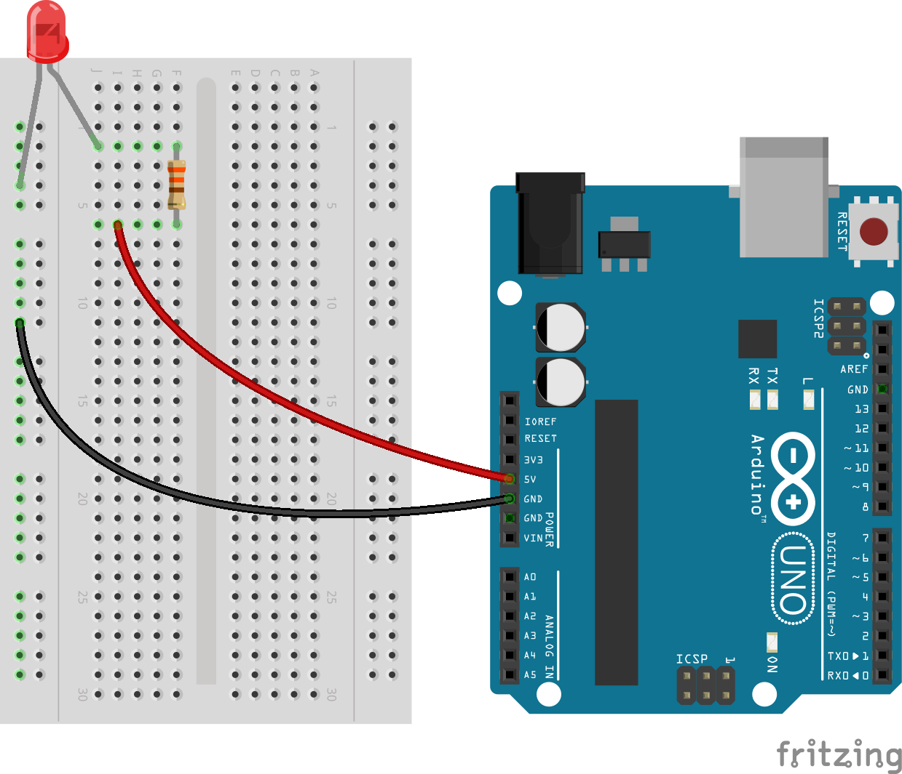


**Theory**

Electricity is mysterious

- We can predict what it will do quite accurately, but don't really understand
	it what is it
- Flow of electrons
- Electrons want to move from place of higher potential energy to place of lower potential energy
	- Like a rock or water falling from a height
	- Unlike a rock or water, electricity can only travel in a conductor
- AC vs. DC - very briefly, will discuss more as it comes up
- (Advanced)[The Big Misconception About Electricity](https://youtu.be/bHIhgxav9LY)

What makes a circuit?

- Something to provide that difference in potential 
that will cause the electrons to want to move. 
	- Typically a battery, charger, or USB port
	- The technical term is "power supply"
	- In our case your laptop via the Arduino
		- What is the Arduino doing in this case?
- Conductors to allow the electronics to move
- Components or other things that usually convert this electrical energy 
to some other form of energy (e.g. light, sound, heat, movement)
- Optionally, switches or other sensors to control the flow of energy
	- In our circuit the resistor is controlling the brightness of the LED so that it doesn't burn out

#### Schematics

Here is the schematic of what you've built


- Important part of something, 
	without getting distracted by details (e.g. subway maps)
- What's important in an electrical schematic?
	- Where is the power coming from?
	- What other components are there in the circuit?
	- How are they connected?

**Schematics are an important way to show a circuit. You will be required to
understand and use them**

#### Switches

- What if we want to turn it the LED on and off?
 	- Pull out a wire
 	- That's a switch, but a pretty inconvenient one
	- Schematic symbol of switch
	- How does it work?
		- Breaks the flow of electrons by breaking the continuous path
		- Doesn't electricity (the electrons) just flow out the end of the wire?
	- The switch can go on either side. How is this possible?

Let's use a real switch


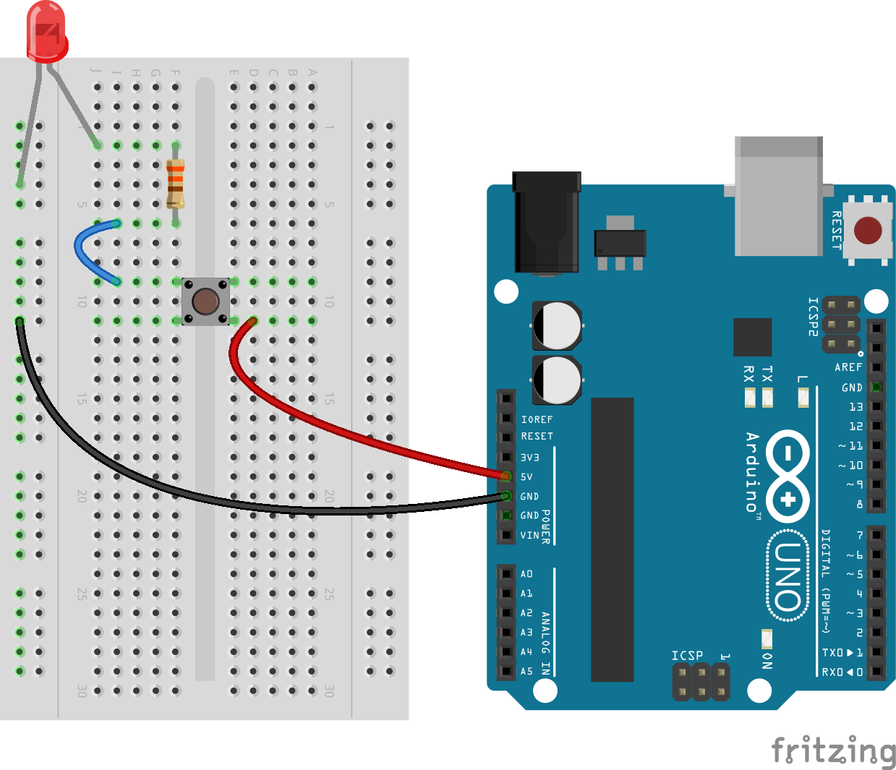

- How is this switch different from the earlier switch?
	- Schematic symbol of momentary switch
	- What was the previous "switch"?
	- Schematic symbol of toggle switch

#### Series and Parallel

- What if we put two LEDs or switches in?
- Two different ways: 

Series: All the current (electrons) must go through both components, one after
the other. 

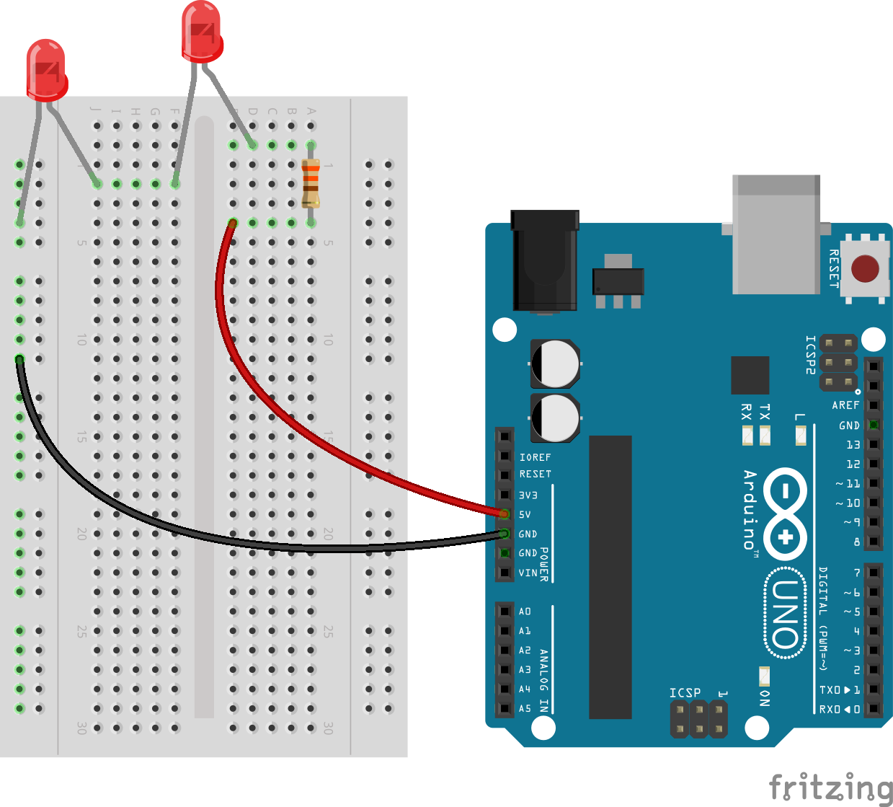

Parallel: Both components experience the same voltage difference

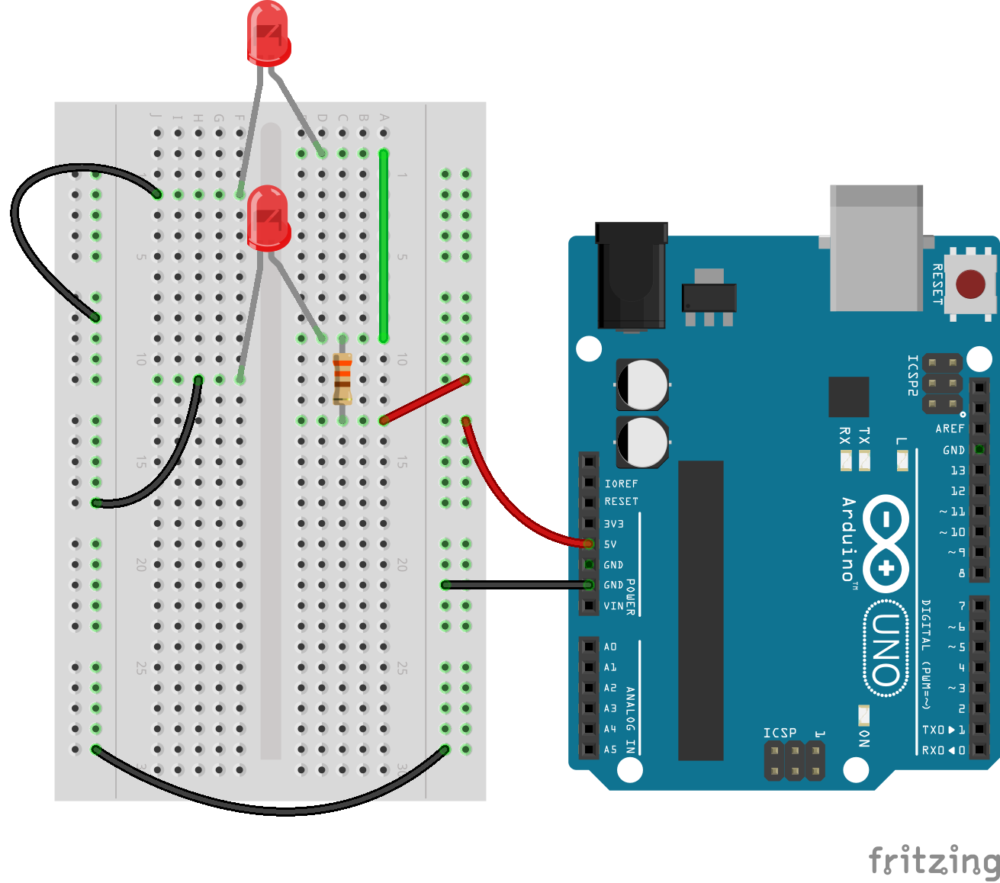

- Any components can be connected in series or parallel; not just LEDs or
	switches
- Components might be in series, or parallel, or neither
- Components in series have the same **current** flowing through them
- Components in parallel have the same **voltage** across them
- No matter how many components you have in a circuit, and how they are
	connected, they will obey these principles.

#### Ohm's law
- I=V/R
- The math only works for linear components 
	- But the principle is the same for non-linear components 
	- **is a very important concept**:
		- For a given resistance, 
			the higher the pressure (voltage), 
				the higher the current
		- For a given voltage, the higher the "resistance", 
			the lower the current


#### Arduino finally!

Make sure everything is working

- Upload the Blink example
- Change the parameter in delay()
- Upload again and verify that the LED blinks at the new rate

[Back to top](#weekly-schedule)

## Week 9

### Week 9.1 - 11/6 - Arduino Digital / Analog IO
#### Plan for today: 

- Review basic Arduino and Digital Output
- Digital Input
- Analog Input (time permitting)

#### Review basic Arduino and Digital Output

Upload File -> Examples -> Basic -> Blink example

What is going on?

- Code
- Circuit
- I/O pins
	- 20 pins
	- Arduino provides LED on pin 13
	- LED_BUILTIN = 13 

Let's extend this circuit to the breadboard:

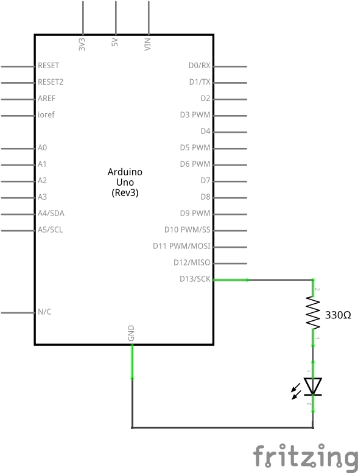
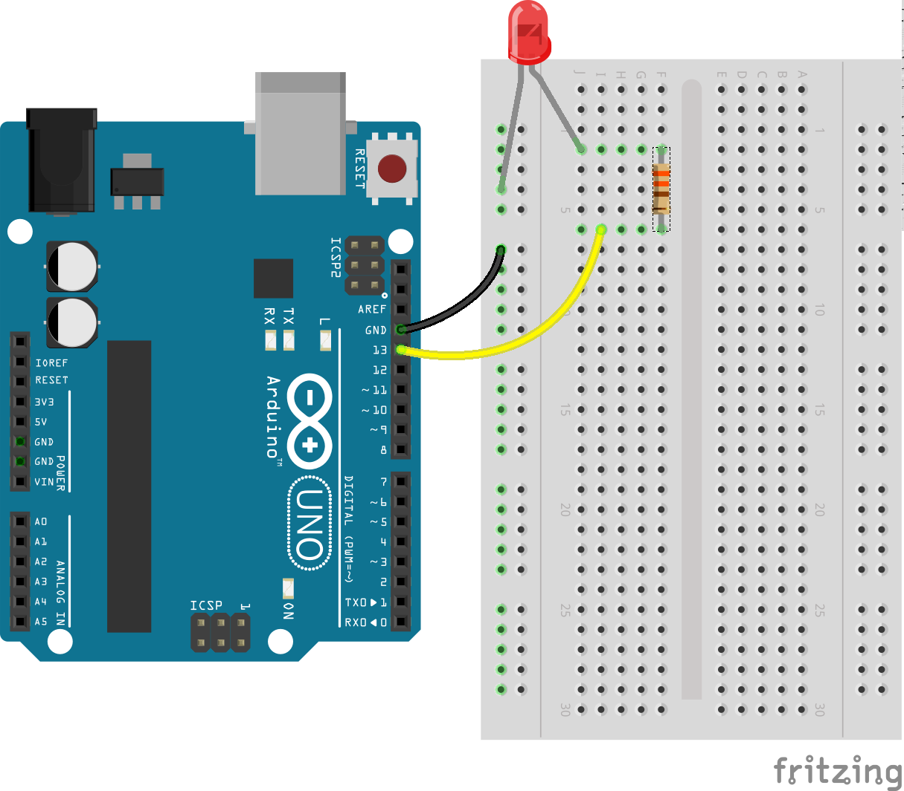

#### Digital Input

Adding a switch

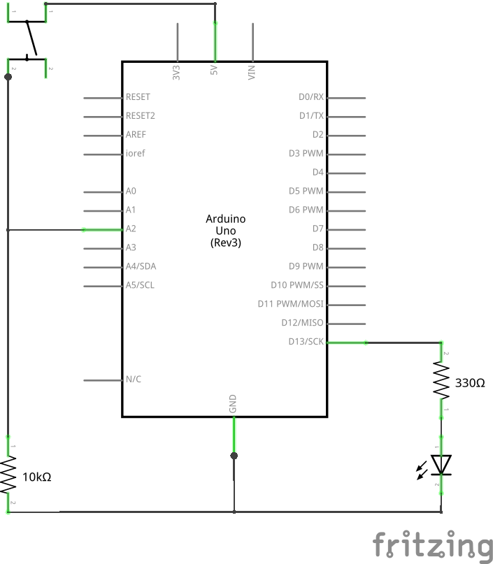
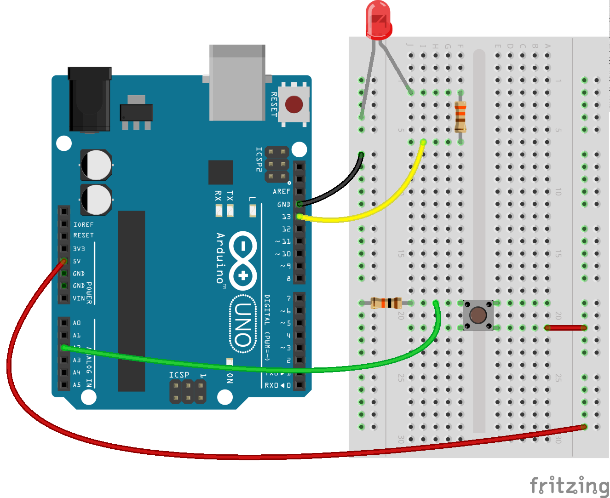

````
// Code for one switch and LEDs
// Wiring:
// - switch on Pin A2
// - LED on Pin 8
// - LED on Pin 13

void setup() {
  pinMode(8, OUTPUT);
  pinMode(13, OUTPUT);
  pinMode(A2, INPUT);
}

void loop() {

  int switchPosition = digitalRead(A2);

  if (switchPosition == HIGH) {
    digitalWrite(8, LOW);   
    digitalWrite(13, HIGH); // turn the LED on (HIGH is the voltage level)
  } else  {
    digitalWrite(8, HIGH);    
    digitalWrite(13, LOW); // turn the LED off by making the voltage LOW
  }
}
````

An example:

````

const int pushButton = A2;
const int redLEDPin = A0;
const int greenLEDPin = 8;

void setup() {
  pinMode(redLEDPin, OUTPUT);
  pinMode(greenLEDPin, OUTPUT);
}

void loop() {

  int buttonState = digitalRead(pushButton);

  if (buttonState == HIGH) {
    digitalWrite(redLEDPin, HIGH);
    digitalWrite(greenLEDPin, HIGH);
    delay(500);
    digitalWrite(greenLEDPin, LOW);
    delay(300);
    digitalWrite(redLEDPin, LOW);
    digitalWrite(greenLEDPin, HIGH);
    delay(700);
  }
  allOff();
  delay(1000);
}

void allOff() {
  digitalWrite(redLEDPin, LOW);
  digitalWrite(greenLEDPin, LOW);
}
````

Other things you can do:

Add another LED on a different pin


Add another switch on a different pin


#### In-class exercise

Now write a program that will blink different patterns depending on which
switch is pressed. 
Using two switches you can select between four patterns.
How is that possible?

### Week 9.2 - 11/8 - Arduino Programming Syntax
#### Plan for today: 
- Discuss reading
- Analog Input
- Analog Output

#### Arduino Programming Syntax
Programming in Arduino uses C/C++ with a very small number of modifications.

p5js uses JavaScript which has a syntax that's based on C. The way JavaScript
programs run is very different than programs written in C but the syntax of
the language (e.g. how `for` loops are declared) is very similar.

One of the main differences for simple Arduino programs is how variables are
declared. We need to declare the *type* of the variable, for example on the Arduino Uno a `byte`
can store a value from 0-255, an `int` can be used for values -32,768 to 32,767 and a `float` can
be used for values like -2.1 and 20332.22.

Storing a `float` in memory requires 32 bits (4 bytes). With the limited memory on
the Arduino Uno (2k bytes of RAM) it's important for us as programmers to
specify the type of each of our variables and understand how much memory they take up.

- [Arduino Syntax Cheat Sheet](https://github.com/liffiton/Arduino-Cheat-Sheet)
- [Arduino Memory](https://www.arduino.cc/en/Tutorial/Foundations/Memory)


>Notice that there's not much SRAM available in the Uno. It's easy to use it all up by having lots of strings in your program. For example, a declaration like:
>
>char message[] = "I support the Cape Wind project.";
>
>puts 33 bytes into SRAM (each character takes a byte, plus the '\0' terminator). This might not seem like a lot, but it doesn't take long to get >to 2048, especially if you have a large amount of text to send to a display, or a large lookup table, for example.


#### Analog Input

Build this circuit. Try to follow the schematic and not the breadboard view:

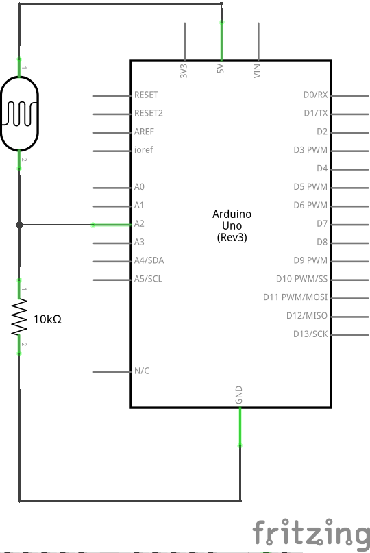
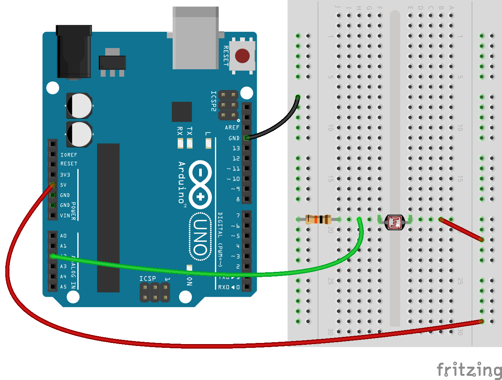

```
/*
  AnalogReadSerial

  Reads an analog input on pin 0, prints the result to the Serial Monitor.
  Graphical representation is available using Serial Plotter (Tools > Serial Plotter menu).
  Attach the center pin of a potentiometer to pin A2, and the outside pins to +5V and ground.

  This example code is in the public domain.

  https://www.arduino.cc/en/Tutorial/BuiltInExamples/AnalogReadSerial
*/

// the setup routine runs once when you press reset:
void setup() {
  // initialize serial communication at 9600 bits per second:
  Serial.begin(9600);
}

// the loop routine runs over and over again forever:
void loop() {
  // read the input on analog pin
  int sensorValue = analogRead(A2);
  // print out the value you read:
  Serial.println(sensorValue);
  delay(1);  // delay in between reads for stability
}
```

- Analogue Inputs, `analogRead()`, and (some) sensors go together
	- This only works on the six analog input pins (A0-A5)
	- Digital sensors, like a switch, have only one of two values 
	and so are more suited to a digital input
- Remember that the so-called analog input pins can do digital input and
	output as well
- Since you have so few analog input pins, when you decide which pins to use
	for which device, reserve the analog input pins for analog input devices
	as much as possible

Do you see a similarity between this circuit and 
something we learned earlier?

Some analogue sensors are resistive, some are not. 
Resistive sensors all use the same
pattern: a voltage divider.
Note the similarity to the circuit we used for a switch - 
the switch circuit is also effectively a voltage divider, one that has only
two values instead of an infinite range of values

What other sensors do we have in the kit?

Which ones are resistive?

#### Potentiometer

[Here](https://learn.sparkfun.com/tutorials/sparkfun-inventors-kit-experiment-guide---v41/circuit-1b-potentiometer)

#### Misc
- Hand drawn schematics in your homework are fine!

- Hand drawn switches can use the simple symbol
- Resources are available to help you with homework (me, Jack), but only
	if you start your homework early enough. If you wait until the last minute
	and then don't have time to get help, that is unexcusable.
- Use constants for pin numbers

#### Analog Output

- Analog Outputs, `analogWrite()`, PWM and (some) actuators go together
	- `analogWrite()` only works on the six PWM pins (3, 5, 6, 9, 10, and 11).
	- LEDs, motors, and some other actuators respond properly to PWM
	- Other actuators, like a solenoid, do not respond well to PWM and really
		should be considered digital actuators
	- Since you have so few analog outputs, when you decide which pins to use
		for which device, reserve the analog output pins for analog output devices
		as much as possible

- Not true analog voltage. PWM = Pulse Width Modulation
- Works for LEDs and motors

#### Functions that you know from p5.js which are useful here:
- `map()`
- `constrain()`
- `if()`

Remember how we used `print()` in p5.js to help us find problems in our 
program? You can do that in Arduino to but the function has a slightly
different name: `Serial.println()`
- Must be initialized `Serial.begin()`
- Can not concatenate strings with the `+` function
	- Instead, you need multiple calls to `Serial.print()` e.g.:

````
Serial.print("First value = ");
Serial.print(firstValue);
Serial.print(" Second value = ");
Serial.print(secondValue);
Serial.println();
````

Here is the program we developed at the end of class:

````
const int LED_PIN = 3;           // the PWM pin the LED is attached to
const int POT_PIN = A2;
int brightness = 0;    // how bright the LED is

// the setup routine runs once when you press reset:
void setup() {
  // declare pin 9 to be an output:
  pinMode(LED_PIN, OUTPUT);
  Serial.begin(9600);
}

// the loop routine runs over and over again forever:
void loop() {
  int pot_value = analogRead(POT_PIN); // 0-1023
  brightness = map(pot_value, 0, 1023, 255, 0);
  Serial.println(brightness);
  analogWrite(LED_PIN, brightness); // 0-255
}
````

#### In-class exercise

1. Use one of the analogue sensors to select which of two LEDs lights up
1. Use one of the analogue sensor to control how fast two LEDs alternate
1. Use a momentary switch (often called a *pushbutton* or a *button* in the
	 Arduino literature) to select a different range for mapping an analog
	 sensor to an analog output device
1. Use a potentiometer to select from 4 different behaviors of a circuit


## Week 10

### Week 10.1 - 11/13 - Schematics, Circuit conventions

#### Plan for today: 
- Schematic conventions
- Sound
- Servo motor
- PWM
- Data Types
- Circuit theory
- Examples

#### Schematics

- [How to Read a Schematic (Sparkfun)](https://learn.sparkfun.com/tutorials/how-to-read-a-schematic/all)
- Hand-drawn
  - Best way to get started! Think about your circuit, then draw it

Here is an example:

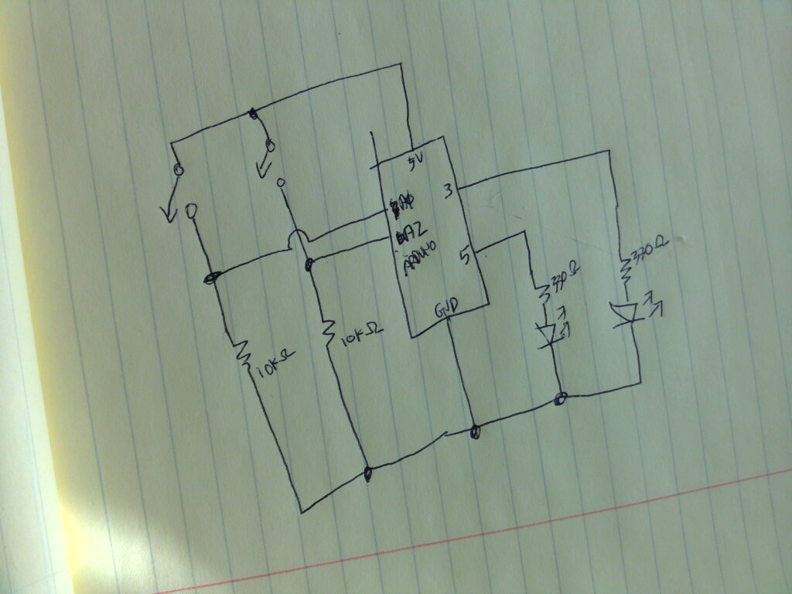

- [Fritzing](https://fritzing.org/) (~$8 download, simple)
- [KiCad](https://www.kicad.org/) (open source, complex)

#### Conventions: Schematics and Wire Colours

- When drawing schematics

	- All **sensors** on the **left**
	- All **inputs** on the **left** side of the Arduino 
	- All **actuators** on the **right**
	- All **outputs** on the **right** side of the Arduino 
	- There are exceptions e.g.
		- If using CAD you can't control where the pins are on Arduino
		- Some devices (e.g. the ultrasonic distance measuring sensor) that have
			both inputs and outputs

- When wiring your circuits

	- All **5V** connections should use **red** wire, 
	and don't use red for anything else
	- All **GND** connections should use **black** wire,
	and don't use black for anything else
		- If you run out of black you may either
			- Color some white cables black with a Sharpie
			- Dedicate green as an additional black, and then
			don't use green for anything else either
	- All other connections can use any other colors
	- If you use the buses on the sides of the breadboard
		- Red bus for 5V only
		- Black or Blue bus for GND only


#### Circuits

Some theory that might help you think about why circuits are they way they
are
- Important concepts:
	- Voltage 
		- Voltage is a relative quantity so it's always measured or identified
			relative to some other point (usually a common reference point such as
			"ground")
		- Can be thought of the "pressure" applied to the electrons
		- Analogous to holding a brick at a certain height above the floor. Relative
			to the floor, the brick has a certain amount of potential energy
		- Voltage exists whether or not there is a circuit
	- Resistance 
		- The resistance the electrons face as they try to get through
		components. 
		- Analogous to a traffic jam on a road
		- Conductors (wires) have zero resistance (for our purposes)
		- All components have some sort of "resistance"
		- Resistance is a property of a component and therefore
		exists whether or not there is a circuit
	- Current  
		- The rate of flow of electrons through a circuit (electrons/second)
		- Somewhat analogous to litres/hour or cars/hour
		- **Current only exists when there is a circuit**
- If you measure the voltage between any two points, the voltage will not
	change as you move to different places on the **wire**. 
		However if you cross
		a component the voltage might be different on the other side of the
		component
- If you measure current through components connected in 
	series the current will not change. This is because **all** the electrons
	that go through the first component have to go through the rest. No
	electrons can leave the path, and no new ones can enter.
		However if there are any branches some electrons might go on the
		branches and thus the current will drop.
- Review
- Voltage does **not** change in a conductor
	- That is why we can connect things to the same node in any order
- Voltage **does** change when you go across a component
	- That is why it is **important** to make connections to the correct side of a
		component!

### Week 10.2 - 11/15 - Sound, servos

#### Sound

**`tone()`**

- [Schematic](https://www.arduino.cc/en/Tutorial/ToneMelody)
- Before you try that code, just try 
`tone(spkrPin, 440);`
and
`tone(spkrPin, 440, 1000);`
- [Reference
page](https://www.arduino.cc/reference/en/language/functions/advanced-io/tone/)

**Notes**
- "Use of the `tone()` function will interfere with PWM output on pins 3 and 11"
	- The word "intefere" is rather vague. 
	I think they mean that it 
	prevents `analogWrite()` from working on pins 3 and 11
- The `tone()` function is *non-blocking*
- Arduino supports tabs just like in p5.js
- Arduino has arrays just like in p5.js
- What is resistor for? 
	- [What is a resistor?](https://www.atlearner.com/2020/02/what-is-resistor.html)
	- LED needs a resistor to limit current so it doesn't burn out
	- LDR needs a resistor to form a voltage divider
	- Piezo buzzer neither burns out nor needs a voltage divider
	- So why a resistor?

#### Servo motor

- [Schematic](https://www.arduino.cc/en/Tutorial/Knob)
- [Reference
page](https://www.arduino.cc/en/Reference/Servo)


**Notes**
- Use of the servo library disables `analogWrite()` (PWM) on pins 9 and 10
- The `Servo.write()` function is *non-blocking*

#### More about PWM
- How do you suppose `analogWrite()` makes an LED dimmer?
- [PWM](https://www.ekwb.com/blog/what-is-pwm-and-how-does-it-work/)
- What do `analogWrite()`, `tone()` and `Servo` have in common?
- What is sound?
- How does a servo motor
	[work](https://lastminuteengineers.com/servo-motor-arduino-tutorial/)?

**Notes**
1. You may have noticed that the built-in LED blinks 3 times when you turn on
	 your Arduino. In fact it does this every time it resets, which also happens
	 when you upload a new program. Since this LED is connected directly to pin
	 13, it means that whatever you have attached to pin 13 will be activated 3
	 times briefly whenver the Arduino resets. So, if you make a big robot, 
	 you probably should not use pin 13 for the motor
1. Pins 0 and 1 are used for communication with your laptop, and this has two
	 effects:
	1. Connecting anything to pins 0 or 1 might interfere with laptop
		 communication (which includes uploading!)
	2. Anything connected to pins 0 or 1 might be activated during
		 communication!
1. For these reasons it is best to avoid pins 0, 1, and 13. If you run out of
	 pins and need to use them there are ways around this.

#### Data Types

Unlike in p5.js, you must declare what type of data you want to store in a
variable:

- `int` - whole numbers only
- `float` - a number with a fractional part ('floating point number')
- `char` - a character
- `boolean` - only either `true` or `false`


#### In-class exercises


1. Build a circuit with a switch (pushbutton) and a servo motor, and when you
	 press the switch go to one position, when you don't press the switch go to
	 another

2. Add a piezo buzzer so that when the switch is pressed it plays a tone for
	 half a second, then a tone for another half a second as long as the switch
	 is pressed

3. Modify the code so that it plays the two tones only once when the switch is
	 pressed

4. Add an LED and make the LED change brightness according to which tone is
	 playing

5. Add a potentiometer which controls how fast the servo motor moves from one
	 position to the next

#### Examples

Some examples using the piezo speaker, servo motor, and a potentiometer:

````
// Moving the servo motor first to one position and then to another,
// and then stopping:

const int servoPin = 7;

#include <Servo.h>
Servo myservo;

void setup() {
	myservo.attach(servoPin);
	myservo.write(10);
	delay(1000);
	myservo.write(130);
}

void loop() { 
}
````

````
// Moving the servo motor first to one position and then to another,
// continuously:

const int servoPin = 7;

#include <Servo.h>
Servo myservo;

void setup() {
	myservo.attach(servoPin);
}

void loop() {
	myservo.write(10);
	delay(1000);
	myservo.write(130);
	delay(1000);
}
````

````
// Minimal example of the tone() function
// Make a tone, never stop

const int spkrPin = 7;

void setup() {
	tone(spkrPin, 440); // starts a tone on pin 7 at frequency 440
}

void loop() {
 // Arduino always needs a loop, even if it's empty
}
````

Is the `tone()` function blocking? 

````
// If tone() is a blocking function, the LED will be off while the tone sounds
// If the LED comes on as soon as the tone starts, tone() is non-blocking
const int spkrPin = 7;

void setup() {
	pinMode(LED_BUILTIN, OUTPUT);

	digitalWrite(LED_BUILTIN, LOW);
	tone(spkrPin, 440, 1500); // starts a tone and then automatically stops it after 1500 milliseconds
	digitalWrite(LED_BUILTIN, HIGH);
}

void loop() {
}
````

````
// Using a potentiometer to control the position of a servo motor

#include <Servo.h>

Servo myservo;  // create servo object to control a servo

int potpin = A0;  // analog pin used to connect the potentiometer

void setup() {
	myservo.attach(9);  // attaches the servo on pin 9 to the servo object
}

void loop() {
	int val = analogRead(potpin); // reads the value of the potentiometer (value between 0 and 1023)
	val = map(val, 0, 1023, 0, 180); // scale it for use with the servo (value between 0 and 180)
	myservo.write(val);   // sets the servo position according to the scaled value
	delay(15);            // waits for the servo to get there
}
````

````
	// Use a potentiometer to control the position of a servo motor
	// and the pitch of a tone

	#include <Servo.h>
	Servo myservo;

	void setup() {
		// initialize serial communication at 9600 bits per second:
		Serial.begin(9600);
		myservo.attach(7);
	}

	void loop() {
		// read the input on analog pin 0:
		int sensorValue = analogRead(A2);
		// print out the value you read:
		Serial.println(sensorValue);

		// servo motor stuff
		int servoPosition = map(sensorValue, 0, 1023, 0, 180);
		myservo.write(servoPosition);

		// piezo buzzer stuff
  int pitch = map(sensorValue, 0, 1023, 200, 4000);
  tone(8, pitch);

  delay(1);        // delay in between reads for stability
}
````
[Back to top](#weekly-schedule)


## Week 11

### Week 11.1 - 11/20 - Serial Communication
#### Plan for today: 
- Look at homework (musical instruments)
- Debugging
- Serial Communication


##### Debugging

If you want my help solving a problem in your assignment, do the following:
1. Figure out the simplest circuit and program that demonstrates your problem
1. Upload your schematic, code, and 
the best picture you can take of your breadboard circuit to GitHub 
1. Write a message on Discord, describing carefully
	1. What you think should happen
	1. What you observe happens

What techniques have you learned to help you find problems?


#### Serial Communication

Communicating between p5.js and Arduino
- Bidirectional communication example
	- [Week 11 Bidirectional serial communication(p5js Sketch)](https://editor.p5js.org/mangtronix/sketches/s67XC0zT4)
	- [Week 11 Arduino serial code (Arduino Sketch)](https://github.com/mangtronix/IntroductionToInteractiveMedia/blob/master/code/Week11Serial.ino)
	- [p5.web-serial library (copy to Sketch files)](https://raw.githubusercontent.com/mangtronix/IntroductionToInteractiveMedia/master/code/p5.web-serial.js)
	- [Week 11 Serial Communication Schematic](https://github.com/mangtronix/IntroductionToInteractiveMedia/blob/master/code/Week_11_Serial_schematic.png)

- Before you incorporate this in your project, first test this as it is and
	make sure you understand it
- Briefly, what this code does:
	- Arduino waits for a message from p5.  
	- Arduino expects two values separated by a comma. It uses these two values
		to control two LEDs.  
	- Arduino then reads two sensors and sends the values back to p5, separated
		by a comma.
	- p5 reads these two values from Arduino. One value controls the text color,
		the other controls the text transparency
	- p5 sends two values back to Arduino indicating if the mouse was clicked,
		and if so, which half of the screen it was in.

- Once it's working, duplicate the code and then start adapting it to your
	needs:
	- Duplicate Aaron's project so that you get the other files as well
	- Increase or decrease the amount of data that is exchanged. You may need
		more, or you may need less. 
	- Modify the data that is exchanged. You may need a digital sensor on the
		Arduino instead of an analog sensor. Similarly, on the p5 side, you may
		need something different from a mouse click or changing the text color and
		transparency.
	- Once you are reliable sending information back and forth you can start
		adding the rest of your program

- More tutorials
	- [ITP Labs serial output, bidirectional communication](https://itp.nyu.edu/physcomp/labs/#Serial_Communication)
	- [p5.js and Arduino serial communication - Send a digital sensor to a p5.js sketch (YouTube)](https://www.youtube.com/watch?v=feL_-clJQMs)
	- Note: these use a different serial library, don't mix and match code between the ITP WebSerial code and Aaron's web-serial. You need to start with one example and continue to use the same software library
 

### Week 11.2 - 11/22 - Serial communication
#### Plan for today
- Serial communication continued
  
#### In-class exercise (break class into groups of 2-3 students)

- make something that uses only one sensor  on arduino and makes the ellipse
	in p5 move on the horizontal axis, in the middle of the screen, and nothing
	on arduino is controlled by p5 
- make something that controls the LED brightness from p5 
- take the [gravity wind example](https://editor.p5js.org/aaronsherwood/sketches/I7iQrNCul) and make it so
	every time the ball bounces one led lights up and then turns off, and you
	can control the wind from one analog sensor 


#### Discussion
- What did the writer mean by Vision?
- Do you agree with the writer when he says future tech neglects the
	importance of hands?
- What are your views on if future technology should actually make use of
	hands, for the feel of it, for the sense of touch?
- What are some examples of how fingers manipulate things?
- Do you agree with the writer about how we will actually be going back and
	not modernizing or not?
- What do you think is a good way of designing the interaction for the future
	rather than extrapolating yesterday's technology?
- Is intuitive interface deeply rooted with our physiology of doing things or
	does it evolve with practice?
- Does experiential perspective helps in creating visionary designs or does it
	fades your vision?


## Week 12
### Week 12.1 - 11/27 - Motors, soldering, fabrication

#### Plan for today: 
- Discussion
- Motors
- Soldering
- Fabrication and Construction Techniques


#### Discussion of *Design Meets Disability*

1. Considering only modern day technology like your phones, can you identify
	 any "features" that are implemented to help people with certain
	 disabilities
1. Why did glasses become a matter of fashion and prostatic limbs are still
	 conservative in design, when both of them are disability aids?
1. How can we make sure that this narrative navigates towards more inclusive
	 and keep the 'design in design' for disabilities?
1. How can the language we use to address disability-wear affect our approach
	 towards such designs? E.g. eyewear vs hearing aids?
1. In the case of glasses, the author mentions “what others see is more
	 important than what you see yourself” - do you guys agree?


#### Motors

An LED can make light, what makes motion?

	=> **Electromagnetism**

Electrical devices that rely on the principle of electromagnetism:

- Electromagnets
- Loudspeakers and headphones
- Solenoid
- Relays
- All kind of motors
	- AC motors
	- DC motors
	- Brushless DC motors
	- Stepper motors
	- Servo motors (which actually consist of a DC motor + servo circuitry)

##### In-class exercise

- Take the DC motor and connect it directly to 5V and GND
- Now reverse the wires

Can we connect the motor to an Arduino output just like we did with the piezo
buzzer?
- How would we reverse it?
- Another problem: Arduino current limitations

##### Arduino current limitations

- What is current? It is the rate of flow of electrons through a conductor.
	- You don't get to control the current. 
	- The voltage depends on the current and the resistance (Ohm's law: I=V/R)
	- You can provide a voltage (with Arduino, the voltage is always 5V)
	- Each device has it's own "resistance"

Small LEDs use relatively <strong>low</strong> current (~20-30mA).
- [What is the resistance of a typical LED?](https://www.quora.com/What-is-the-resistance-of-a-typical-red-LED)

Motors have relatively <strong>low</strong> "resistance", 
and so consume <strong>high</strong> current

- Current flowing through any resistance causes heat (P = I^2/R)
- Everything has resistance

**Therefore, where electricity is flowing there will be heat**

**Heat causes damage**

(We've not had to worry about that up to now because everything we've done
uses very little current)

Arduino can not protect itself from damaged caused by overheating. 
It does not <strong>limit</strong> current, 
it is <strong>damaged</strong> by too much current

The amount of heat a component can withstand before it is damaged 
is governed, to a large extent, by its size

The transistors that make up Arduino are tiny 


(Image courtesy of SparkFun)

The reason for using the separate Motor Driver is simple:

**It has much bigger transistors**

(It also makes it easier to control both direction and speed, 
but you could do that with the Arduino alone, 
it  would just be more complicated)

In addition to the bigger transistors, the Motor Driver
includes an H-bridge which allows us to control rotation direction

Circuit Schematic

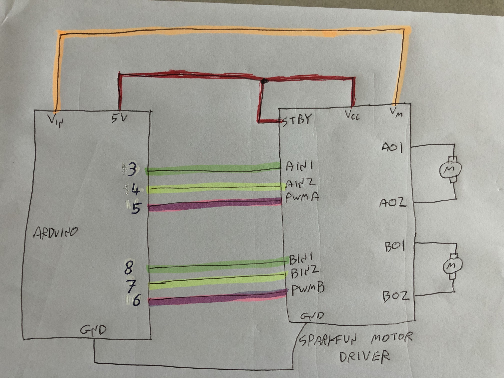

How did I choose which pins to use?
- Never use pins 0 and 1 (dedicated for USB communication)
- Avoid pin 13 if possible (it flashes 3 times on reset)
- Directional control pins (ain1, ain2, bin1, bin2) only require
	digital signals so avoid pins with extra functionality 
	(analog input, SPI, PWM)
- Inclusion of the servo library 
	disables `analogWrite()` on pins 9 and 10
	(I'm not using the servo library now but perhaps I'll add it later)
- Use of the `tone()` function 
	disables `analogWrite()` on pins 3 and 11
	(I'm not using the `tone()` function now but perhaps I'll add it later)
- This leaves PWM pins 5 and 6 for the speed controls (pwma and pwmb)
- Might as well choose nearby digital pins

[Code - Week 12 - Simple motor driver (DMA GitHub)](https://github.com/mangtronix/IntroductionToInteractiveMedia/blob/master/code/Week%2012%20-%20Simple%20Motor%20Driver/Week%2012%20-%20Simple%20Motor%20Driver.ino)


````

const int ain1Pin = 3;
const int ain2Pin = 4;
const int pwmAPin = 5;

const int bin1Pin = 8;
const int bin2Pin = 7;
const int pwmBPin = 6;


void setup() {
  pinMode(ain1Pin, OUTPUT);
  pinMode(ain2Pin, OUTPUT);
  pinMode(pwmAPin, OUTPUT); // not needed really
}

void loop() {
  // turn in one direction, full speed
  Serial.println("full speed");
  analogWrite(pwmAPin, 255);
  digitalWrite(ain1Pin, HIGH);
  digitalWrite(ain2Pin, LOW);
  // stay here for a second
  delay(1000);

  // slow down
  Serial.println("slowing down");
  int speed = 255;
  while (speed--) {
    analogWrite(pwmAPin, speed);
    delay(20);
  }
}

````

Here is the code that Noah developed to control the motor speed and
direction using a potentiometer:

[Code - Week 12 - Motor Driver - 2 channel (DMA GitHub)](https://github.com/mangtronix/IntroductionToInteractiveMedia/blob/master/code/Week%2012%20-%20Motor%20Driver%202%20channel/Week%2012%20-%20Motor%20Driver%202%20channel.ino)

````
const int ain1Pin = 3;
const int ain2Pin = 4;
const int pwmAPin = 5;

const int bin1Pin = 8;
const int bin2Pin = 7;
const int pwmBPin = 6;

const int potPin = A5;


void setup() {
  pinMode(ain1Pin, OUTPUT);
  pinMode(ain2Pin, OUTPUT);
  pinMode(pwmAPin, OUTPUT); // not needed really
}

void loop() {
  int potVal = analogRead(potPin);
  delay(20);
  if (potVal > 1023 / 2) { //counterclockwise
    digitalWrite(ain1Pin, HIGH);
    digitalWrite(ain2Pin, LOW);
    analogWrite(pwmAPin, potVal / 4);
  } else { //clockwise
    digitalWrite(ain1Pin, LOW);
    digitalWrite(ain2Pin, HIGH);
    analogWrite(pwmAPin, 255 - potVal / 4);
  }
}
````

[Sparkfun Inventor's Kit - 5a Motor Basics](https://learn.sparkfun.com/tutorials/sparkfun-inventors-kit-experiment-guide---v41/circuit-5a-motor-basics)
- Tutorial for using motor driver board to control yellow geared motor

[Sparkfun Inventor's Kit - 5C: Autonomous Robot](https://learn.sparkfun.com/tutorials/sparkfun-inventors-kit-experiment-guide---v41/circuit-5c-autonomous-robot)
- Set your Arduino free to roam!


[Back to top](#weekly-schedule)

### Week 12.2 - 11/29 - NO CLASS - Legislative Friday

[Back to top](#weekly-schedule)

## Week 13
### Week 13.1 - 12/4 - NO CLASS - Holiday!

### Week 13.2 - 12/6 - Debugging, look at final projects, work session
- Look at final project plans
  - Example final projects
    - [Are you stressed?](https://intro.nyuadim.com/author/az2177/)
    - [Friendship lamp](https://intro.nyuadim.com/author/ftt4473/)
- Any projects with special requirements?
  - Book equipment now (last chance to book is Monday Dec 11)
- Questions about serial connections?
- Work session
- Document / post your progress
- Conduct user testing (see main page for description / documentation requirement)

- [Building with Cardboard (pdf)](https://714b93b6-8f08-4438-a192-33c8b6312170.filesusr.com/ugd/534455_ad6ffb237afc468da86e74f6bdc07fbf.pdf)
  - [Adaptive Design Association](https://www.adaptivedesign.org/) - A nonprofit building custom adaptations, nurturing communities, and challenging assumptions about disability

- Running sketch fullscreen
  - [p5js fullscreen()](https://p5js.org/reference/#/p5/fullscreen) 
  - [Responsive fullscreen (p5js sketch)](https://editor.p5js.org/mangtronix/sketches/t4G0erH1B)
    - Press 'f' to go fullscreen - sketch automatically resizes to full screen size

- Blink without `delay()`
- How to use a Digital Multimeter (DMM) 
- Soldering
  - [Adafruit Guide to Excellent Soldering](https://learn.adafruit.com/adafruit-guide-excellent-soldering)
  - Soldering demo - button to solid core wires
- Work on projects


##### Blink Without `delay()`

Why do we need this? 
- To get rid of `delay()`

What problem does `delay()` cause? 
- **`delay()` is a blocking function. 
Whenever your program encounters `delay()`, 
your program stops until the delay is finished**

For example, how would you
- Blink LEDs at different rates
- Blink an LED while playing a tune
- Play a tune while moving a servo motor
- Do anything while responding to sensors immediately


[Tutorial](https://www.arduino.cc/en/Tutorial/BlinkWithoutDelay)

So much for blinking. What if we want to move a servo motor at the same time?

Adafruit [Multitasking Tutorial Part
I](https://learn.adafruit.com/multi-tasking-the-arduino-part-1?view=all)

Play a melody and blink an LED 
without using `delay()`:
[toneMelodyAndBlinkWithoutDelay](https://github.com/michaelshiloh/toneMelodyAndBlinkWithoutDelay)

#### How to use a Digital Multimeter (DMM) 

- The three most useful measurements
	- Continuity
		- Checking connections
		- Checking switches
	- Voltage
		- Checking sensor circuits
		- Checking Arduino digital outputs
	- Resistance
		- Checking resistive sensors
		- Checking motors
- How to connect to Arduino pins or the solderless breadboard

### Legislative MONDAY - Sunday 12/10 - TBD
- TBD - 5-6:15pm debugging session?

## Week 14
### Week 14.1 - 12/11 - Final project work / debugging session
- IM Show gameplan
- Work on final projects
- Ask any questions now!
- Your project must be working at start of next class for presentations

### Week 14.2 - 12/13 - Final project presentations

#### Plan for today:
- Course feedback
  - Please fill out Intro to IM Course Feedback Questionnaire]
- Final project presentations
  
## IM Show
Friday December 15, 3-6pm

- **Exhibit** your project in the IM End of Semester Show
- **Deinstall** your work at end of show


### Timeline
- Thursday Dec 14 - Class setup - 4-6pm in the Arts Center Lobby
  - Set up and test equipment, resolve any problems
  - Batool,  not at 4pm
- Friday Dec 15 - IM End of Semester Show - 3-6pm
  - 12-2:30pm - Prayer time
  - 2:30pm - Get installation running
  - 3-5pm Installations open for viewing
  - 5-5:45pm Performances in the Black Box
  - 5:45pm Closing ceremony - group picture
  - 6pm - Cleanup, return equipment to EC, help move tables
- Have a great summer!


[Back to top](#weekly-schedule) 
