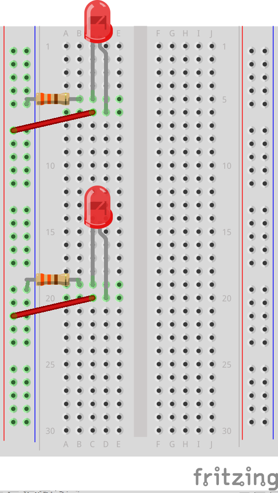
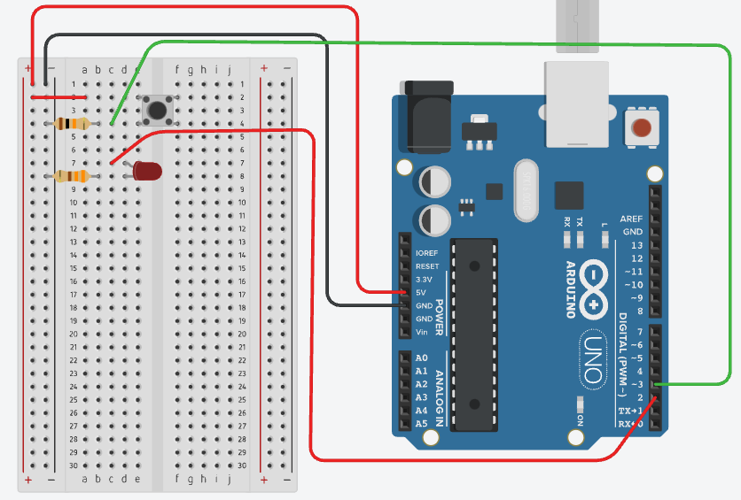

# Aaron's's Intro to IM - Lecture Notes #

[p5js Example Sketches](https://editor.p5js.org/aaronsherwood/collections/BKHiAiMtG)

## Weekly Schedule 
- [Week 1](#week-1) - Introductions, p5.js, variables
- [Week 2](#week-2) - Animation, conditionals, loops
- [Week 3](#week-3) - Functions, arrays, object oriented programming (OOP)
- [Week 4](#week-4) - Working with text
- [Week 5](#week-5) - Working with pixels, sound
- [Week 6](#week-6) - Computer Vision
- [Week 7](#week-7) - Midterm presentations
- SPRING BREAK
- [Week 8](#week-8) - Introduction to Arduino, electricity, No class Mar 19 (1st class back is Mar 21)
- [Week 9](#week-9) - Digital I/O
- [Week 10](#week-10) - Analog I/O
- [Week 11](#week-11) - Sound, servo
- [Week 12](#week-12) - Connecting Arduino to p5.js
- [Week 13](#week-13) - Motors
- [Week 14](#week-14) - Final project due, course review
- [IM Show](#im-show) - IM End of Semester Show


## Week 1

### Week 1.1 - Jan 23

#### Introductions
- Who am I?? [https://aaron-sherwood.com/](https://aaron-sherwood.com/)

#### What’s the class about?

<ul>
 	<li>
Digital computation beyond computers (sometimes called "physical computing") considering humanistic needs in design and usability</li>
 	<li>
Computers traditionally lacked knowledge of outside world beyond a keyboard, mouse</li>
<li>Look critically at products and designs</li>
 	<li>
As artists and designers, we can explore new paradigms of interaction with machines and each other</li>
 	<li>
Relatively easily and inexpensively explore creative computation through open source software and hardware</li>
 	<li>
No background needed, strong DIY attitude</li>
 	<li>
Low barrier to entry, high ceiling</li>
</ul>

#### Red Burns advice to new students
[Let's Stop Focusing on Shiny Gadgets and Start Using Tech to Empower People](https://www.wired.com/2013/09/focus-on-people-not-tech-and-other-impt-lessons-for-interaction-design-and-life/)

**What I hope for you:**

That you combine that edgy mixture of self-confidence and doubt.

That you have enough self-confidence to try new things.

That you have enough self doubt to question.

That you think of technology as a verb, not a noun; it is subtle but important difference.

That you remember the issues are usually not technical.

That you create opportunities to improvise.

That you provoke it. That you expect it.

That you make visible what, without you, might never have been seen.

That you communicate emotion.

That you create images that might take a writer ten pages to write.

That you observe, imagine and create.

That you look for the question, not the solution.

That you are not seduced by speed and power.

That you don’t see the world as a market, but rather a place that people live in -- you are designing for people, not machines.

That you have a stake in magic and mystery and art.

That sometimes we fall back on Rousseau and separate mind from body.

That you understand the value of pictures, words, and critical thinking.

That poetry drives you, not hardware.

That you are willing to risk, make mistakes, and learn from failure.

That you develop a practice founded in critical reflection.

That you build a bridge between theory and practice.

That you embrace the unexpected.

That you value serendipity.

That you reinvent and re-imagine.

That you listen. That you ask questions. That you speculate and experiment.

That you play. That you are spontaneous. That you collaborate.

That you welcome students from other parts of the world and understand we don’t live in a monolithic world.

That each day is magic for you.

That you turn your thinking upside down.

That you make whole pieces out of disparate parts.

That you find what makes the difference.

That your curiosity knows no bounds.

That you understand what looks easy is hard.

That you imagine and re-imagine.

That you develop a moral compass.

That you welcome loners, cellists, and poets.

That you are flexible. That you are open.

That you can laugh at yourself. That you are kind.

#### Example
- [red circles interaction](https://vimeo.com/14633259)
- [music capacitive touch wall](https://www.youtube.com/watch?v=RG5Fi-eCLbc&ab_channel=raonsquare)
- [range finder music wall](https://www.youtube.com/watch?v=hP36xoPXDnM&ab_channel=VoicesofU)
- [mirror following](https://vimeo.com/9852175)
- [bubble blowing](http://intro18spring.nyuadim.com/2018/03/01/midterm-bubble-blowing-machine/)
- [interactive totoro](https://vimeo.com/325303174)
- [interactive stairs](https://www.behance.net/gallery/88193739/Musical-Stairs-An-Interactive-Installation)

#### Administration
- Website
- Syllabus etc.
- Reading discussions
- Video's on Wordpress

#### Homework (due before next class)
- Join the Discord server (optional, recommended)
- Log into the class Wordpress using your user account. If you have problems let me know
- Create an account on [p5js.org](https://p5js.org/)


### Week 1.2 - Jan 25

#### Let's get started
- What is p5.js?
  - [https://p5js.org/](https://p5js.org/)
  - [Getting started with p5.js](https://p5js.org/get-started/)
  - [Learn p5.js](https://p5js.org/learn/)
    - [Color](https://p5js.org/learn/color.html)
    - [Co-ordinate system and shapes](https://p5js.org/learn/coordinate-system-and-shapes.html)
    - [Curves](https://p5js.org/learn/curves.html)
    - [Interactivity](https://p5js.org/learn/interactivity.html)
    - [Program Flow](https://p5js.org/learn/program-flow.html)
    - [Debugging](https://p5js.org/learn/debugging.html)
  - [Programming with p5.js videos (Coding Train)](https://www.youtube.com/playlist?list=PLRqwX-V7Uu6Zy51Q-x9tMWIv9cueOFTFA)
    - [p5.js Web Editor (Coding Train)](https://www.youtube.com/playlist?list=PLRqwX-V7Uu6Zy51Q-x9tMWIv9cueOFTFA)
    - [Shapes and Drawing (Coding Train)](https://www.youtube.com/watch?v=c3TeLi6Ns1E&list=PLRqwX-V7Uu6Zy51Q-x9tMWIv9cueOFTFA&index=5)
    - [Color (Coding Train)](https://www.youtube.com/watch?v=riiJTF5-N7c&list=PLRqwX-V7Uu6Zy51Q-x9tMWIv9cueOFTFA&index=6)

##### Simple shapes in p5.js

Open [p5.js editor](https://editor.p5js.org/)

- `ellipse()`
- `rect()`
- `createCanvas()`
- `triangle(x1, y1, x2, y2, x3, y3)`
- `line()`
- `point()`

What does this all mean?
- Functions
- Arguments or parameters

Controlling color, fill, and stroke

- `stroke()`
- `noStroke()`
- `fill()`
- `arc(100, 100, 100, 100, 0, 180)`
- `arc(100, 100, 100, 100, 0, radians(180), CHORD)`

Here is the example program:

````
////////////////////////////////////////////////
// global variables:
// they're being declared and initialized
// outside of functions
// though they could be initialized in a function
// but will always have to be declared outside
////////////////////////////////////////////////

let trianglePosX = 100;
let trianglePosY = 200;
let circlePosX = 0;
let speed = 5;

function setup() {
  createCanvas(600, 400);

  ////////////////////////////////////////////////
  // print will print info to the console
  print(trianglePosX);
  ////////////////////////////////////////////////
}

function draw() {
  background(255);
  
  ////////////////////////////////////////////////
  // UNCOMMENT BELOW FOR THE VARIOUS EXAMPLES
  ////////////////////////////////////////////////

  ////////////////////////////////////////////////
  // simple drawing
  ////////////////////////////////////////////////
  
  noStroke();
  fill(0, 255, 0);
  rect(200, 200, 150, 150);
  
  ////////////////////////////////////////////////
  // ellipse and circle
  ////////////////////////////////////////////////
  
  //   fill(255, 120, 0, 200);
  //   ellipse(width / 2, height / 2, width / 4, height / 4);

  //   fill(255, 0, 0, 100);
  //   circle(width / 2, height / 2, height / 2);
  
  ////////////////////////////////////////////////
  // line only has stroke
  ////////////////////////////////////////////////

  //   stroke(255, 120, 0);
  //   line(0, height / 2, width, height / 2);

  ////////////////////////////////////////////////
  // variables are helpful to move a shape around
  ////////////////////////////////////////////////
  
  //   noStroke();
  //   fill(255);
  //   trianglePosX = mouseX;
  //   trianglePosY = mouseY;
  //   triangle(
  //     trianglePosX,
  //     trianglePosY,
  //     trianglePosX,
  //     trianglePosY + 100,
  //     trianglePosX + 100,
  //     trianglePosY + 100
  //   );
  
  ////////////////////////////////////////////////
  // an arc draws part of a circle
  ////////////////////////////////////////////////

  // arc(width/2, height/2, 100, 100, PI, 5, PIE);

  // noStroke();
  // fill(255, 120, 0, 200);
  // circle(circlePosX, height / 2, width / 4);
  
  ////////////////////////////////////////////////
  // add a number to the circle's x position to
  // make it move across the screen
  ////////////////////////////////////////////////

  // circlePosX = circlePosX + speed;

  // if (circlePosX > width) {
  //   circlePosX = 0;
  // }
}


````
**Notes**
- Built-in variables
	- `width`, `height`, `mouseX`, `mouseY`
	- many others; we will discover more as we go along

**Create an account on p5js.org so you can save your sketches!**
Sketches will be submitted by making a blog post and submitting through Brightspace (in future weeks)
	
##### Sharing your sketch
- [How to embed your P5js sketch directly into a blog post](https://intro.nyuadim.com/2022/01/06/how-to-embed-a-p5js-sketch-in-your-blog-post/)
- Code snippets in blog post

- Uploading files to web editor
  - Click triangle next to "Sketch Files" and click "Upload file"
  - [p5.js Web Editor: Uploading Media Files (Coding Train)](https://www.youtube.com/watch?v=rO6M5hj0V-o)
  - [Load image example sketch (p5js Editor)](https://editor.p5js.org/mangtronix/sketches/xw78_aQeb)

##### Variables

p5.js Links
- [Variables](https://p5js.org/examples/data-variables.html)
- [True and False](https://p5js.org/examples/data-true-and-false.html)
- [Variable Scope](https://p5js.org/examples/data-variable-scope.html)
- [Array](https://p5js.org/examples/arrays-array.html)
- [Mouse Functions](https://p5js.org/examples/input-mouse-functions.html)
  - Example of storing a value in a variable

- Javascript is not a typed language: you don't need to declare
	a variable's type
- `let myNumber = 4.5;`
- `let myString = "the quick brown fox";`
- `let myArray = ["the", "quick", "brown", "fox"];`
- `let myRandomNumber = random(255);`
- `let myRandomNumber = round(random(255));`
How can we find out what a variable's value is?
`print()` 

##### Animation

p5.js Links
- [Setup and Draw](https://p5js.org/examples/structure-setup-and-draw.html)
- [Width and Height](https://p5js.org/examples/structure-width-and-height.html)


Use the `draw()` function to draw something different in each frame. This can
be the location of a shape but you can manipulate anything such as color also:

The  `draw()` function is called once per frame. Think of it as drawing a new
page on a ["flip book"](https://en.wikipedia.org/wiki/Flip_book)

````
let foo = 0;

function setup() {
  createCanvas(300, 300);
}

function draw() {
  ellipse(foo, 50, 40, 40);
  foo = foo + 1;
}
````

By default, the previous frame is not erased. Sometimes this is useful.
Use the `background()` function to "paint" over any previous drawings. 

````
function setup() {
  createCanvas(500, 500);
}

let triangleTopLeftX = 0;
let redValue = 255;

function draw() {
  // erase previous drawings
  background(10, 255, 255);

  // Move the triangle
  triangleTopLeftX = triangleTopLeftX + 1;

	// If the triangle reaches the right edge, move to the left edge
  if (triangleTopLeftX >= width) {
    triangleTopLeftX = 0;
  }

  // Change the value of red
  redValue = redValue - 1;

	//If red reaches a certian level, reset it
  if (redValue === 55) {
		redValue = 255;
	}

  // Select the fill for the triangle
  fill(redValue, redValue - 100, redValue - 100);

  // Draw the triangle
  triangle(
    triangleTopLeftX,
    20, // top left corner
    triangleTopLeftX + 100,
    30, // top right corner
    triangleTopLeftX + 50,
    200
  ); // bottom corner
  
  // Select the fill for the circle
  fill(10,20, 240);

  // Draw the circle
  circle(mouseX, mouseY, 30);
  print("mouse coordinates = " + mouseX + ", " + mouseY);
}

````

##### Notes:

- Local vs. Global variables
- Built-in variables

````
// Example usage of a global variable

let count; // this is now a global variable

function setup() {
  circle(50, 50, 30);
  count = 7; // the variable is initialized here
}

function draw() {
  count = count + 1; // not algebra!
  // The result of the right hand side calculation
  // replaces whatever value was stored in the variable
  // on the left side of the '=' sign
  // end result: the variable "count" is incremented by 1

  print (count);
}
````

##### What is `frameRate()`?

````
function setup() {
  frameRate(10);       // frameRate() is a function
  print(frameRate()); // it takes awhile for the frame rate to change
}

function draw() {
  print(frameRate());
}
````

##### Additional resources
Refer to these for additional information
- [Programming with p5.js for Beginners (Coding Train Videos)](https://www.youtube.com/playlist?list=PLRqwX-V7Uu6Zy51Q-x9tMWIv9cueOFTFA)
- [JavaScript Programming Tutorial (w3schools)](https://www.w3schools.com/js/default.asp)
- [JavaScript Loops Explained](https://www.freecodecamp.org/news/javascript-loops-explained-for-loop-for/)

[Back to top](#weekly-schedule)


## Week 2

### Week 2.1 - 1/30

Overview:
- Readings
- Review
- Loops
- Homework assignment + reading

##### Readings
Each week there will be assigned reading. You need to read / watch the material before the start of
Monday's class and post a response. We will discuss the readings in groups in class.

[Explanation of in-class discussion (Syllabus)](https://intro.nyuadim.com/syllabus/#studentled)

[Week 2 - Random shuffle group (p5js)](https://editor.p5js.org/aaronsherwood/sketches/stJyUVRV9) - Choosing discussion groups

[List of readings (Weekly Schedule)](https://intro.nyuadim.com/)


##### Review

- conditionals 

````
function setup() {
  createCanvas(300, 300);
}

function draw() {
  if (mouseIsPressed === true) {
    background(color(0, 0, 255));
  } else {
    background(color(200, 0, 0));
  }
}
````

**Notes**:
1. `mouseIsPressed` is another built-in variable. There are many others.
1. `mouseIsPressed` is a new type of data, namely a `boolean`, 
	which means it has
	 only one of two values, `true` or `false`
1. Note that `{` and `}` indicate the blocks
1. The `else` part of an `if()` statement is optional (what happens if we
	 remove it?)

In class exercise:
- Using the cursor to draw
- Now use a mouse press to clear the screen
- Clear the screen if the mouse is pressed inside a certain circle
- Combine these to create a primitive painting program

##### Loops
`while()` is like `if()` but it keeps on doing it as long as condition is true

````
function setup() {
  createCanvas(300, 300);

  let foo = 50; // create and initialize a variable

  while (foo < width) { // keep going as long as the condition is true
    ellipse(foo, 50, 40, 40);
		// modify the variable so something different happens next time
    foo = foo + 50; 
  }
}
````

1. You should get in the habit of giving meaningful names to your variables.
	1. What is a better name for the variable foo?
1. What would happen if you replace the `while()` with `if()`?

There is another way to make a loop using the keyword `for()`. The `for()`
loop structure combines the initialization step and the incrementation step
into the `for()` loop construction:

````
function setup() {
  createCanvas(300, 300);

  // initialization, condition, and incrementation all in one line
  for (let foo = 50; foo < width; foo = foo + 50)  {
    ellipse(foo, 50, 40, 40);
  }
}
````

Which should you use? Whichever is easier for you to understand. Remember that
**most of the time spent programming is fixing problems**, and **whatever you
understand best will probably have fewer problems**.

Both `for()` loops and `while()` loops can be nested, meaning a loop inside a
loop:

````

function setup() {
  createCanvas(700, 700);
  background(230);
  fill(0);

  let yPos = 0;
  let xPos = 0;

  for (yPos = 30; yPos < height; yPos=yPos + 40) {
    for (xPos = 20; xPos<width; xPos=xPos + 40) {
      circle(xPos,yPos, 5);
    }
  }
}

````

#### Variable Scope (again)

````
let foo;  // this is a global variable, visible in all functions

function setup() {
  foo = 7;
}

function draw() {

  print(foo);

  let bar; // this is a local variable, visible only inside of draw()

  for (let i = 0; i < width/2; i++) { 
    // i is a local variable visible only inside this for() loop
    ellipse(i, height/2, 10,15);
  }
}
````

### Readings / Class Discussion
- Readings are listed on the [main page](https://intro.nyuadim.com/)

### Debugging
- [p5js Field Guide to Debugging](https://p5js.org/learn/debugging.html)
- [Debugging (Happy Coding)](https://happycoding.io/tutorials/p5js/debugging)

#### Week 2.1 Additional Resources
- [Programming with p5.js for Beginners (Coding Train Videos)](https://www.youtube.com/playlist?list=PLRqwX-V7Uu6Zy51Q-x9tMWIv9cueOFTFA)
- [JavaScript Programming Tutorial (w3schools)](https://www.w3schools.com/js/default.asp)
- [JavaScript Loops Explained](https://www.freecodecamp.org/news/javascript-loops-explained-for-loop-for/)
- [p5.js rotate (p5js reference)](https://p5js.org/reference/#/p5/rotate)
- [p5js transformations (Gene Kogan)](https://genekogan.com/code/p5js-transformations/)
  - Running examples of transformations
- [9.1: Transformations Pt.1 (Translate, Rotate, Push/Pop) - p5.js Tutorial (Dan Shiffman YouTube)](https://www.youtube.com/watch?v=o9sgjuh-CBM)
- [Intro to IM Sketch Collection (p5 web editor)](https://editor.p5js.org/mangtronix/collections/A3JbliQrM)


### Week 2.2 - Feb 1

##### Artwork examples
- [Vera Molnar](https://magazine.artland.com/vera-molnar/)
- [Manfred Mohr](http://www.emohr.com/)

Transformations:
- Push Pop: need to do this before and after any transformation
- Translate changes teh coordinate system so that 0,0 is in a new location
- Rotate revolves around 0,0, so need to translate before doing rotate
- Rotate takes radians as a parameter (remember radians define a circle being inbetween 0 and TWO_PI)

  ````
  let x = 20;
  let y = 100;
  let angle = PI;

  push();
  translate(x,y);
  rotate(angle);
  rect(0,0,50,50);
  pop();
  ````

- Random takes either one number, which will give you psuedo-random numbers between 0 and that number, or two numbers, which will give you psuedo-random numbers between the two numbers provided.
- Noise, developed by Ken Perlin, gives us random numbers that have some relationship to the other that came before. This allows us to create random-ness where we can still recognize patterns (think the leaves on a tree for example). Noise gives numbers out between 0 and 1, so it is easily scalable. The number we put into noise needs to be changing at the same rate to get proper results out of noise. frameCount is good for this, though increasing by integers is usually too large, so scaling frameCount down is important.
  ````
  let rectY = noise(frameCount*0.01) * height;
  ````
- Noise can take up to three parameters, which will give it some more individuality when used in a foor loop (for example):
  ````
  for (let x=0; x<width; x++){
     let noiseValue = noise(frameCount * 0.01, x * 0.001);
    // then change the range from 0 to 1 into -0.5 to 0.5
    // then multiply that by 100 to get values that are between -50 and 50
    let scaledNoise = (noiseValue - 0.5) * 100;
    // add that to our rect's y location
    rect(x, yLoc + scaledNoise, rectWidth, rectHeight);
  }
  ````

  [Noise Rects example in class P5 editor](https://editor.p5js.org/aaronsherwood/sketches/E62Nup5TP)

  [Nested For Loop P5 editor](https://editor.p5js.org/aaronsherwood/sketches/Qpcx02Z57)

**Notes**
- Operator precedence is [very
	complicated](https://developer.mozilla.org/en-US/docs/Web/JavaScript/Reference/Operators/Operator_Precedence). It is best to put parenthesis to
	force the order you want.

[Back to top](#weekly-schedule)


## Week 3

### Week 3.1 - Feb 6

#### Topics today
- Reading discussion
- Look at homework
- Functions
- Arrays
- Object Oriented Programming
  - [Class Syntax](https://javascript.info/class)

Artist we looked at in class:
- [Ryoichi Kurokawa](https://www.ryoichikurokawa.com/project.html)
- [Jared Tarbell](http://www.complexification.net/gallery/) (co-founder of Etsy)
- [Casey Reas](https://reas.com/)

  ##### Functions

Any questions about what we've covered already?

Functions that return a value: See the [reference page for
`return`](https://p5js.org/reference/#/p5/return)

**Notes**
- Functions can take any number of arguments (or none), but can return at most
one

In class exercise:

1. Write a function that will take a single parameter
and draw a vertical line from the top of the canvas to the bottom
at the X coordinate indicated by the parameter
	1. In the `setup()` function test your function 
	at a couple of different locations
1. Write another function that will draw a **horizontal** line
at the indicated **Y** coordinate
	1. Test as before
1. Using these two functions, write a program in `setup()`
that draws a grid of lines at regular intervals on the canvas

#### Callback Functions / Event Handlers

`mouseClicked()` [example](https://p5js.org/reference/#/p5/mouseClicked) in
the reference section

**Notes**
- You never have to call **callback functions**. The p5.js system calls them
	for you when that event happens
	
See [Program flow](https://p5js.org/learn/program-flow.html) for more examples of callback functions and event handlers.

````
const redLocationX = 40;
const redLocationY = 40;

const blueLocationX = 80;
const blueLocationY = 40;

const menuSizeX = 120
const menuSizeY = 80;

const circleDiameter = 40;
const backgroundColor = 240;

function setup() {
  createCanvas(400,400);

  //prepare background
  background(backgroundColor);

  // Put a box around the menu. We won't be allowed to draw here
  rect(0,0, menuSizeX, menuSizeY);

  // draw red circle
  fill (255,0,0);
  circle(redLocationX, redLocationY, circleDiameter);

  // now blue
  fill (0, 0, 255);
  circle(blueLocationX, blueLocationY, circleDiameter);

  // initialize fill to green
  fill (0, 255, 0);

  // turn off stroke
  noStroke();

  // faster refresh rate makes line more solid
  frameRate(200);
}

function draw() {

  if (mouseIsPressed &&
      !mouseIsWithinRect(0, 0, menuSizeX, menuSizeY)) {
    circle(mouseX, mouseY, 15);
  }
}

function mouseClicked() {

   // Have we chosen red?
  if (mouseIsWithinCircle(redLocationX, redLocationY, circleDiameter/2)) {
    console.log("you chose red!");
    fill (255,0,0);
  }

  // Have we chosen blue?
  if (mouseIsWithinCircle(blueLocationX, blueLocationY, circleDiameter/2)) {
    console.log("you chose blue!");
    fill (0, 0, 255);
  }

}

function mouseIsWithinCircle( x, y, radius) {
  if (dist(mouseX, mouseY, x, y) < radius) {
    return true;
  }
  return false;
}

function mouseIsWithinRect( x, y, sizeX, sizeY) {
  if (mouseX > x &&
      mouseX < x + sizeX &&
      mouseY > y &&
      mouseY < y + sizeY) {
    return true;
  }
  return false;
}

````

#### Arrays

Very simply, arrays let you store multiple things under one variable name, and
let you identify which thing you want by using an `index`

- [JavaScript Array Reference (w3schools)](https://www.w3schools.com/jsref/jsref_obj_array.asp)
- [Arrays Example (p5editor)](https://editor.p5js.org/mangtronix/sketches/RgFNsZcxI)

````
function setup() {
  const numberOfValues = 10;

  let values = []

  let n = 0;
  while (n < numberOfValues ) {
    values.push( n * n );
    n = n + 1;
  }

  for (let i = 0; i < values.length; i++) {
    print(values[i]);
  }
}
````

**Things to notice**

- Similar to the way functions are signified by `()`, 
	arrays are signified by `[]`
- Arrays can be of any data type, but can't be mixed types
- New keyword: `const` 
- Why not just use ten "normal" variables?
- Arrays and loops (either `for()` or `while()`) almost always show up
  together. If you have an array, you almost always want a loop.
- Note that the `while()` loop used to put the numbers into the array
	is exactly the same as the `for()` loop used to print the array. I could
	have used either in both places. I did this to show you that they are
	interchangeable.
	
- Some ways to iterate over an array
  - [JS Loop For (w3schools)](https://www.w3schools.com/js/js_loop_for.asp)
  - [JS Loop For Of (w3schools)](https://www.w3schools.com/js/js_loop_forof.asp)


#### Object Oriented Programming (OOP)

- [JavaScript Classes (w3schools)](https://www.w3schools.com/js/js_classes.asp)
- [Classes (MDN)](https://developer.mozilla.org/en-US/docs/Web/JavaScript/Reference/Classes)

Built a simple class with a sine wave moving circles around on screen:
- [Week 3 - Simple Sine Circle OOP](https://editor.p5js.org/aaronsherwood/sketches/QEoQ5QXxr)


### Week 3.2 - Feb 8

#### Plan for today

- In class exercise to change this car sketch into a class and have many cars going:
 - [Basic Car](https://editor.p5js.org/aaronsherwood/sketches/eYFQE9EZa)

Simple physics: just as we add veloticy to position, we can add acceleration to velocity. We can simulate a simple drag effect by scaling down velocity every frame. After using acceleration it should be reset to 0 every frame; You can experiment with adding different forces by setting acceleration.

````
velocity += acceleration;
posX += velocity;
velocity *= 0.9;
acceleration *= 0;
````

[Simple Phyics P5 sketch](https://editor.p5js.org/aaronsherwood/sketches/-J2A-1epn)

Additional p5js resources:
- [Programming with p5.js (Coding Train)](https://www.youtube.com/playlist?list=PLRqwX-V7Uu6Zy51Q-x9tMWIv9cueOFTFA)
- [Introduction to p5.js](https://medium.com/comsystoreply/introduction-to-p5-js-9a7da09f20aa)

  [Back to top](#weekly-schedule)

## Week 4

### Week 4.1 - Feb 13
#### Plan for today: 

- Finish Car OOP Exercise
- Look at homework
- Discuss Reading
- Working with text

Working Text and Data Examples:

- [Feltron Report](http://feltron.com/FAR14.html)
- [Reza Ali - Typography](https://www.syedrezaali.com/generative-typography-experiments)
- [Ben Fry](http://benfry.com/allstreets/)
- [Jer Thorp](https://www.jerthorp.me/) 
- [earth:: a global map of wind, weather, and ocean conditions](https://earth.nullschool.net/)
- [Aaron Koblin](http://www.aaronkoblin.com/project/flight-patterns)
- [Aaron's (Sherwood) Life Patterns](https://aaron-sherwood.com/blog/?p=755)

##### Text on the canvas

###### The most basic usage

[Week 4 - Basic Text](https://editor.p5js.org/mangtronix/sketches/Gsvk37_QK)
````
function setup() {
  createCanvas(400, 400);

  text("My Important Message", width / 2, height / 2);
}
````

###### Different Fonts and Position

[Week 4 - Basic Text](https://editor.p5js.org/mangtronix/sketches/Gsvk37_QK)

````
function setup() {
  createCanvas(400, 400);
	textFont("Courier New", 25);

	text("My Important Message", width / 2, height / 2);
}
````

Fonts that seem to be available are 'Courier New' (monospace),
and 'Helvetica' (non-monospace)

You can also load your own fonts but that requires uploading them to the p5.js
server

Help->Reference->LoadFont
[Typography (p5 reference)](https://p5js.org/reference/#group-Typography)

**Important**: Note that p5.js is asynchronous, 
meaning that `setup()` will continue even if the `loadFont()` hasn't finished.
There are two ways to force your program to wait for the font to load:

1. Use `preLoad()`
1. Specify an optional callback function in `loadFont()`

###### Selecting one of many fonts

Note that loading a font takes time, so if you expect to use multiple
fonts it's best to preload all of them, and then switch between
them using [`textFont()`](https://p5js.org/reference/#/p5/textFont)

###### Access characters in a string
You can use charAt to get a character out of a string. You can use textWidth to get the widths of strings and characters:
````
// drawing each character
  for (let i = 0; i < myString.length; i++) {
    // get the char at each index in the string
    let c = myString.charAt(i);
    // find the starting point for everything
    // this is the middle of the screen minus half the width of the entire string
    let startPoint = width / 2 - textWidth(myString) / 2;
    // need to space them out based on the width of each character
    // use i for this
    let xLoc = startPoint + textWidth(c) * i;
    text(c, xLoc, height * 0.5);
  }
````

###### Other things to do with text

There are of course many other things you can do with text. You can look at 
Help->Reference->Typography and File->Examples->Typography for ideas and
examples.

### Week 4.2 - Feb 15

#### Working with text

##### Generative Typography

You can do interesting things by getting the locations of all the points making up a character and then drawing other things there:
````
let boundingBox = font.textBounds(textString, 0, 0, textSize);

  points = font.textToPoints(
    textString,
    width / 2 - boundingBox.w / 2,
    height / 2 + boundingBox.h / 2,
    textSize,
    {
      sampleFactor: 0.3,
      simplifyThreshold: 0,
    }
  );
````
[Circles Words Typography - P5 example](https://editor.p5js.org/aaronsherwood/sketches/2ngWwq1I7)


##### Data Visualization

###### Finding data

Note: your data source must be available via an https (SSL-encrypted) URL in order for it to be loaded dynamically from a sketch hosted on an https server (like https://p5editor.p5js.org).  Sites starting with http:// will not work. For static data you can download the .csv file to your computer and then add it to your sketch files.

Sources

- https://www.springboard.com/blog/free-public-data-sets-data-science-project/
- https://www.ndbc.noaa.gov/rt_data_access.shtml
- https://www.kaggle.com/datasets
- Professor' Mathura's [list of data
	sources](https://github.com/MathuraMG/ConnectionsLabSpring22/blob/master/Week_3_JSON_Fetch/README.md#list-of-data-sources)
- https://trends.google.com/trends/
 	
Format

- The most common format is CSV. You can create your own CSV file from a 
	spreadsheet because most programs
	(Excel, OpenOffice Calc, Google Sheets) can export any table in CSV format
- Other formats are JSON and XML. We won't spend any time on them, but there
	are p5.js libraries for these.
	
##### Simple CSV example
- [Week 4 - Simple CSV examples (p5 editor)](https://editor.p5js.org/mangtronix/sketches/yCb7BOnKf)

##### Worked example: Getting and working with a CSV file

- Use {Google Trends](https://trends.google.com/trends/) to search a topic and get the search results in CSV format
- Upload the file to your sketch
[Line Graph with Google Trends - P5 Example](https://editor.p5js.org/aaronsherwood/sketches/UUNSai0-y)


##### JSON and XML: Other file formats

JSON and XML are other format for organizing data in a file. 
They are more complex than CSV, and again p5.js provides functions.

#### Extra (FULLSCREEN):
- Running sketch fullscreen
  - [p5js fullscreen()](https://p5js.org/reference/#/p5/fullscreen) 
  - [Responsive fullscreen (p5js sketch)](https://editor.p5js.org/mangtronix/sketches/t4G0erH1B)
    - Press 'f' to go fullscreen - sketch automatically resizes to full screen size
  - Note: most browsers require user interaction (e.g. click) before JS can play sound	
   

[Back to top](#weekly-schedule)


## Week 5

#### Plan for this week: 
- Midterm Intro!
    - Each student makes their own project
- Look at homework
-  Discuss Reading
- Working with Images
- Sprite sheets
- Sound
- Additional tutorials
  - [Happy Coding p5js tutorials](https://happycoding.io/tutorials/p5js/) 

### Week 5.1 - 2/20

#### Homework feedback to all:

- Better comments. I should be able to read your code and comments and
	completely understand your program.
	- Your code should explain what is really happening. 
		`things = 2; // increase the number of things` is wrong. It is setting
		the number of things to 2, not increasing the number of things.
- Better formatting:
	- Remove unnecessary spaces
	- Break long lines (both code and comments) into short lines. A line
		should fit in the p5.js editor window.
- Remove unnecessary functions, or explain why they are there
- Remove unnecessary variables, or explain why they are there
- Instead of naming functions thing1, thing2, thing3, give them
	meaningful names like happyFace, sadFace, and surprisedFace
- Any time you have more than 2 or 3 objects they should probably be in an
	array. If there is a reason not to have them in an array you need to
	explain why in the comments.
- Read the assignment carefully and make sure you provide everything that 
is requested
- If `draw()` is empty explain why
- Don't include your entire program in the README.md. You may include short
	pieces to augment your description.
- Explain the arguments to functions, or better yet, use names that are so 
	clear that no comments are needed. `constructor(wid,hgt,rnd,clr)` I could
	guess that `wid` is width and `hgt` is height, but why not use the full
	word? You are all fast typists. Better yet, if you are drawing e.g. a
	car, name the variables `carWidth` and `carHeight`. `clr` and `rnd` I
	could not figure out except by seeing how they were used, but I shouldn't
	have to do that.
- If code is commented out, explain why
- Tidy your code before posting
- Use the correct suffix for your variables, classes, and functions. If a
	class defines a single car, don't call it `cars`. If individual cars are
	then gathered in an array of multiple cars, don't call it `arrayCar`.
- Try to avoid hardcoded or magic numbers. 
	Use built-in variables (`width/2` instead
	of `const CENTER = 200`) whenever possible. If you must use numbers
	explain why.
- Start your homework early so that there is time to meet with me if you
	need help.

#### Smoothing!
I have 15 cookies but need 17, how do I figure how many more cookies I need??? It's easy, subtract! `17-15=2`. 15 is our current amount and 17 is our destination, so in order to find the "direction" of how to go from our current location to our destination we subtract the current from the destination: `(destination-current)`. To smooth, we scale that down a little then add the partial distance back into our current location to move in the direction of our destination:
````
current=(destination-current)*0.1;
````

#### Working with images!

[Image basics](https://editor.p5js.org/aaronsherwood/sketches/H1vMpFsex):
````
let img;

// use preload to load the image you uploaded
function preload() {
  img = loadImage("fruits.png");
}

function setup() {
  createCanvas(512, 512);
}

function draw() {
  // draw an image
  image(img, 0, 0, width, height);

  // get a subsection
  let section0 = img.get(0, 0, 250, 150);
  // use tint to change color, push/pop to not affect other stuff
  push();
  tint(255, 0, 200);
  image(section0, 0, 0);
  pop();

  // get another subsection
  // want to draw it in middle of screen so need center mode
  // push/pop for that
  // and subtract half of the desired width/height from the mouse position
  // in order to get the center of the section around the mouse
  let section1 = img.get(mouseX - 100, mouseY - 100, 200, 200);
  push();
  imageMode(CENTER);
  image(section1, width / 2, height / 2);
  pop();
}
````

Can we use a sequence of images for animation? Yes!

[Week 5 - Spritesheets](https://editor.p5js.org/aaronsherwood/sketches/H7D2yV3he)
````
let spritesheet;
let sprites = [];
let direction = 1; // 0 up
let step = 0;
let x;
let y;
let speed = 5;
let stepSpeed = 60;
let animationTimer;

function preload() {
  spritesheet = loadImage("walking.png");
}

function setup() {
  createCanvas(600, 600);
  imageMode(CENTER);

  // get the width and hieght of each sprite
  let w = spritesheet.width / 12;
  let h = spritesheet.height / 4;

  // there are four rows, create a for loop to iterate through them
  for (let y = 0; y < 4; y++) {
    // create another emoty array for that row
    sprites[y] = [];
    // there are 12 images in a row, iterate through them
    for (let x = 0; x < 12; x++) {
      // get the image subsection there and then stor in the array
      sprites[y][x] = spritesheet.get(x * w, y * h, w, h);
    }
  }

  x = width / 2;
  y = height / 2;
}

function draw() {
  background(255);

  //look at sprite sheet to determine which direction is which
  // use isKeyPressed here to get continuous key presses
  if (isKeyPressed == true) {
    if (keyCode == DOWN_ARROW) {
      direction = 0;
      y += speed;
    }
    if (keyCode == LEFT_ARROW) {
      direction = 1;
      x -= speed;
    }
    if (keyCode == RIGHT_ARROW) {
      direction = 2;
      x += speed;
    }
    if (keyCode == UP_ARROW) {
      direction = 3;
      y -= speed;
    }
  }

  // the first part choose the diretion (or row)
  // and the second part (the step) chooses the proper image from that row
  image(sprites[direction][step], x, y);
}

function advanceStep() {
  step = (step + 1) % 12;
}

function keyPressed() {
  // use the javascript setInterval function that will
  // call a function repeatedly at a given milliseconds interval
  // supply setInterval with a function that will run the animation steps
  
  // but first! clear any interval that already might be running
  // to account for accidental multiple keypresses
  clearInterval(animationTimer)
  
  // then set the interval
  animationTimer = setInterval(advanceStep, stepSpeed); // stepSpeed is our global variable that is the milliseconds for the interval
}

function keyReleased() {
  // when a key is released clear the interval
  clearInterval(animationTimer);
}

````

You can probably find many sprite sheets by googling "sprite sheet" +
whatever you want.

##### Working in groups (time permitting):
Work together to use the running cat spritesheet.

### Week 5.2 - 2/22

#### Sound!

[Week 5 - Short Sound File](https://editor.p5js.org/aaronsherwood/sketches/-3KLG9EiT)
````
let sounds = [];
let currentFile;
let hue = 360;
let lastFrameKeyPressed = false;

function preload() {
  for (let i = 0; i < 5; i++) {
    let fileName = "sounds/" + i + ".mp3";
    print(fileName);
    sounds[i] = loadSound(fileName);
  }
}

function setup() {
  createCanvas(600, 600);

  currentFile = sounds[Math.floor(random(5))];
  colorMode(HSB, 360, 100, 100);
}

function draw() {
  background(0);
  if (currentFile.isPlaying()) {
    background(hue, 100, 100);
  }
  
  // if calling play repeatedly you'll get noise
  // checking to see if file is finished playing before triggering again is one solution
  if (keyIsPressed && !currentFile.isPlaying()) {
    currentFile = sounds[Math.floor(random(5))];
    currentFile.play();
    hue = random(360);
  }
  
  // another option is making sure that the last frame was not pressed
  // if (keyIsPressed && !lastFrameKeyPressed) {
  //   currentFile = sounds[Math.floor(random(5))];
  //   currentFile.play();
  //   hue = random(360);
  // }
  
  lastFrameKeyPressed = keyIsPressed;
}

function mousePressed() {
  currentFile = sounds[Math.floor(random(5))];
  currentFile.play();
  hue = random(360);
}
````

As always, it's useful to explore the examples and the reference page

- Sound examples
	- File -> Examples -> Sound
		- [Load and Play Sound](https://editor.p5js.org/p5/sketches/Sound:_Load_and_Play_Sound)
		- [Sound Effect](https://editor.p5js.org/p5/sketches/Sound:_Sound_Effect)
		- [Record Save](https://editor.p5js.org/p5/sketches/Sound:_Record_Save)
		- [Live Input](https://editor.p5js.org/p5/sketches/Sound:_Live_Input)
 
[Week 5 - Looping Files](https://editor.p5js.org/aaronsherwood/sketches/w-rnSqX2U)
````
let soundfiles = [];

//array to hold the volumes for each track
let volumes = [];
//array to hold the volume destinations, to smoothly fade in and out
let volumeDestinations = [];

let currentHue = 100;
let currentTextHue = 255;
let currentMessage = "";

//all included soundfiles are 120bpm

function preload() {
  //load the sound files
  for (let i = 0; i < 5; i++) {
    let fileName = "sounds/" + i + ".mp3";
    print(fileName);
    soundfiles[i] = loadSound(fileName);
  }
}

function setup() {
  createCanvas(600, 600);
  colorMode(HSB);
  noStroke();

  for (let i = 0; i < soundfiles.length; i++) {
    soundfiles[i].loop(); // set all the files to loop
    soundfiles[i].setVolume(0); // turn the volume down
    volumes[i] = 0; // store the volume as all the way down
    volumeDestinations[i] = 0; // set are current destination to the same
  }
}

function draw() {
  background(currentHue, 255, 255);
  drawText();

  // assume nothing is still playing, 
  // and then change later if we find something that is playing
  let stillPlaying = false;
  for (let i = 0; i < soundfiles.length; i++) {
    //set volume
    // do smoothing and save the new value to the volumes array
    volumes[i] = smoothing(volumes[i], volumeDestinations[i]);
    //set the volume
    soundfiles[i].setVolume(volumes[i]);
    //continuously fade volume out
    volumeDestinations[i] -= 0.1;
    //constrian the fade out to 0
    volumeDestinations[i] = constrain(volumeDestinations[i], 0, 1);
    //check to see if any sound is still playing
    if (volumeDestinations[i] > 0) stillPlaying = true;
  }
  //if nothing is playing remove the track number on the screen
  if (!stillPlaying) {
    currentMessage = "";
  }
}

//see what section the of the screen the mouse is in
//set the message and play the track
function mouseMoved() {
  let track = 0;
  if (mouseX < width / 5) track = 1;
  else if (mouseX < (width / 5) * 2) track = 2;
  else if (mouseX < (width / 5) * 3) track = 3;
  else if (mouseX < (width / 5) * 4) track = 4;
  else if (mouseX < width) track = 5;
  showMessage(track);
  changeTracks(track);
}

function showMessage(i) {
  currentHue = generateColor(i);
  currentTextHue = generateColor(i + 1);
  currentMessage = i;
}

//Write instructions to screen.
function drawText() {
  push();
  textFont("Arial", 14);
  textAlign(LEFT, TOP);
  fill(currentTextHue, 255, 255);
  text("Move mouse horizontally to make sound", 10, 10);
  pop();

  push();
  textFont("Arial", 80);
  textAlign(CENTER);
  fill(currentTextHue, 255, 255);
  text(currentMessage, width / 2, height / 2);
  pop();
}

function generateColor(which) {
  // account for going below zero, just set to 100
  if (which <= 0) {
    return 100;
  } else {
    return (generateColor(which - 1) + 1.61 * 360) % 360;
  }
}

function changeTracks(whichTrack) {
  //playing only one sound at a time
  //but you can easily make files overlap if you want
  for (let i = 0; i < soundfiles.length; i++) {
    volumeDestinations[i] = 0;
  }
  volumeDestinations[whichTrack - 1] = 1;
}

//smoothing for fading in and out
function smoothing(current, destination) {
  current += (destination - current) * 0.5;
  return current;
}

````

**Remember**
Sound requires a separate library which must be included and to record sound it has to be enabled in the
security preferences.

##### Sound Synthesis

The other way to make sounds is to create them mathematically

- Sound examples
	- File -> Examples -> Sound
		- [Note Envelope](https://editor.p5js.org/p5/sketches/Sound:_Note_Envelope)
		- [Frequency Modulation](https://editor.p5js.org/p5/sketches/Sound:_FreqModulation)


##### Working in groups (time permitting):
If we had multiple sound files, how would we create an interface to switch tracks using the mouse?

[Back to top](#weekly-schedule)

## Week 6

### Week 6.1 - 2/27
#### Plan for today: 
Tool training!

### Week 6.2 - 2/29

#### Agenda for today:
- Computer Vision/Work session

#### Computer Vision!

#### The `pixels` array: Treating the canvas as an image

You can access individual pixels 
from the canvas (and whatever is on the canvas)
using the special built-in array called `pixels`. 
Before using this array you must load everything from the canvas 
into the `pixels` array using the `loadPixels()` function, 
and after making any changes you must call `updatePixels()` 
to write from the `pixels` array back to the canvas
if you want to make the changes visible

````
function setup() {
  let pink = color(255, 102, 204);
  loadPixels();
  let d = pixelDensity();
  let halfImage = 4 * (width * d) * ((height / 2) * d);
  for (let i = 0; i < halfImage; i += 4) {
    pixels[i] = red(pink);
    pixels[i + 1] = green(pink);
    pixels[i + 2] = blue(pink);
    pixels[i + 3] = alpha(pink);
  }
  updatePixels();
}
````

- The pixels array is one-dimensional, 
meaning if you want to go to a different row on the canvas 
you need to offset by that many widths
- Each pixel occupies 4 positions in the array
- Thus the equation for accessing a given pixel is
   (x + y * width) * 4
- Remember to set `pixelDensity(1);` in case you have a high 
resolution display

````
function setup() {
  pixelDensity(1);

	// blue background 
	// makes it easier to see the pink
  background(0, 102, 204);

  loadPixels();

	// Here is the equation 
	// for the start (red value) 
	// of a pixel 
	// at a particular coordinate (x,y)
  // (x + y*width) * 4

  // Change most of the fiftieth row to pink
  // instead of the whole line, 
	// only do from x = 10 to x = 90
  for (let i = (10 + 50 * width) * 4;
       i < (90 + 50 * width) * 4;
       i += 4) {

		// pink
    pixels[i + 0] = 255;
    pixels[i + 1] = 102;
    pixels[i + 2] = 204;
    pixels[i + 3] = 100;
  }

	// this puts the array back on the screen
  updatePixels();
}
````

It's important to remember that a pixel is just four numbers
so you can manipulate pixels mathematically 
e.g. make it fade:

````
function setup() {
  pixelDensity(1);
  background(0, 102, 204);
}

let redValue = 0; 

function draw() {

  loadPixels();
  
  for (let i = 0; i < width * height * 4 ; i+=4) {
    pixels[i] = redValue;
  } 
  updatePixels();

  redValue = (redValue + 1 ) %255
  print(redValue);
  
  updatePixels();

}
````

Just for fun, here is the last example from the video where Dan
created a random (only in the green channel) background:

````
function setup() {
  createCanvas(256,256);
  pixelDensity(1);
}

function draw() {
  loadPixels();
  for (var y = 0; y < height; y++) {
    for (var x = 0; x < width; x++) {
      var index = (x + y * width) * 4;

      pixels[index + 0] = x;
      // red value changes horizontally

      pixels[index + 1] = random(255);
      // green value random

      pixels[index + 2] = y;
      // blue value changes vertically

      pixels[index + 3] = 255;
      // no transparency
    }
  }
  updatePixels();
}
````

Look at the reference page for the pixels array.

There are many different things you can do just playing with pixels: 

[Week 6 - Playing with pixels](https://editor.p5js.org/aaronsherwood/sketches/eGC1Gs9Az)

Frame differencing is where you subtract all the pixels of the previous frame from all the pixels of the current frame. This gives you motion detection. It's pretty simple but actually can achieve a lot:

[Week 6 - Frame Differencing](https://editor.p5js.org/aaronsherwood/sketches/DJaFY9Vol)
````
let capture;
let previousPixels;

function setup() {
  createCanvas(640, 360);
  capture = createCapture(VIDEO);
  capture.size(640, 360);
  capture.hide();
  pixelDensity(1);
  noStroke();
}

function copyImage(src, dst) {
  let n = src.length;
  if (!dst || dst.length != n) dst = new src.constructor(n);
  while (n--) dst[n] = src[n];
  return dst;
}

function draw() {
  capture.loadPixels();
  let total = 0;
  if (capture.pixels.length > 0) {
    // don't forget this!
    if (!previousPixels) {
      previousPixels = copyImage(capture.pixels, previousPixels);
    } else 
    {
      let thresholdAmount = 50;
      thresholdAmount *= 3; // 3 for r, g, b
      for (let y = 0; y < capture.height; y++) {
        for (let x = 0; x < capture.width; x++) {
          let index = 4 * (x + y * width);
          // calculate the differences
          let rdiff = Math.abs(
            capture.pixels[index + 0] - previousPixels[index + 0]
          );
          let gdiff = Math.abs(
            capture.pixels[index + 1] - previousPixels[index + 1]
          );
          let bdiff = Math.abs(
            capture.pixels[index + 2] - previousPixels[index + 2]
          );
          // copy the current pixels to previousPixels
          previousPixels[index + 0] = capture.pixels[index + 0];
          previousPixels[index + 1] = capture.pixels[index + 1];
          previousPixels[index + 2] = capture.pixels[index + 2];
          let diffs = rdiff + gdiff + bdiff;
          let output = 0;
          if (diffs > thresholdAmount) {
            output = 255;
            total += diffs;
          }
          capture.pixels[index] = output;
          capture.pixels[index + 1] = output;
          capture.pixels[index + 2] = output;
          // also try this:
          // capture.pixels[i++] = rdiff;
          // capture.pixels[i++] = gdiff;
          // capture.pixels[i++] = bdiff;
        }
      }
    }
  }
  // need this because sometimes the frames are repeated
  if (total > 0) {
    capture.updatePixels();
    image(capture, 0, 0, 640, 480);
  }
  
  let avgMotion=total/capture.pixels.length;
  fill(255);
  rect(0,height-avgMotion*20,100,height);
}
````

You can test for motion in certain parts of the camera feed by seeing if the motion is above a certain threshold based on the pixel locations:
````
if (x>100 && x<200 && y >100 && y<200){
              triggerThresholdCounter++;
            }
````

Further examples of using this technique:
- [Week 6 - Trigger Sounds in Space](https://editor.p5js.org/aaronsherwood/sketches/Bn6nqoQ90)
- [Week 6 - Playing Looping Sounds in Space](https://editor.p5js.org/aaronsherwood/sketches/uxNAkReWT)

Many more useful computer vision algorithm examples available on: 
[Kyle McDonald's website](https://kylemcdonald.github.io/cv-examples/).

#### Extras:

##### Debugging
- [A Brief Introduction to Debugging (Vimeo, ITP)](https://vimeo.com/channels/debugging)
- [p5js Field Guide to Debugging](https://p5js.org/learn/debugging.html)
- [p5js Debugging (Happy Coding)](https://happycoding.io/tutorials/p5js/debugging)
- [p5js Interactivity](https://p5js.org/learn/interactivity.html)

##### Game techniques
- [Week 6 - Game State](https://editor.p5js.org/mangtronix/sketches/lwALEq10U)
  - Sketch that transitions between start, playing, and end states
- [Week 6 - Time in game](https://editor.p5js.org/mangtronix/sketches/TS0cjoC86)
  - Writing a millisInGame() that returns milliseconds since game (re)started
- [Week 6 - continuous scrolling background image](https://editor.p5js.org/mangtronix/sketches/xZQRSxmgl)
  - Scrolling background image

##### Other resources

[Creative Coding lecture notes](https://creative-coding.decontextualize.com/)

[Coding Train](https://thecodingtrain.com/Tutorials/) tutorials (by Dan Shiffman)

A nice set of p5.js tutorials by [Happy
Coding](https://happycoding.io/tutorials/p5js/)

[Back to top](#weekly-schedule)

## Week 7

Midterms! (and computer vision)

[Back to top](#weekly-schedule)

## SPRING BREAK / SPRING BREAK / SPRING BREAK

## Week 8

### 3/21 - Introduction to Arduino

##### Introduction to Arduino
- [What is an Arduino? (Sparkfun)](https://learn.sparkfun.com/tutorials/what-is-an-arduino/all)
- [What is Arduino and can I use it for my project? (YouTube)](https://www.youtube.com/watch?v=CSx6k-zXlLE)
  - More in-depth [Arduino MASTERCLASS | Full Programming Workshop in 90 Minutes (YouTube)](https://www.youtube.com/watch?v=BLrHTHUjPuw)
- Our class kit
  - [Sparkfun Inventor's Kit for Arduino Uno](https://www.sparkfun.com/products/15631)

- Arduino IDE (Integrated Development Environment)
  - Download [Arduino 2.x IDE](https://www.arduino.cc/en/software)
  - [Arduino 2.x IDE installation instructions](https://docs.arduino.cc/software/ide-v2/tutorials/getting-started/ide-v2-downloading-and-installing)
  
- Making an LED blink
  -  Arduino IDE -> File -> Examples 01.Basics -> Blink
  -  [LED (Wikipedia)](https://en.wikipedia.org/wiki/Light-emitting_diode)
  -  [Making the Arduino Blinking LED Project (Arduino Intro)](https://arduinointro.com/projects/making-the-arduino-blinking-led-project-a-complete-tutorial) 

- Electricity
- Schematics
- Switches
- Series and Parallel
- Arduino

#### Electricity 

**Simple circuit using Arduino, LED, and Resistor**

The most confusing part of this lecture will be the solderless breadboard:

Image courtesy of
[SparkFun](https://learn.sparkfun.com/tutorials/how-to-use-a-breadboard/all)

Here is how to build the circuit


**Theory**

Electricity is mysterious

- We can predict what it will do quite accurately, but don't really understand
	it what is it
- Flow of electrons
- Electrons want to move from place of higher potential energy to place of lower potential energy
	- Like a rock or water falling from a height
	- Unlike a rock or water, electricity can only travel in a conductor
- AC vs. DC - very briefly, will discuss more as it comes up
- (Advanced)[The Big Misconception About Electricity](https://youtu.be/bHIhgxav9LY)

What makes a circuit?

- Something to provide that difference in potential 
that will cause the electrons to want to move. 
	- Typically a battery, charger, or USB port
	- The technical term is "power supply"
	- In our case your laptop via the Arduino
		- What is the Arduino doing in this case?
- Conductors to allow the electronics to move
- Components or other things that usually convert this electrical energy 
to some other form of energy (e.g. light, sound, heat, movement)
- Optionally, switches or other sensors to control the flow of energy
	- In our circuit the resistor is controlling the brightness of the LED so that it doesn't burn out

#### Schematics

Here is the schematic of what you've built


- Important part of something, 
	without getting distracted by details (e.g. subway maps)
- What's important in an electrical schematic?
	- Where is the power coming from?
	- What other components are there in the circuit?
	- How are they connected?

**Schematics are an important way to show a circuit. You will be required to
understand and use them**

#### Switches

- What if we want to turn it the LED on and off?
 	- Pull out a wire
 	- That's a switch, but a pretty inconvenient one
	- Schematic symbol of switch
	- How does it work?
		- Breaks the flow of electrons by breaking the continuous path
		- Doesn't electricity (the electrons) just flow out the end of the wire?
	- The switch can go on either side. How is this possible?

Let's use a real switch


- How is this switch different from the earlier switch?
	- Schematic symbol of momentary switch
	- What was the previous "switch"?
	- Schematic symbol of toggle switch

#### Series and Parallel

- What if we put two LEDs or switches in?
- Two different ways: 

Series: All the current (electrons) must go through both components, one after
the other. 


Parallel: Both components experience the same voltage difference



- Any components can be connected in series or parallel; not just LEDs or
	switches
- Components might be in series, or parallel, or neither
- Components in series have the same **current** flowing through them
- Components in parallel have the same **voltage** across them
- No matter how many components you have in a circuit, and how they are
	connected, they will obey these principles.

#### Ohm's law
- I=V/R
- The math only works for linear components 
	- But the principle is the same for non-linear components 
	- **is a very important concept**:
		- For a given resistance, 
			the higher the pressure (voltage), 
				the higher the current
		- For a given voltage, the higher the "resistance", 
			the lower the current


#### Arduino finally!

Make sure everything is working

- Upload the Blink example
- Change the parameter in delay()
- Upload again and verify that the LED blinks at the new rate

[Back to top](#weekly-schedule)

## Week 9

Daito Manabe

- [muscle(smiles)](https://www.youtube.com/watch?v=YxdlYFCp5Ic)
- [teeth led](https://www.youtube.com/watch?v=QsWc58zmBKI)
- [11 play box projection](https://www.youtube.com/watch?time_continue=1&v=H_eAkJ_o-pk)
- [dynamic vr display view dependent tracking](https://www.youtube.com/watch?time_continue=24&v=G7ZQ4KiX1JE)
- [11 play](https://www.youtube.com/watch?v=HQLORg5COiU)
    - [research](https://research.rhizomatiks.com/s/works/24drones/)
- [Nosaj Thing](https://www.youtube.com/watch?v=_woNBiIyOKI)
- [Phosphere](https://www.youtube.com/watch?v=El82ewNJdNs)
- [Border](https://www.youtube.com/watch?time_continue=6&v=gpE20khn8R0)
- [Ok Go](https://www.youtube.com/watch?time_continue=6&v=LgmxMuW6Fsc)

### Arduino Digital / Analog IO

#### Digital Output

Upload File -> Examples -> Basic -> Blink example

What is going on?

- Code
- Circuit
- I/O pins
	- 20 pins
	- Arduino provides LED on pin 13
	- LED_BUILTIN = 13 

Let's extend this circuit to the breadboard:


#### Digital Input

Adding a switch




Example of getting a button press to momentarily turn on an LED:
````
const int led0 = 2;
const int buttonPin = 3;

void setup() {
  pinMode(led0, OUTPUT);
  pinMode(buttonPin, INPUT);
  Serial.begin(9600);
}

void loop() {
  int buttonState = digitalRead(buttonPin);
  Serial.println(buttonState);
  digitalWrite(led0, buttonState);
}
````

Example: Maintaining state of an LED and button. To change an LED to either be continuously on or off we need to use global variables to change its state. We also want to make sure that when we press a button we only read the first button press, and not all the subsequent presses that happen in a single moment. To do this, we need to keep track of what the previous button state was and only change the LED's state if the current state of the button is high and the state of the button in the previous frame was low. An important point here is to only set the previous button state after you've already used the variable to compare the current and the previous states.

````
const int led0 = 2;
const int buttonPin = 3;
int buttonState = 0;
int prevButtonState = 0;
int ledState = 0;

void setup() {
  pinMode(led0, OUTPUT);
  pinMode(buttonPin, INPUT);
  Serial.begin(9600);
}

void loop() {
  buttonState = digitalRead(buttonPin);

  Serial.println(buttonState);

  if (buttonState == HIGH && prevButtonState != HIGH){
    ledState = !ledState;
  }

  digitalWrite(led0, ledState);

  prevButtonState = buttonState;
}
````

Example: Blink without delay. DON'T USE DELAY IN YOUR SKETCHES. This will make it so your interactions are not consistent. We can use millis() to test a certain interval to see when to blink the LED.

````
const int led0 = 2;
int ledState = 0;
unsigned long timer = 0;
int interval = 500;

void setup() {
  pinMode(led0, OUTPUT);
  pinMode(buttonPin, INPUT);
  Serial.begin(9600);
}

void loop() {
  if (millis()>timer){
    ledState = !ledState;
    timer = millis()+interval;
  }
  digitalWrite(led0, ledState);
}
````

Other things you can do:

Add another LED on a different pin


Add another switch on a different pin


#### In-class exercise

Now write a program that will blink different patterns depending on which
switch is pressed. 
Using two switches you can select between four patterns.
How is that possible?

[Back to top](#weekly-schedule)

### Week 10 
#### Plan for today: 
- See assignments
- Data types
- Analog Input
- Analog Output

#### Arduino Programming Syntax
Programming in Arduino uses C/C++ with a very small number of modifications.

p5js uses JavaScript which has a syntax that's based on C. The way JavaScript
programs run is very different than programs written in C but the syntax of
the language (e.g. how `for` loops are declared) is very similar.

One of the main differences for simple Arduino programs is how variables are
declared. We need to declare the *type* of the variable, for example on the Arduino Uno a `byte`
can store a value from 0-255. Here are is a list of the types:

- boolean (8 bit) - simple logical true/false
- byte (8 bit) - unsigned number from 0-255
- char (8 bit) - signed number from -128 to 127. The compiler will attempt to interpret this data type as a character in some circumstances, which may yield unexpected results
- unsigned char (8 bit) - same as 'byte'; if this is what you're after, you should use 'byte' instead, for reasons of clarity
- word (16 bit) - unsigned number from 0-65535
- unsigned int (16 bit)- the same as 'word'. Use 'word' instead for clarity and brevity
- int (16 bit) - signed number from -32768 to 32767. This is most commonly what you see used for general purpose variables in Arduino example code provided with the IDE
- unsigned long (32 bit) - unsigned number from 0-4,294,967,295. The most common usage of this is to store the result of the millis() function, which returns the number of milliseconds the current code has been running
- long (32 bit) - signed number from -2,147,483,648 to 2,147,483,647
- float (32 bit) - signed number from -3.4028235E38 to 3.4028235E38. Floating point on the Arduino is not native; the compiler has to jump through hoops to make it work. If you can avoid it, you should. We'll touch on this later.

- [Arduino Syntax Cheat Sheet](https://github.com/liffiton/Arduino-Cheat-Sheet)
- [Arduino Memory](https://www.arduino.cc/en/Tutorial/Foundations/Memory)


>Notice that there's not much SRAM available in the Uno. It's easy to use it all up by having lots of strings in your program. For example, a declaration like:
>
>char message[] = "I support the Cape Wind project.";
>
>puts 33 bytes into SRAM (each character takes a byte, plus the '\0' terminator). This might not seem like a lot, but it doesn't take long to get >to 2048, especially if you have a large amount of text to send to a display, or a large lookup table, for example.


#### Analog Input

Build this circuit. Try to follow the schematic and not the breadboard view:


```
/*
  AnalogReadSerial

  Reads an analog input on pin 0, prints the result to the Serial Monitor.
  Graphical representation is available using Serial Plotter (Tools > Serial Plotter menu).
  Attach the center pin of a potentiometer to pin A0, and the outside pins to +5V and ground.

  This example code is in the public domain.

  https://www.arduino.cc/en/Tutorial/BuiltInExamples/AnalogReadSerial
*/

// the setup routine runs once when you press reset:
void setup() {
  // initialize serial communication at 9600 bits per second:
  Serial.begin(9600);
}

// the loop routine runs over and over again forever:
void loop() {
  // read the input on analog pin
  int sensorValue = analogRead(A0);
  // print out the value you read:
  Serial.println(sensorValue);
  delay(1);  // delay in between reads for stability
}
```

- Analogue Inputs, `analogRead()`, and (some) sensors go together
	- This only works on the six analog input pins (A0-A5)
	- Digital sensors, like a switch, have only one of two values 
	and so are more suited to a digital input
- Remember that the so-called analog input pins can do digital input and
	output as well
- Since you have so few analog input pins, when you decide which pins to use
	for which device, reserve the analog input pins for analog input devices
	as much as possible
- Will get 10 bits from analogRead: 0-1023

Do you see a similarity between this circuit and 
something we learned earlier?

Some analogue sensors are resistive, some are not. 
Resistive sensors all use the same
pattern: a voltage divider.
Note the similarity to the circuit we used for a switch - 
the switch circuit is also effectively a voltage divider, one that has only
two values instead of an infinite range of values

What other sensors do we have in the kit?

Which ones are resistive?

#### Voltage Divider


#### Photoresistor


#### Smoothing
Remember this? `smoothedSensorValue += (sensorValue - smoothedSensorValue)*0.1;`

#### Misc
- Hand drawn schematics in your homework are fine!

- Hand drawn switches can use the simple symbol
- Resources are available to help you with homework (me, Jack), but only
	if you start your homework early enough. If you wait until the last minute
	and then don't have time to get help, that is unexcusable.
- Use constants for pin numbers

#### Analog Output

- Analog Outputs, `analogWrite()`, PWM and (some) actuators go together
	- `analogWrite()` only works on the six PWM pins (3, 5, 6, 9, 10, and 11).
	- LEDs, motors, and some other actuators respond properly to PWM
	- Other actuators, like a solenoid, do not respond well to PWM and really
		should be considered digital actuators
	- Since you have so few analog outputs, when you decide which pins to use
		for which device, reserve the analog output pins for analog output devices
		as much as possible

- Not true analog voltage. PWM = Pulse Width Modulation
- Works for LEDs and motors

#### Functions that you know from p5.js which are useful here:
- `map()`
- `constrain()`
- `if()`

Remember how we used `print()` in p5.js to help us find problems in our 
program? You can do that in Arduino to but the function has a slightly
different name: `Serial.println()`
- Must be initialized `Serial.begin()`
- Can not concatenate strings with the `+` function
	- Instead, you need multiple calls to `Serial.print()` e.g.:

````
Serial.print("First value = ");
Serial.print(firstValue);
Serial.print(" Second value = ");
Serial.print(secondValue);
Serial.println();
````


````
const int LED_PIN = 2;           // the PWM pin the LED is attached to
const int POT_PIN = A0;
int brightness = 0;    // how bright the LED is

// the setup routine runs once when you press reset:
void setup() {
  // declare pin 9 to be an output:
  pinMode(LED_PIN, OUTPUT);
  Serial.begin(9600);
}

// the loop routine runs over and over again forever:
void loop() {
  int pot_value = analogRead(POT_PIN); // 0-1023
  brightness = map(pot_value, 0, 1023, 255, 0);
  Serial.println(brightness);
  analogWrite(LED_PIN, brightness); // 0-255
}
````

Code from Class on Tuesday:
````
const int potentiometer = A0;
const int led0 = 3;
const int led1 = 5;
const int photoResistor = A1;

void setup() {
  // put your setup code here, to run once:
  Serial.begin(9600);
  pinMode(led0, OUTPUT);
  pinMode(led1, OUTPUT);
}

void loop() {
  // put your main code here, to run repeatedly:
  int potentiometerValue = analogRead(potentiometer);
  delay(1);
  int lightValue = analogRead(photoResistor);

  // Serial.print("Light Value: ");
  Serial.println(lightValue);

  int pwmValue = map(potentiometerValue, 0, 1023, 0, 255);
  analogWrite(led0, pwmValue);

  lightValue = constrain(lightValue, 500, 800);
  int photoLED = map(lightValue, 500, 800, 255, 0);

  analogWrite(led1, photoLED);
}
````

#### In-class exercise

1. Use one of the analogue sensors to select which of two LEDs lights up
2. Use one of the analogue sensor to control how fast two LEDs alternate
3. Use a momentary switch (often called a *pushbutton* or a *button* in the
	 Arduino literature) to select a different range for mapping an analog
	 sensor to an analog output device
4. Use a potentiometer to select from 4 different behaviors of a circuit

[Back to top](#weekly-schedule)

## Week 11 
Sound and Servo

#### Examples
- peter vogel [https://vimeo.com/19780802](https://vimeo.com/19780802)
- field: jacks performance: [https://vimeo.com/149364292](https://vimeo.com/149364292)
- giant instrument: [https://vimeo.com/95706212](https://vimeo.com/95706212)
- nyc subway: [https://www.youtube.com/watch?v=QjwxE_kI5wA](https://www.youtube.com/watch?v=QjwxE_kI5wA)
- interface example: [https://www.youtube.com/watch?v=5B-0zGBwMx4](https://www.youtube.com/watch?v=5B-0zGBwMx4)
- me robospiel: [https://vimeo.com/50586230](https://vimeo.com/50586230)
- servo drum machine: [https://www.youtube.com/watch?v=EXgQfelajZc](https://www.youtube.com/watch?v=EXgQfelajZc)
- servo harp: [https://www.youtube.com/watch?v=CtvZJb9VMkE](https://www.youtube.com/watch?v=CtvZJb9VMkE)
- block example: [https://www.youtube.com/watch?v=0HobOt06gOI](https://www.youtube.com/watch?v=0HobOt06gOI)
- chordocentric: [http://loisliow.netii.net/project2.html](http://loisliow.netii.net/project2.html)

#### Plan
- Sound
- Servo

#### Basic Wiring


#### In-class exercises

1. Build a circuit with a switch (pushbutton) and a servo motor, and when you
	 press the switch go to one position, when you don't press the switch go to
	 another

2. Add a piezo buzzer so that when the switch is pressed it plays a tone for
	 half a second, then a tone for another half a second as long as the switch
	 is pressed

3. Modify the code so that it plays the two tones only once when the switch is
	 pressed

4. Add an LED and make the LED change brightness according to which tone is
	 playing

5. Add a potentiometer which controls how fast the servo motor moves from one
	 position to the next

#### Timers
The Arduino Uno has three timers which each have dedicated uses. If you're trying to do many things requiring a timer then you'll have to be strategic in how you use them.
- Timer0 – used for millis(), micros(), delay() and PWM on pins 5 & 6
- Timer1 – used for Servos, the WaveHC library and PWM on pins 9 & 10
- Timer2 – used by Tone and PWM on pins 3 & 11

#### Code Examples

##### Basic use of tone:
````
void setup() {
  //make a tone play
  //parameters are: pin, pitch (frequency), duration
  tone(4,440,500);
}

void loop() {

}

````

##### Basic use of Servo:
````
//need to include servo library
#include <Servo.h>
//make a servo object
Servo servo;

//position to change servo angle
int position=0;

void setup() {
  //conenct the servo to pin 9
  servo.attach(9);
}

void loop() {
  //move the servo
  if (millis()%50==0)
    position = (position+1)%180;
  servo.write(position);
}

````
##### Complex use of Servo and Tone:

Make a second tab and name it "pitches.h". Paste the following code into that tab.

###### pitches.h file
````
/*************************************************
 * Public Constants
 *************************************************/
#define NOTE_B0  31
#define NOTE_C1  33
#define NOTE_CS1 35
#define NOTE_D1  37
#define NOTE_DS1 39
#define NOTE_E1  41
#define NOTE_F1  44
#define NOTE_FS1 46
#define NOTE_G1  49
#define NOTE_GS1 52
#define NOTE_A1  55
#define NOTE_AS1 58
#define NOTE_B1  62
#define NOTE_C2  65
#define NOTE_CS2 69
#define NOTE_D2  73
#define NOTE_DS2 78
#define NOTE_E2  82
#define NOTE_F2  87
#define NOTE_FS2 93
#define NOTE_G2  98
#define NOTE_GS2 104
#define NOTE_A2  110
#define NOTE_AS2 117
#define NOTE_B2  123
#define NOTE_C3  131
#define NOTE_CS3 139
#define NOTE_D3  147
#define NOTE_DS3 156
#define NOTE_E3  165
#define NOTE_F3  175
#define NOTE_FS3 185
#define NOTE_G3  196
#define NOTE_GS3 208
#define NOTE_A3  220
#define NOTE_AS3 233
#define NOTE_B3  247
#define NOTE_C4  262
#define NOTE_CS4 277
#define NOTE_D4  294
#define NOTE_DS4 311
#define NOTE_E4  330
#define NOTE_F4  349
#define NOTE_FS4 370
#define NOTE_G4  392
#define NOTE_GS4 415
#define NOTE_A4  440
#define NOTE_AS4 466
#define NOTE_B4  494
#define NOTE_C5  523
#define NOTE_CS5 554
#define NOTE_D5  587
#define NOTE_DS5 622
#define NOTE_E5  659
#define NOTE_F5  698
#define NOTE_FS5 740
#define NOTE_G5  784
#define NOTE_GS5 831
#define NOTE_A5  880
#define NOTE_AS5 932
#define NOTE_B5  988
#define NOTE_C6  1047
#define NOTE_CS6 1109
#define NOTE_D6  1175
#define NOTE_DS6 1245
#define NOTE_E6  1319
#define NOTE_F6  1397
#define NOTE_FS6 1480
#define NOTE_G6  1568
#define NOTE_GS6 1661
#define NOTE_A6  1760
#define NOTE_AS6 1865
#define NOTE_B6  1976
#define NOTE_C7  2093
#define NOTE_CS7 2217
#define NOTE_D7  2349
#define NOTE_DS7 2489
#define NOTE_E7  2637
#define NOTE_F7  2794
#define NOTE_FS7 2960
#define NOTE_G7  3136
#define NOTE_GS7 3322
#define NOTE_A7  3520
#define NOTE_AS7 3729
#define NOTE_B7  3951
#define NOTE_C8  4186
#define NOTE_CS8 4435
#define NOTE_D8  4699
#define NOTE_DS8 4978
````
###### arduino file
````
#include <Servo.h>
#include "pitches.h"

Servo servo;
int servoPos = 100;
int whichNote = 0;
int notes[10] = {NOTE_C4, NOTE_D4, NOTE_E4, NOTE_F4, NOTE_G4, NOTE_A4, NOTE_B4, NOTE_C5, NOTE_D5, NOTE_E5};
int servoDirection = 1;

void setup() {
  servo.attach(9);
  pinMode(4, OUTPUT);
  Serial.begin(9600);
}

void loop() {

  int rate = 200;
 
  // get the current time
  unsigned long currentTime = millis();

  // trigger a note
  if (currentTime % rate == 0  ) {
    tone(4, notes[whichNote], random(100, 400));
    whichNote = random(10);
    //delay is necessary for the servo to work later
    delay(1);
  }

  // do the servo at half speed
  if (currentTime % (rate*2) == 0  ) {
    servoPos += 50*servoDirection;
    servoDirection*=-1;
    servo.write(servoPos);
  } 
}
````


[Back to top](#weekly-schedule)


## Week 12
### Serial Communication

#### Plan: 
- Look at homework (musical instruments)
- Serial Communication
- Discuss Readings
- Discuss Final Projects

#### Serial Communication

Communicating between p5.js and Arduino
- Bidirectional communication example
	- [Week 12 Bidirectional serial communication(p5js Sketch)](https://editor.p5js.org/mangtronix/sketches/s67XC0zT4)
	- 

- Before you incorporate this in your project, first test this as it is and
	make sure you understand it
- Briefly, what this code does:
	- Arduino waits for a message from p5.  
	- Arduino expects two values separated by a comma. It uses these two values
		to control two LEDs.  
	- Arduino then reads two sensors and sends the values back to p5, separated
		by a comma.
	- p5 reads these two values from Arduino. One value controls the text color,
		the other controls the text transparency
	- p5 sends two values back to Arduino indicating if the mouse was clicked,
		and if so, which half of the screen it was in.

- Once it's working, duplicate the code and then start adapting it to your
	needs:
	- Duplicate the P5 project so that you get the other files as well
	- Increase or decrease the amount of data that is exchanged. You may need
		more, or you may need less. 
	- Modify the data that is exchanged. You may need a digital sensor on the
		Arduino instead of an analog sensor. Similarly, on the p5 side, you may
		need something different from a mouse click or changing the text color and
		transparency.
	- Once you are reliable sending information back and forth you can start
		adding the rest of your program

- More tutorials
	- [ITP Labs serial output, bidirectional communication](https://itp.nyu.edu/physcomp/labs/#Serial_Communication)
	- [p5.js and Arduino serial communication - Send a digital sensor to a p5.js sketch (YouTube)](https://www.youtube.com/watch?v=feL_-clJQMs)
	- Note: these use a different serial library, don't mix and match code between the ITP WebSerial code and Aaron's web-serial. You need to start with one example and continue to use the same software library
 
  
#### In-class exercise (break class into groups of 2-3 students)

- make something that uses only one sensor  on arduino and makes the ellipse
	in p5 move on the horizontal axis, in the middle of the screen, and nothing
	on arduino is controlled by p5 
- make something that controls the LED brightness from p5 
- take the [gravity wind example](https://editor.p5js.org/aaronsherwood/sketches/I7iQrNCul) and make it so
	every time the ball bounces one led lights up and then turns off, and you
	can control the wind from one analog sensor 


#### Discussion of a *Brief Rant*
- What did the writer mean by Vision?
- Do you agree with the writer when he says future tech neglects the
	importance of hands?
- What are your views on if future technology should actually make use of
	hands, for the feel of it, for the sense of touch?
- What are some examples of how fingers manipulate things?
- Do you agree with the writer about how we will actually be going back and
	not modernizing or not?
- What do you think is a good way of designing the interaction for the future
	rather than extrapolating yesterday's technology?
- Is intuitive interface deeply rooted with our physiology of doing things or
	does it evolve with practice?
- Does experiential perspective helps in creating visionary designs or does it
	fades your vision?
 
#### Discussion of *Design Meets Disability*

- Considering only modern day technology like your phones, can you identify
	 any "features" that are implemented to help people with certain
	 disabilities
- Why did glasses become a matter of fashion and prostatic limbs are still
	 conservative in design, when both of them are disability aids?
- How can we make sure that this narrative navigates towards more inclusive
	 and keep the 'design in design' for disabilities?
- How can the language we use to address disability-wear affect our approach
	 towards such designs? E.g. eyewear vs hearing aids?
- In the case of glasses, the author mentions “what others see is more
	 important than what you see yourself” - do you guys agree?


## Week 12 & a half (Legislative day on Sunday)
### Motors, soldering, fabrication

#### Plan for today: 
- Fabrication and Construction Techniques
- Soldering
- Motors

#### Motors

An LED can make light, what makes motion?

	=> **Electromagnetism**

Electrical devices that rely on the principle of electromagnetism:

- Electromagnets
- Loudspeakers and headphones
- Solenoid
- Relays
- All kind of motors
	- AC motors
	- DC motors
	- Brushless DC motors
	- Stepper motors
	- Servo motors (which actually consist of a DC motor + servo circuitry)

##### In-class exercise

- Take the DC motor and connect it directly to 5V and GND
- Now reverse the wires

Can we connect the motor to an Arduino output just like we did with the piezo
buzzer?
- How would we reverse it?
- Another problem: Arduino current limitations

##### Arduino current limitations

- What is current? It is the rate of flow of electrons through a conductor.
	- You don't get to control the current. 
	- The voltage depends on the current and the resistance (Ohm's law: I=V/R)
	- You can provide a voltage (with Arduino, the voltage is always 5V)
	- Each device has it's own "resistance"

Small LEDs use relatively <strong>low</strong> current (~20-30mA).
- [What is the resistance of a typical LED?](https://www.quora.com/What-is-the-resistance-of-a-typical-red-LED)

Motors have relatively <strong>low</strong> "resistance", 
and so consume <strong>high</strong> current

- Current flowing through any resistance causes heat (P = I^2/R)
- Everything has resistance

**Therefore, where electricity is flowing there will be heat**

**Heat causes damage**

(We've not had to worry about that up to now because everything we've done
uses very little current)

Arduino can not protect itself from damaged caused by overheating. 
It does not <strong>limit</strong> current, 
it is <strong>damaged</strong> by too much current

The amount of heat a component can withstand before it is damaged 
is governed, to a large extent, by its size

The transistors that make up Arduino are tiny 


(Image courtesy of SparkFun)

The reason for using the separate Motor Driver is simple:

**It has much bigger transistors**

(It also makes it easier to control both direction and speed, 
but you could do that with the Arduino alone, 
it  would just be more complicated)

In addition to the bigger transistors, the Motor Driver
includes an H-bridge which allows us to control rotation direction

##### Motor Driver

Circuit


Link for Motor Shield tutorial: [https://learn.sparkfun.com/tutorials/tb6612fng-hookup-guide](https://learn.sparkfun.com/tutorials/tb6612fng-hookup-guide)

Download the library here: [TB6612FNG ARDUINO LIBRARY](https://github.com/sparkfun/SparkFun_TB6612FNG_Arduino_Library/archive/master.zip). In the Arduino IDE, navigate to Sketch > Include Library > Add .ZIP Library. At the top of the drop down list, select the option to "Add .ZIP Library''. Once the library is installed, open the example code included in the Library through the Arduino IDE’s examples.

[Back to top](#weekly-schedule)

<!--

## Week 13

##### Debugging

If you want my help solving a problem in your assignment, do the following:
1. Figure out the simplest circuit and program that demonstrates your problem
1. Upload your schematic, code, and 
the best picture you can take of your breadboard circuit to GitHub 
1. Write a message on Discord, describing carefully
	1. What you think should happen
	1. What you observe happens

What techniques have you learned to help you find problems?

### Week 13.2 - 12/6 - Debugging, look at final projects, work session
- Look at final project plans
  - Example final projects
    - [Are you stressed?](https://intro.nyuadim.com/author/az2177/)
    - [Friendship lamp](https://intro.nyuadim.com/author/ftt4473/)
- Any projects with special requirements?
  - Book equipment now (last chance to book is Monday Dec 11)
- Questions about serial connections?
- Work session
- Document / post your progress
- Conduct user testing (see main page for description / documentation requirement)

- [Building with Cardboard (pdf)](https://714b93b6-8f08-4438-a192-33c8b6312170.filesusr.com/ugd/534455_ad6ffb237afc468da86e74f6bdc07fbf.pdf)
  - [Adaptive Design Association](https://www.adaptivedesign.org/) - A nonprofit building custom adaptations, nurturing communities, and challenging assumptions about disability

- Running sketch fullscreen
  - [p5js fullscreen()](https://p5js.org/reference/#/p5/fullscreen) 
  - [Responsive fullscreen (p5js sketch)](https://editor.p5js.org/mangtronix/sketches/t4G0erH1B)
    - Press 'f' to go fullscreen - sketch automatically resizes to full screen size

- Blink without `delay()`
- How to use a Digital Multimeter (DMM) 
- Soldering
  - [Adafruit Guide to Excellent Soldering](https://learn.adafruit.com/adafruit-guide-excellent-soldering)
  - Soldering demo - button to solid core wires
- Work on projects


##### Blink Without `delay()`

Why do we need this? 
- To get rid of `delay()`

What problem does `delay()` cause? 
- **`delay()` is a blocking function. 
Whenever your program encounters `delay()`, 
your program stops until the delay is finished**

For example, how would you
- Blink LEDs at different rates
- Blink an LED while playing a tune
- Play a tune while moving a servo motor
- Do anything while responding to sensors immediately


[Tutorial](https://www.arduino.cc/en/Tutorial/BlinkWithoutDelay)

So much for blinking. What if we want to move a servo motor at the same time?

Adafruit [Multitasking Tutorial Part
I](https://learn.adafruit.com/multi-tasking-the-arduino-part-1?view=all)

Play a melody and blink an LED 
without using `delay()`:
[toneMelodyAndBlinkWithoutDelay](https://github.com/michaelshiloh/toneMelodyAndBlinkWithoutDelay)

#### How to use a Digital Multimeter (DMM) 

- The three most useful measurements
	- Continuity
		- Checking connections
		- Checking switches
	- Voltage
		- Checking sensor circuits
		- Checking Arduino digital outputs
	- Resistance
		- Checking resistive sensors
		- Checking motors
- How to connect to Arduino pins or the solderless breadboard

### Legislative MONDAY - Sunday 12/10 - TBD
- TBD - 5-6:15pm debugging session?

## Week 14
### Week 14.1 - 12/11 - Final project work / debugging session
- IM Show gameplan
- Work on final projects
- Ask any questions now!
- Your project must be working at start of next class for presentations

### Week 14.2 - 12/13 - Final project presentations

#### Plan for today:
- Course feedback
  - Please fill out Intro to IM Course Feedback Questionnaire]
- Final project presentations
  
## IM Show
Friday December 15, 3-6pm

- **Exhibit** your project in the IM End of Semester Show
- **Deinstall** your work at end of show


### Timeline
- Thursday Dec 14 - Class setup - 4-6pm in the Arts Center Lobby
  - Set up and test equipment, resolve any problems
  - Batool,  not at 4pm
- Friday Dec 15 - IM End of Semester Show - 3-6pm
  - 12-2:30pm - Prayer time
  - 2:30pm - Get installation running
  - 3-5pm Installations open for viewing
  - 5-5:45pm Performances in the Black Box
  - 5:45pm Closing ceremony - group picture
  - 6pm - Cleanup, return equipment to EC, help move tables
- Have a great summer!


[Back to top](#weekly-schedule) 
